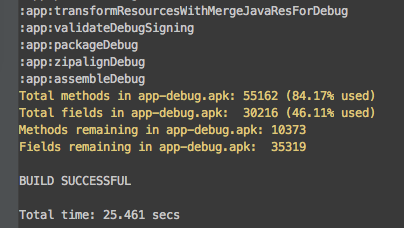
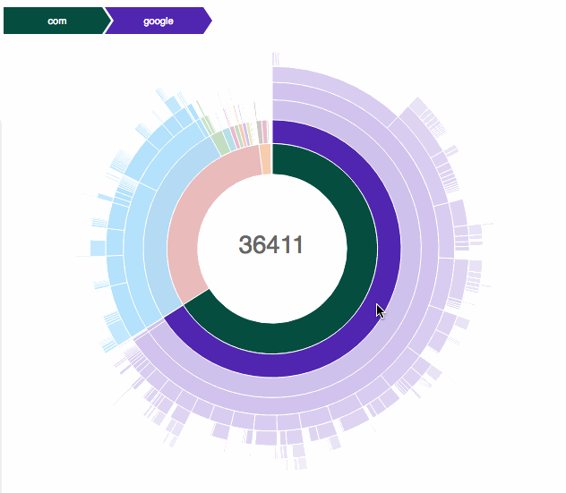
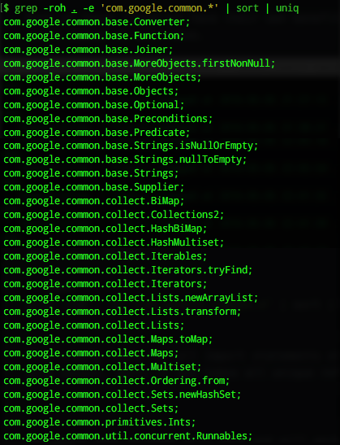
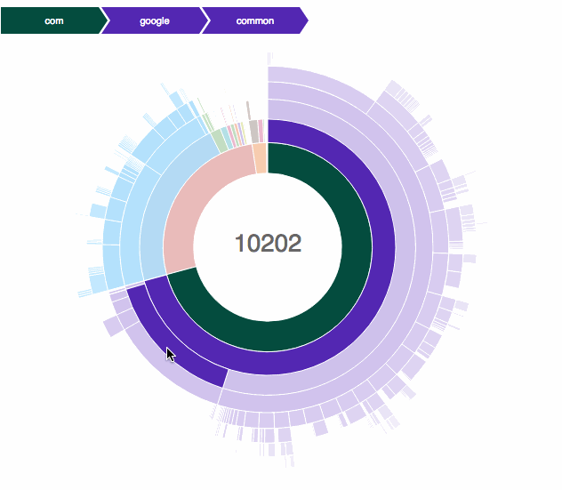
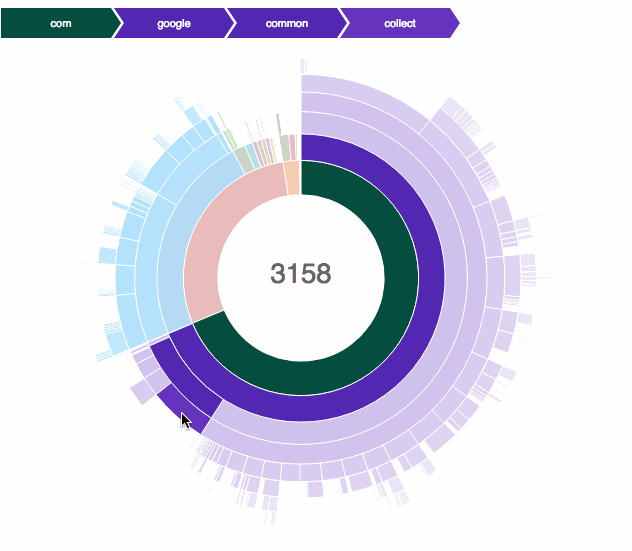

As green field projects are a rare breed, chances are that you've inherited a legacy code base. If you're as lucky as me, that code base has over 65k methods causing the build times to be boringly slow.

Today I would like to show how you can visualize your current method count and understand what libraries are eating up the largest part of that. Next it's time to reduce said method count and remove that nasty multidex solution once and for all.


## Visualizing method count
The easiest and most attractive way (imho) to visualize the method count is by using the [Dexcount Gradle Plugin](https://github.com/KeepSafe/dexcount-gradle-plugin). Applying it to your project is as easy as adding a classpath dependency to your root `build.gradle` and applying the plugin to your App `build.gradle`.

```groovy
// root build.gradle file
buildscript {
    repositories {
        jcenter() // or mavenCentral()
    }

    dependencies {
        classpath 'com.getkeepsafe.dexcount:dexcount-gradle-plugin:0.5.0'
    }
}
```

```groovy
// app build.gradle file (apply AFTER Android plugin)
apply plugin: 'com.getkeepsafe.dexcount'
```

Running a normal project build `./gradlew assembleDebug` will now print out the current method count in the console:



and generate an interactive graphical report in the outputs folder `build/outputs/dexcount/debugChart`:

<a href="/blog/methodcount/dexcount-googleplayservices/debugChart" target="blank"></a>

Click the graphic above to interact with it.

Using the graphical representation of the method count for all packages in your app, it becomes really easy to find which libraries are consuming your precious method count. Some of the usual suspects are big monolithic libraries like [Guava](https://github.com/google/guava) and the non-split-up [Google play services](https://developers.google.com/android/guides/overview#the_google_play_services_client_library). In the next section will see what we can do about these.


## Reducing method count

### Choosing the right libraries
Normally I recommend never to optimize unless you have a problem. But with method counts, I really advice you to consider the method count before you start using a library for two reasons:

1. Replacing libraries in existing apps can be very challenging, if not almost impossible.
2. Many developers are using huge libraries just to do simple things. (`Strings.isNullOrEmpty()` anyone?) Note that you don't need to use a library for everything!

There [used to be a great website methodscount](https://medium.com/@rotxed/sunsetting-methodscount-com-cb5693a9586) that told you the method count of a library before you start using it. This can really be helpful to avoid using "large libraries" which only add limited benefit to your app.

### Replacing existing libraries
Often there are multiple libraries accomplishing the same goals. Take for instance image loading:

| Library | Method count|
|---------|-------------|
| Picasso 2.5.2| 849 |
| Universal Image Loader 1.9.5| 1206 |
| Glide 3.7.0| 2879 |
| Fresco 0.9.0| 12984 |

Each of these libraries have their own benefits and features, so choose wisely and balance the features you are going to use versus the method count impact it will have.

That being said, replacing libraries in existing projects can be incredibly hard and may not even be feasible on the short term. Later I'll suggest an alternative solution to reduce method count in existing libraries.

### Running Proguard
Proguard is a great tool to strip out unused code from your app, but you typically only run it for release builds to save precious build time. If that's not really an issue for you, by all means you can also enable Proguard for debug builds:

```groovy
buildTypes {
    debug {
        minifyEnabled true
        proguardFiles getDefaultProguardFile('proguard-android.txt'), 'proguard-rules.pro'
    }
}
```

### Reducing library size
If it's not feasible to replace an existing library or to run Proguard all the time, then it becomes really interesting. Because if Proguard can strip out code during a release build, why not use it ahead of time to create a modified version of a library with fewer methods?

Well this is possible, but you'll have to manually specify which parts of the library you are going to use! This is because Proguard doesn't have a context during library stripping of what methods your application will be needing and what not.

Let's reproduce one of the projects I recently started working on as an example. Guava was used throughout the app extensively, making it very hard/risky to remove. But because of the huge method count we were constantly flirting with the 65k method limit and had to enable multidex.

<a href="/blog/methodcount/dexcount-guava/debugChart" target="blank"></a>

First of all you need to know what parts of the library the app was actually using. This can easily be done by running the following command in your `src` folder.

```bash
grep -roh . -e 'com.google.common.*' | sort | uniq
```

This simply looks for all import statements starting with the library prefix (for Guava that is `com.google.common`), removes all clutter from the grep output, sorts it and takes all unique references.



Next we'll create a simple Proguard configuration that keeps all top level packages, without any obfuscation or optimizations.

```java
-dontoptimize
-dontobfuscate

-keep public class com.google.common.base.** {
    public *;
}

-keep public class com.google.common.collect.** {
    public *;
}

-keep public class com.google.common.primitives.** {
    public *;
}

-keep public class com.google.common.util.** {
    public *;
}
```

Now we'll use a little Gradle script that takes a library as an input, runs Proguard on it an creates a new library as an output. If you're interested I advice you look at the [source code](https://github.com/JeroenMols/MethodCountExample/blob/master/shrink_lib/build.gradle), which is based on a script by [@mr_ligi](https://github.com/ligi/shrinkGuava). This Gradle script outputs a shrinked library version, which can be copied to the libs folder of your project.

Looking at our example, this simple process saved us 4000 methods and we are only just above the dex method limit.

<a href="/blog/methodcount/dexcount-packageshrink/debugChart" target="blank"></a>

Back to the drawing board, because this isn't nearly enough! Turns out the `collect` package by itself has over 8000 methods, so I decided to just keep certain classes instead of the entire package.

This more aggressive approach will most likely cause some compile errors when you try to use the library in your app, so I had to iterate and add some extra classes until all of those were solved. The resulting Proguard configuration looks like this:

```java
-dontoptimize
-dontobfuscate

-keep public class com.google.common.base.** {
    public *;
}

-keep public class com.google.common.collect.Sets
-keepclassmembers class com.google.common.collect.Sets** {
 *;
 }

 -keep public class com.google.common.collect.Collections2
 -keepclassmembers class com.google.common.collect.Collections2** {
  *;
  }

-keep public final class com.google.common.collect.Lists
-keepclassmembers class com.google.common.collect.Lists** {
 *;
 }

-keep public final class com.google.common.collect.Iterables
-keepclassmembers class com.google.common.collect.Iterables** {
 *;
 }

-keep public class com.google.common.collect.ImmutableList.** {
    public *;
}

-keep public class com.google.common.io.CharStreams {
    public *;
}

-keep public class com.google.common.collect.HashMultiset
-keepclassmembers class com.google.common.collect.HashMultiset** {
 *;
 }

-keep public class com.google.common.collect.HashBiMap
-keepclassmembers class com.google.common.collect.HashBiMap** {
 *;
 }

-keep public class javax.annotation.Nullable.** {
     public *;
 }

-keep public class com.google.common.util.** {
    public *;
}

-keep public class com.google.common.primitives.** {
    public *;
}
```

Resulting in an extra decrease of almost 4500 methods, which brings the total removed methods to 8500!

<a href="/blog/methodcount/dexcount-agressiveshrink/debugChart" target="blank"></a>

Further our build times have not only improved because we no longer need multidexing, but also because the compiler now has less code to process.

Obviously your mileage will vary depending on what library you choose. For low coupled, highly cohesive libraries (like Guava), this technique works really well, but for other libraries it might not.

> **Disclaimer**

> The technique presented above should be used with caution! Because instead of relying on Proguard to strip out what's not needed, we're now doing that manually, which is more error prone.


## Wrap-up
Hitting the 65k method limit is a real pain, but choosing wisely what libraries you use can already bring you a long way. Fortunately there is a great tools like the [Dexcount Gradle Plugin](https://github.com/KeepSafe/dexcount-gradle-plugin) to help with these decisions.

For existing projects, always try to replace existing large method libraries with alternatives. If this is not feasible and you feel comfortably using Proguard, you can use the latter to preprocess and shrink existing libraries.

A basic example project with everything in this blogpost integrated is available on [GitHub](https://github.com/JeroenMols/MethodCountExample).

As always you can reach me on [Mastodon](https://androiddev.social/@Jeroenmols), or leave a comment below!
