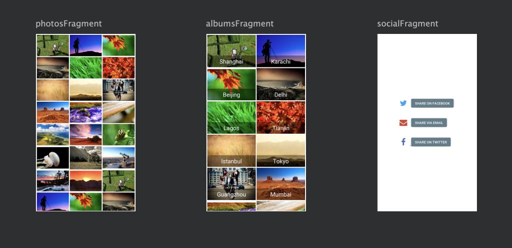
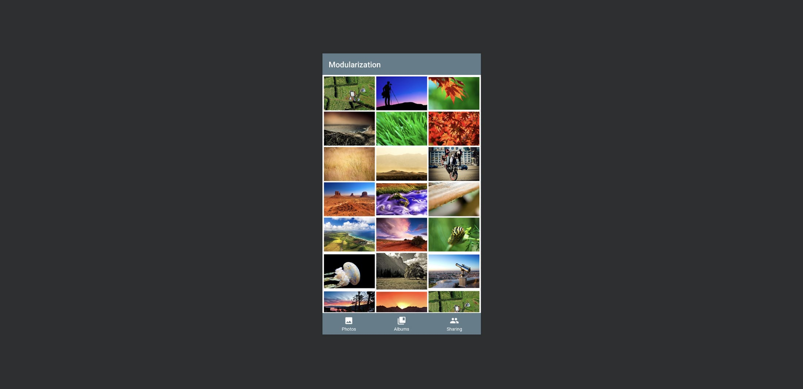
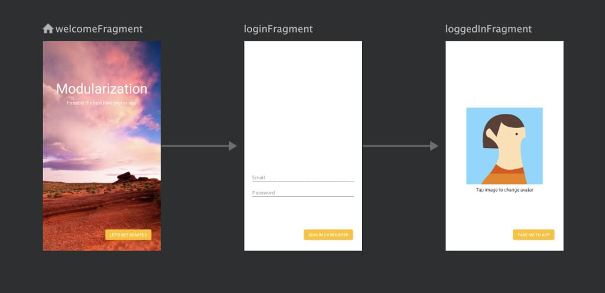
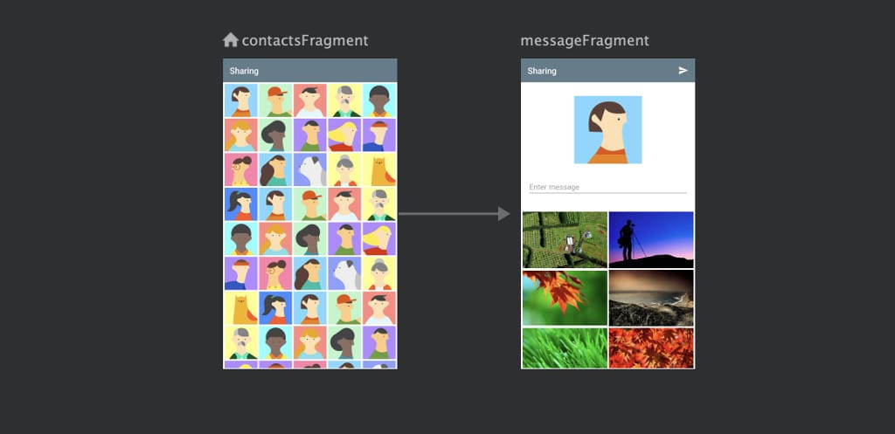

With a clear view on how multi-module apps should be architected, let's dive into a real-life practical example.

We'll discover how the architecture results in a clear application structure, how navigation is handled, how to use staged rollouts, how to test everything and even look at a production app that is using this architecture.

## Source code
All source code for this blog post is available on [Github](https://github.com/JeroenMols/ModularizationExample).

This is not a fully functional app, but rather a highly focussed example that only concentrates on demonstrating the [modularization architecture]().

## Application structure
One of the key benefits of the three-layer app-features-libraries architecture is supposed to be clear navigation throughout the app and source code. So let's investigate if that promise holds true.

Looking at the root folder of the project, the following structure becomes clear:

```text
.
├── app
├── features
│   ├── dashboard
│   ├── login
│   └── sharing
└── libraries
    ├── actions
    └── ui-components
```

Simple, right?

There is one app that consists out of three features: `dashboard`, `login`, and `sharing`. It is backed by a few libraries: `actions` and `ui-components`. All feature and library modules are grouped within the features and libraries folder respectively.

But what do the features themselves do?

We'll let's have a look at their respective navigation graphs! First up is the [dashboard](https://github.com/JeroenMols/ModularizationExample/blob/master/features/dashboard/src/main/res/navigation/dashboard_graph.xml):



Clearly, this app seems to be about photos!

But the navigation graph looks a bit odd (no destinations), this is because this isn't an actual functioning graph! The navigation components don't support visualizing a graph for an activity with bottom tabs (yet?).

So let's have a look at the [DashboardActivity](https://github.com/JeroenMols/ModularizationExample/blob/master/features/dashboard/src/main/res/layout/activity_dashboard.xml) more closely:



Here we go, the main dashboard consists out of three tabs: photos, albums and social.

Now let's have a look at the [Login feature](https://github.com/JeroenMols/ModularizationExample/blob/master/features/login/src/main/res/navigation/login_graph.xml):



In one visual overview you can see that the login screen consists out of three screens that link together as a flow. The navigation graph even displays the nave of every screen on top so you can easily navigate to it!

Similarly, zooming into the [Sharing module](https://github.com/JeroenMols/ModularizationExample/blob/master/features/sharing/src/main/res/navigation/sharing_graph.xml) immediately explains what this feature is all about:



Again, a picture says more than a 1000 lines of code!

Due to the way feature modules are defined, this architecture splits your app hierarchically, similar to how a user navigates through your app. This in combination with a visual represenation of each feature (navigation graph) helps to understand the app structure, the navigation between screens and find back the name of screens.

## Navigation
As navigation seems to be one of the key problems people are facing in multi-modules apps (see [my previous article]()), let's explore the two different modes of navigation:

1. within a feature
2. between features

### 1. Within a feature
All navigation within a feature is handled by the navigation components. To do this, just add a `NavHostFragment` to the `Activity` layout and load it with a navigation graph.

Let's have a look at the [`LoginActivity`](https://github.com/JeroenMols/ModularizationExample/blob/master/features/login/src/main/res/layout/activity_login.xml) layout:

```xml
<fragment xmlns:android="http://schemas.android.com/apk/res/android"
    xmlns:app="http://schemas.android.com/apk/res-auto"
    android:id="@+id/nav_host_fragment"
    android:name="androidx.navigation.fragment.NavHostFragment"
    android:layout_width="match_parent"
    android:layout_height="match_parent"
    app:defaultNavHost="true"
    app:navGraph="@navigation/login_graph"/>
```

Note how the fragment attribute instantiates a `NavHostFragment` that gets loaded with the navigation graph from [`login_graph.xml`]((https://github.com/JeroenMols/ModularizationExample/blob/master/features/login/src/main/res/navigation/login_graph.xml)).

This navigation graph doesn't only describe the three screens that are in the login feature, but it also defines actions for navigation between screens.

```xml
<navigation xmlns:android="http://schemas.android.com/apk/res/android"
    xmlns:app="http://schemas.android.com/apk/res-auto"
    android:id="@+id/login_graph"
    app:startDestination="@id/welcomeFragment">

    <fragment
        android:id="@+id/welcomeFragment"
        android:name="modularization.login.WelcomeFragment">
        <action
            android:id="@+id/action_welcomeFragment_to_loginFragment"
            app:destination="@id/loginFragment" />
    </fragment>

    <fragment
        android:id="@+id/loginFragment"
        android:name="modularization.login.LoginFragment">
        <action
            android:id="@+id/action_loginFragment_to_avatarFragment"
            app:destination="@id/avatarFragment" />
    </fragment>

    <fragment
        android:id="@+id/avatarFragment"
        android:name="modularization.login.AvatarFragment" />
</navigation>
```

In this graph, the `WelcomeFragment` is the entrypoint of the feature and navigation to the next screens can simply be done by invoking a navigation action. E.g. [navigating to the `LoginFragment`](https://github.com/JeroenMols/ModularizationExample/blob/master/features/login/src/main/java/modularization/login/WelcomeFragment.kt) is done by:

```
findNavController()
.navigate(R.id.action_welcomeFragment_to_loginFragment)
```

 `AvatarFragment`, on the other end, is the last screen from where navigation is triggered to a different feature.

### 2. Between features
Recall that features are full screen (entry point is an `Activity`) and different features aren't allowed to rely on each other.

This means that the login feature cannot start the dashboard feature using an explicit `Intent` (e.g. by defining the exact class of the `Activity` to start):

```kotlin
startActivity(Intent(activity, DashboardActivity::class.java))
```

But has to use an implicit `Intent` instead, where you basically ask for some `Activity` that can handle the `action.opendashboard`:

```kotlin
startActivity(Intent("action.dashboard.open"))
```

Which will start the `DashBoardActivity` as it defines it will respond to that action in the [`manifest.xml`](https://github.com/JeroenMols/ModularizationExample/blob/master/features/dashboard/src/main/AndroidManifest.xml) of the `dashboard` feature:

```xml
<manifest xmlns:android="http://schemas.android.com/apk/res/android"
    package="modularization.dashboard">

    <application android:theme="@style/AppTheme" >
        <activity android:name=".DashboardActivity">
            <intent-filter>
                <action android:name="action.dashboard.open"/>
                <category android:name="android.intent.category.DEFAULT" />
            </intent-filter>
        </activity>
    </application>

</manifest>
```

> Note that in theory, multiple activities can offer to handle this action causing a chooser dialog to be displayed. (e.g. multiple apps could offer to take a picture when asking for the implicit action [`MediaStore.ACTION_IMAGE_CAPTURE`](https://developer.android.com/training/camera/photobasics#TaskCaptureIntent))

However, implicit intents alone don't fully solve how to navigate between features:

1. duplication of action `String` "action.opendashboard" in the feature manifest and every feature that wants to create an intent with that action
2. in-depth knowledge required of how to create `Intent` with extras when passing data into a feature (e.g. name of extras)
3. another app can define the same action causing a chooser dialog to pop up (also possible between multiple build flavors)

The first two can be solved by introducing an `actions` module that is responsible for generating properly formatted intents to start feature `Activities`:

```kotlin
object Actions {
    fun openLoginIntent() = Intent("action.login.open")
    fun openDashboardIntent() = Intent("action.dashboard.open")
    fun openSharingIntent() = Intent("action.sharing.open")
}
```

Starting the next feature can then simply be done by:

```kotlin
activity.startActivity(Actions.openDashboardIntent())
```

Not only is this a very descriptive way of linking to the next feature, but this principle can also be used to make passing data into the new feature type safe:

```kotlin
object Actions {
    fun openDashboardIntent(userId: String) =
        Intent(context, "action.dashboard.open")
            .putExtra(EXTRA_USER, UserArgs(userId))
}
```

Now the login feature no longer needs to know how the data is passed into the dashboard, it simply has to call:

```kotlin
activity.startActivity(Actions.openDashboardIntent("userId"))
```

Neat, right?

Finally, relying on implicit `Intent`s can cause chooser dialogs to pop up. While a collision with a 3rd party app is unlikely, it can easily happen for different build flavors.


This can easily be avoided by restricting the intents to the current package:

```kotlin
object Actions {
    fun openLoginIntent(context: Context) =
        internalIntent(context, "action.login.open")

    private fun internalIntent(context: Context, action: String) =
        Intent(action).setPackage(context.packageName)
  }
```

## Feature rewrites/refactors
As you probably already know, [I don't believe in-app rewrites](). However, refactoring by itself can also be frustrating and take a long time to provide results. So how do you get your app in better shape?

Wouldn't it be nice if you could aggressively refactor or even rewrite parts of your app without having to worry about a risky release?

Well, this architecture actually allows you to easily do exactly that! E.g. you can rewrite a completely new login module and ship both the old and new one in your app. Using the actions module you can now very easily choose what feature to start:

```kotlin
object Actions {
    fun openLoginIntent() =
        if (FeatureFlag.loginRewrite) {
            Intent("action.login2.open")
        } else { Intent("action.login.open") }
}
```

With the right analytics in place and a remote feature toggle framework such as [Firebase remote config](https://firebase.google.com/docs/remote-config/), you can now gradually roll out the rewrite.

This allows you to build up confidence in the new code, mitigate risks of breaking a crucial user flow (e.g. Login) and hence refactor/rewrite parts of your app way more aggressively.

## Testing
The strategy to test this architecture consists of three key parts:

1. unit tests: super fast, test classes in isolation
2. feature tests: espresso tests for features in isolation
3. app tests: test key user flows across different features

First of all, unit tests should be added for all business logic: both for logic internal to the feature modules as for all business logic of libraries. The app module likely doesn't require any unit tests as there is no business logic in that module.

Next, all features can be tested using Espresso in isolation from the rest of the app! No need to step from the start screen throughout the entire app towards the screen you want to test first. Just start the feature activity directly via an `ActivityTestRule`.

Look at [how simple](https://github.com/JeroenMols/ModularizationExample/blob/master/features/login/src/androidTest/java/modularization/login/LoginFlowTest.kt) life can be:

```kotlin
class LoginFlowTest {

    @Rule
    @JvmField
    var mActivityTestRule = ActivityTestRule(LoginActivity::class.java)

    @Test
    fun loginFlowTest() {
        onView(withId(R.id.button_login_start)).perform(click())
        onView(withId(R.id.button_login_signin)).perform(click())

        onView(withId(R.id.button_login_toapp)).check(matches(isDisplayed()))
    }
}
```

Such feature tests are fast, way more reliable (can't fail due to bugs in other features) and don't require much setup.

With all business logic unit tested and features tested in isolation, the missing link is to test "real world app usage" in terms of long, typical user flows.

These scenarios are tested in the app module. Take for instance [the following test](https://github.com/JeroenMols/ModularizationExample/blob/master/app/src/androidTest/java/com/jeroenmols/modularization/AppFlowTest.kt) where a user logs in, navigates to the sharing screen and does something meaningful there:

```kotlin
class AppFlowTest {

    @Rule
    @JvmField
    var mActivityTestRule = ActivityTestRule(MainActivity::class.java)

    @Test
    fun test_criticalUserFlow_throughoutEntireApp() {
        onView(withId(modularization.login.R.id.button_login_start)).perform(click())
        onView(withId(modularization.login.R.id.button_login_signin)).perform(click())
        onView(withId(modularization.login.R.id.button_login_toapp)).perform(click())

        onView(withId(R.id.action_albums)).perform(click())
        onView(withId(R.id.action_sharing)).perform(click())
        onView(withId(R.id.button_social_facebook)).perform(click())

        onView(withId(R.id.recyclerView_sharing_contacts)).check(ViewAssertions.matches(ViewMatchers.isDisplayed()))
    }
}
```

The app module tests will be the most difficult ones to write and stabilize, but due to the split in feature modules, the largest chunk of tests can run in isolation per feature. So this provides a really nice balance between reducing repetitive manual testing, while keeping development/maintenance cost under control.

## Production example
While this architecture sounds good in theory and the example looks nice on paper, it still isn't a full fidelity app. Are you sure this will actually work in production?

Well, I'm glad you ask! Because this is exactly the way that the [Philips Hue app](https://play.google.com/store/apps/details?id=com.philips.lighting.hue2) is modularized:


All features are independent, self-contained and they don't rely on each other. There is only one single app module.

Note that due to the large legacy code base of Philips Hue, it hasn't fully migrated to this architecture yet: currently, there are 8 feature modules and 14 libraries. Rewriting features with a feature toggle and gradually rolling them out happens on a regular basis.

It's also interesting to look into some decisions taken on the library level:

- UI components: components reused across features + themes and styles
- Analytics: most of the "horizontal service layers" are already extracted from the app as a library
- Translations: ideally each feature should contain its own translations, but for Philips Hue, this would require to dynamically split the monolithic translation files from our translation agency for each feature. Simply not the biggest fish to fry at the moment.

## Wrap-up
The three-layer app-features-libraries architecture addresses quite some fundamental app/modularization issues: project structure, navigation, staged rollouts and testability.

All source code is available on [Github](https://github.com/JeroenMols/ModularizationExample).

Make sure to follow me on [Mastodon](https://androiddev.social/@Jeroenmols) and let's investigate how you can start modularizing an existing app [in part 4]().
