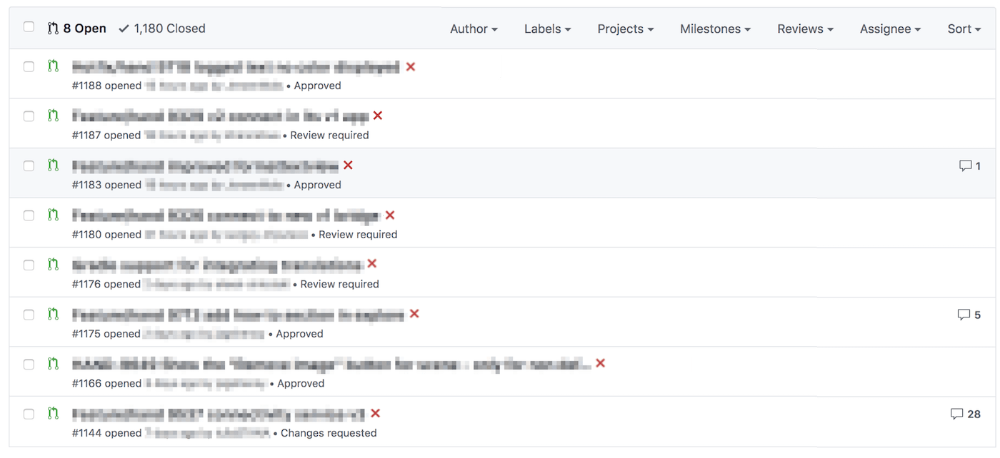

In the past years, my thoughts on pull request reviews have evolved considerably. Given that creating and reviewing pull requests are a core part of our work, let's talk about those.

This post will detail when to craft a pull request and what pull requests require a code review.

## When to craft a pull request
> Always.

Starting with the easiest part: every code change requires a pull request. This is mainly for two reasons:

1. Code quality
1. Provide additional context

### 1. Code quality
Your team likely wants to establish a common baseline of quality.

For this most teams use a set of automated checks that are executed on every pull request. These can verify that the code builds, tests pass, test coverage does not decrease, app size is within certain limits, …

However, some checks can also be manual, such as a checklist on the pull request template. These nudge developers to avoid unrelated changes, do a self-review, add clear descriptions, steps to test the changes, ...

### 2. Provide additional context
Writing a pull request is a useful form of documentation. It allows additional context to code changes such as why the changes are required and what alternatives were considered.

For bugs, you can elaborate on the steps to reproduce, a stack trace of the issue, and what steps others can follow to verify the proposed solution. Adding before/after screenshots can be incredibly helpful in reviewing UI changes.

Finally, draft pull requests can be a tool to compare alternatives or an effective way to convey your design ideas to others.

## When your pull request requires a review
> For all significant, non-critical code changes.

While you might have expected an `always` here, I can at least think of two scenarios where pull request reviews might be skipped:

1. Trivial code
2. High urgency changes

### 1. Trivial code
Some code changes are straightforward, such as bumping the app version. Would you want to hold off your release until a team member finds the time to review the following?

```diff
 defaultConfig {
-    versionName "1.3.0"
+    versionName "1.3.1"
     ...
 }
```

But why stop there?

How about committing the output of automatic scripts? Examples are adding new translations, updating the [Protobuf](https://developers.google.com/protocol-buffers/) definitions, or tweaking assets.

Far too often have I had to disrupt a colleague's "flow" for a "quick stamp" on a particular pull request. Whereas in reality, our default automated checks would have been sufficient.

### 2. High urgency changes
What if, despite all processes, main is suddenly broken?

A common scenario for me is that end-to-end tests suddenly start failing. Either due to a backend change or due to a change on [Firebase tests lab](https://firebase.google.com/docs/test-lab/). In this case, main will still compile, but the builds for all open pull requests would fail.



An even worse situation is when two incompatible changes are merged, breaking main compilation as a result. That is even more impactful as it also breaks compilation for all developers starting from or rebasing onto the latest main.

Given such an impact, should you wait for approval before merging the fix?

Let's think about the worst-case scenario:

1. main breaks
1. someone on the team implements a very hacky fix
1. person opens pull request (mandatory!)
1. all automated checks pass
1. merge the fix into main and builds turn green

Now there's a very hacky fix in main, but builds are green. Did that fix improve the situation? Yes. Should that fix stay in main forever? Of course not.

We need to accept that software is never finished, and it will always continue to evolve. So after the quick patch, other team members can chime in, offer suggestions and follow up with another pull request containing a more sustainable solution.

### Compounding factors
In some situations, requiring reviews can be especially frustrating:

- remote work: unable to tap a colleague on her shoulder for a quick review
- asynchronous work: my colleagues are 9 (!) time zones apart from me
- foundational tasks: e.g. update protobufs, so you can build your new feature on top

## Interesting idea, but it won’t work at our scale
That might be true, I haven’t tested this out on a 100+ people project. And given that my proposal relies more on developer trust, I could see some scaling challenges.

However, I would question whether your scale challenges are unique.

Don’t all processes run into scaling issues as teams grow? Can't we just apply our usual solutions?

Few ideas:

- Tools can determine whether a PR needs a review based on predefined requirements
- Tools can enforce providing a rationale when a PR is merged without review. This can even be broadcasted (Slack) to all team members
- Some trivial changes could be fully automated: e.g. continuously integrating new translations or assets
- Code ownership can restrict who can skip reviews for certain parts of the code base,...
- ...

Regardless of my suggestions, removing frustrations from your development process is one of the most impactful things you can do.

## Wrap-up
All code changes require a pull request before they are merged. Code reviews are encouraged, but they can be skipped for trivial or highly urgent changes.

If you've made it this far you should probably follow me on [Mastodon](https://androiddev.social/@Jeroenmols). Feel free to leave a comment below!
