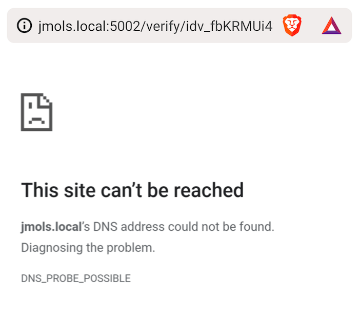
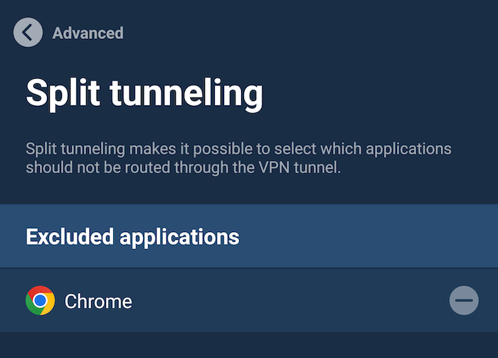
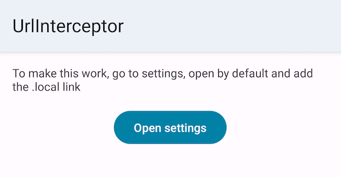

Are you using a VPN on your mobile device? Do you need to disable that to access your development web server over MDNS on your mobile device? Well... read on to simplify your workflow.

## Problem

While using a mobile VPN, you might get a DNS error when trying to access your computer over MDNS (`.local` domain).

This happens because the `jmols.local` domain isn't an actual domain and hence the DNS server on the VPN cannot resolve it.

## Solution

A way to solve this is to use [split tunneling](https://mullvad.net/en/help/split-tunneling-with-the-mullvad-app/), which allows to exclude certain apps from the VPN.

In my case, I decided to use two different browsers:

- one for my normal use with VPN (Brave)
- one for development without VPN (Chrome)

This allows me to access development URLs, whilst still securing all my personal internet usage.

However, this falls apart when I send myself a development URL or when I scan a QR code that links to my development server. This is because Android will use your default browser to open URLs and for personal use that should be a VPN-protected one.

Fortunately, I've built a solution for that: an open-source app that intercepts all links to your local domain and redirects them to a browser of choice!

Here's how to get started:

- Clone the [URLInterceptor Github repository](https://github.com/JeroenMols/DevelopmentUrlInterceptor)
- Fill in your [development url](https://github.com/JeroenMols/DevelopmentUrlInterceptor/blob/f594ad171e70c34e6eacef2639db3f60b6752b6a/app/src/main/AndroidManifest.xml#L31)
- Set the package name of your [development browser](https://github.com/JeroenMols/DevelopmentUrlInterceptor/blob/f594ad171e70c34e6eacef2639db3f60b6752b6a/app/src/main/java/com/jeroenmols/urlinterceptor/InterceptUrlActivity.kt#L14)
- Install the app and follow the instructions to start intercepting URLs.

That's it!

> There is a little bit of setup involved. This is because Android for security reasons first has to verify deep links using a [.well-known hosted file](https://developer.android.com/studio/write/app-link-indexing) on your server. Since this would be tricky to do on a development server, I've opted to manually inform Android to trust our app to handle these links instead.

## Wrap up





Using my URL interceptor app you can combine the best of both worlds: access `.local` domains without VPN and have all your other traffic protected by a VPN.

If this was helpful to you, consider [buying me a coffee](https://www.buymeacoffee.com/jeroen).
