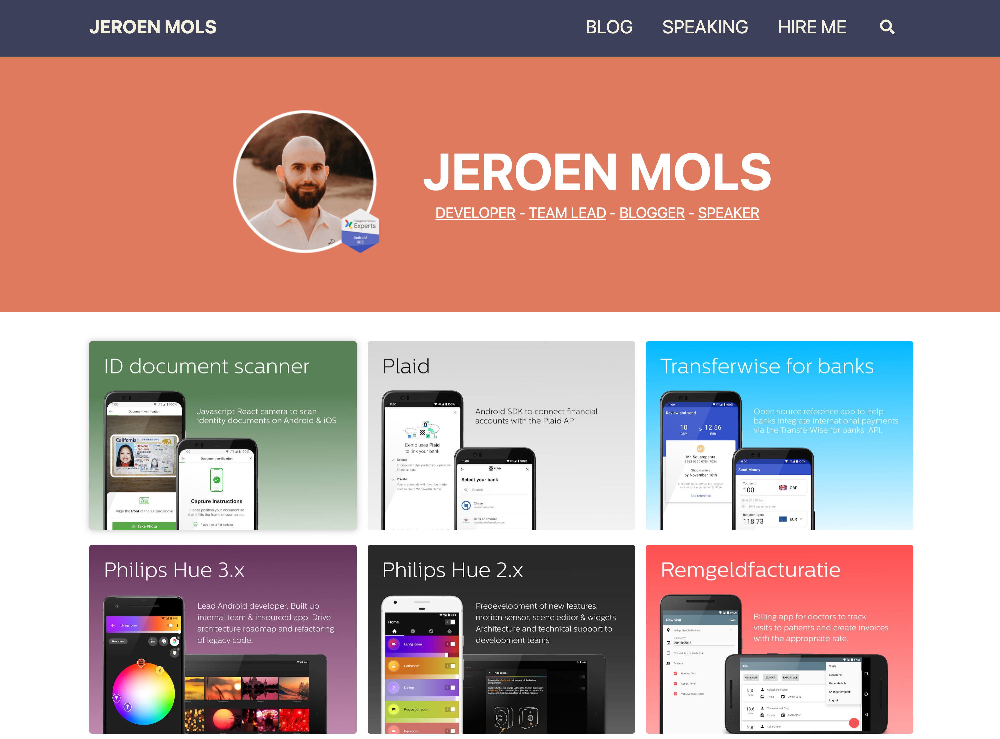
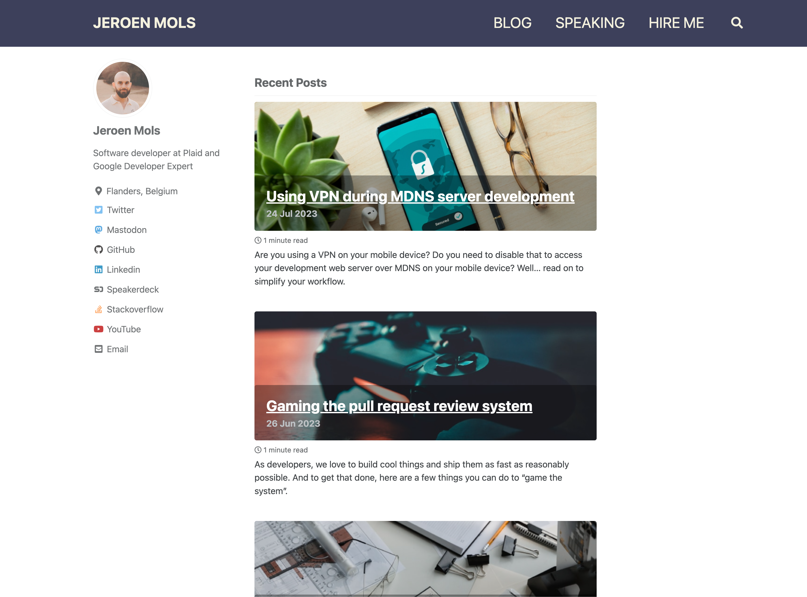
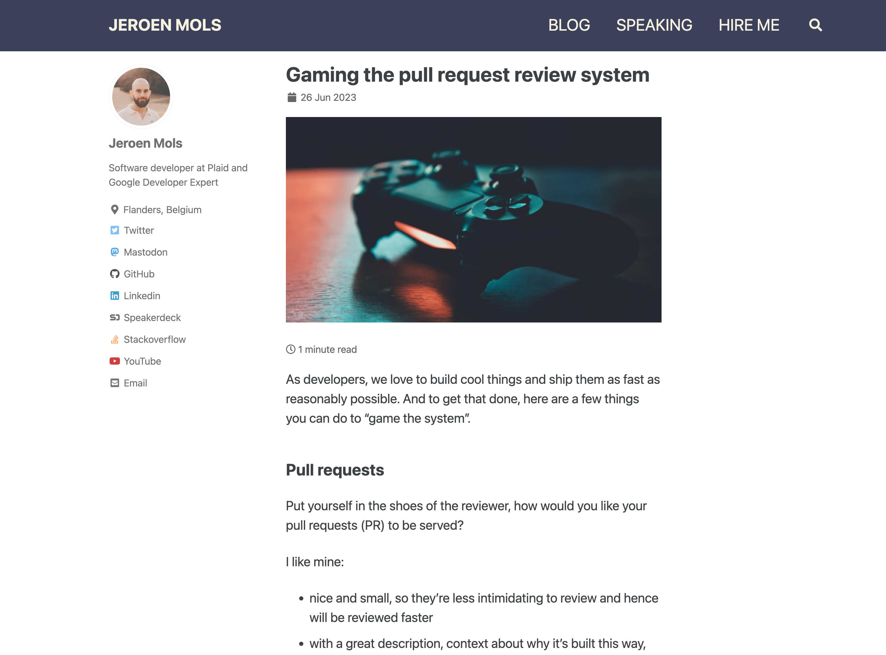
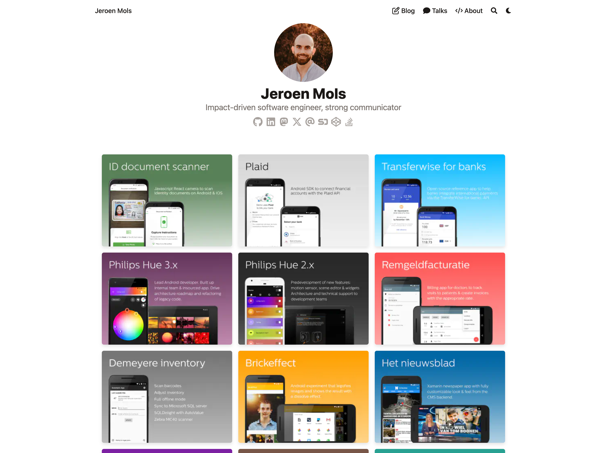
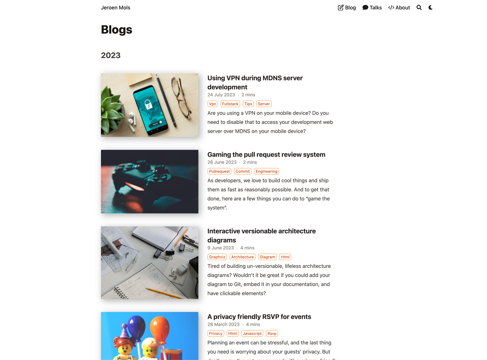
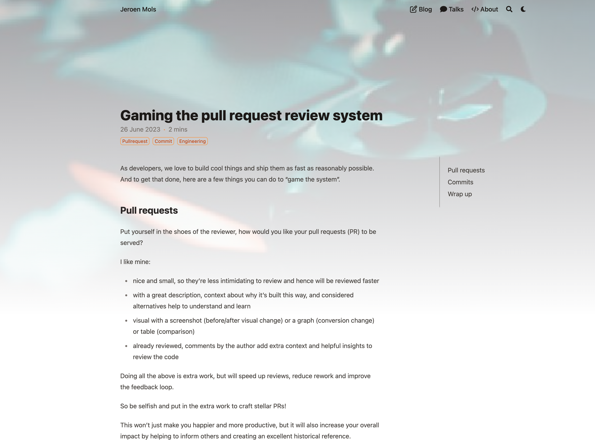
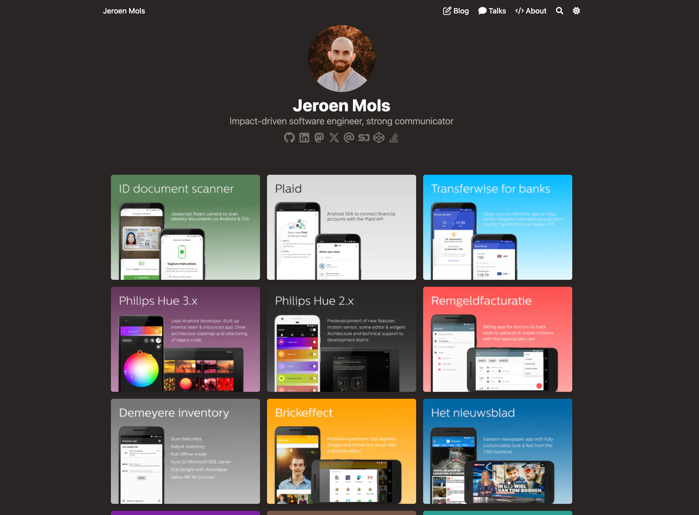
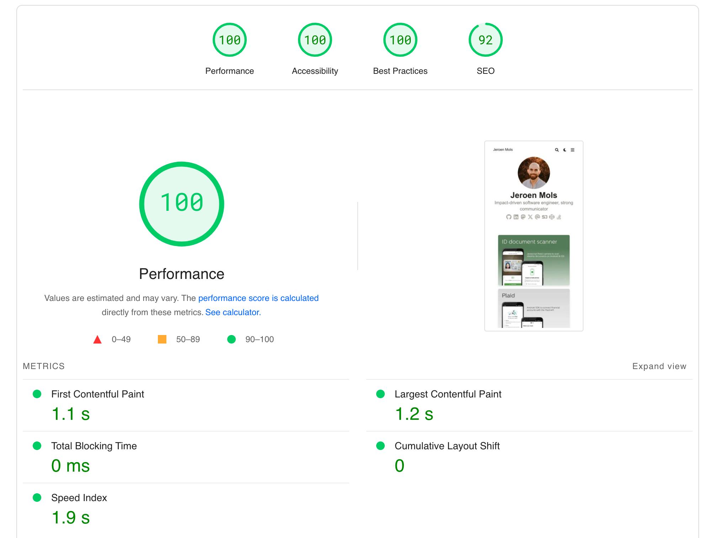
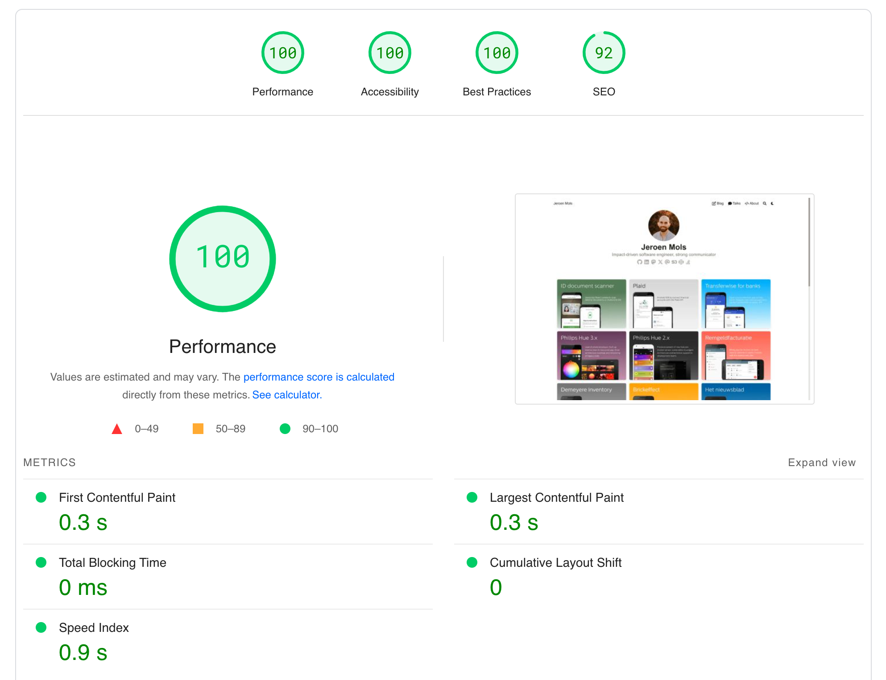

Finally found the time to migrate my old Jekyll website to a new more modern platform. Read on to learn why, how and what the main challenges were in this process.

## Before

My old website was built using [Jekyll](https://jekyllrb.com/) using the [minimal mistakes](https://mmistakes.github.io/minimal-mistakes/) theme. While the idea was to host it [directly on Github](https://docs.github.com/en/pages/setting-up-a-github-pages-site-with-jekyll), I unfortunately had to abandon that since Github (used to) support very few Jekyll plugins.

Therefore I ended up compiling the code locally, and checking it into version control and push it up to Github. 😬 This worked by placing all source code into a [jekyll-code](https://github.com/JeroenMols/jeroenmols.github.io/tree/9f70c540fa7f0d3163d78a09a1c0a184db0627a9/jekyll-code) subfolder, running a [release](https://github.com/JeroenMols/jeroenmols.github.io/blob/9f70c540fa7f0d3163d78a09a1c0a184db0627a9/jekyll-code/release) script to generate all html/css into the root folder and a [deploy](https://github.com/JeroenMols/jeroenmols.github.io/blob/9f70c540fa7f0d3163d78a09a1c0a184db0627a9/jekyll-code/deploy) script to push the code and hit the CDN API to refresh the cache. Let's file this under `fake it till you make it`, not pretty, but it still served me well.

For this, I place all source code into a [jekyll-code](https://github.com/JeroenMols/jeroenmols.github.io/tree/9f70c540fa7f0d3163d78a09a1c0a184db0627a9/jekyll-code) subfolder and I used a [release](https://github.com/JeroenMols/jeroenmols.github.io/blob/9f70c540fa7f0d3163d78a09a1c0a184db0627a9/jekyll-code/release) and [deploy](https://github.com/JeroenMols/jeroenmols.github.io/blob/9f70c540fa7f0d3163d78a09a1c0a184db0627a9/jekyll-code/deploy) script

Here's how my website looked:





## Challenges
Besides the incredibly obvious `committing compiled code to Git`, my old website had a number of challenges:

1. Low information density: due to the large fonts and narrow paragraphs, the reading experience was quite poor
1. Bad performance: the page load speed of my website was really bad, despite quite some manual optimizations
1. No reviews: my (broken) setup only allowed for one version of my website to be live at any given point in time. This made it impossible for me to share a draft article with someone for them to review.
1. Jekyll: development on Jekyll has slowed down significantly, but it never really had good developer ergonomics. I've had a lot of issues with newer ruby versions and installing native Ruby extensions over the years - not fun.
1. Boring: design started to feel dated, no dark mode, ...

But did I realy need a new website? Off course not! Yet, given that I'm doing full stack development nowadays, it was an excellent excuse to allow myself to be [nerd sniped](https://xkcd.com/356/).

## Hey Hugo 👋

As my next blogging platform, I wanted to stick to a [static site generator](https://en.wikipedia.org/wiki/Static_site_generator) due to the speed benefits and ability to write posts in markdown. There are three frameworks I briefly considered: [Astro](https://astro.build/), [11ty](https://www.11ty.dev/) and [hugo](https://gohugo.io/). But I ended up settling for Hugo rather quickly since it has the most Github stars and is actively developed upon.

Besides being super fast to compile, Hugo also offers image processing pipelines to resize/convert my images on automatically. It also has a concept of [shortcodes](https://gohugo.io/content-management/shortcodes/) which make it very easy to rewrite reusable components. The theme I decided to use is [Blowfish](https://blowfish.page/), very feature rich and actively maintained by [Nuno Coração](https://github.com/nunocoracao).

To host my website, I looked at both [Vercel](https://vercel.com/) and [Netlify](https://www.netlify.com/). After reading [this excellent comparison article](https://ikius.com/blog/vercel-vs-netlify), I settled on Netlify since their analytics offering is server side and therefore more anonymous. Full disclosure, I'm not using those analytics at this point in time, but if I were to pick up blogging again I think server side (anonymous) analytics is the way to go.

I'm quite impressed so far with how smooth Netlify has been. Not only is my broken release process fixed, but I now even have [build previews for my pull requests](https://github.com/JeroenMols/jeroenmols.github.io/pull/24#issuecomment-2341170786)!

Behold, my new clean information dense website:





And it even supports dark mode!



## Migration notes
While I don't want to bother you with all migration details, there are three things I do want to highlight:

- using LLMs as a migration tool
- breaking hyper links is unforgivable
- speeding up the homepage

### Using LLMs as a migration tool
Both Jekyll and Hugo use different conventions to organize content. Take for instance my post on [Gaming the pull request review system]():

In Jekyll the article and corresponding cover image was represented as:

```bash
blog/_post/2023-07-24-vpn-development.md
img/blog/prs-and-commits/cover.jpg
```

Whereas in Hugo, both the article and the images should be colocated together, follow different naming conventions and use different [Front matter](https://gohugo.io/content-management/front-matter/):

```bash
content/blog/073-prs-and-commits/index.md
content/blog/073-prs-and-commits/featured.jpg

```

Reorganizing, renaming and changing the Front matter on all my 74 blog posts is quite a lot of work. But it's also a predictable, repetitive taks and hence an excellent use case to ask an LLM (ChatGPT) to write a migration script! 

While the script itself is rather bespoke, below you can find the initial prompt to give you an idea of the workflow I used. After this initial prompt, I requested some follow up modifications and also made some modifications myself that I fed back to ChatGPT.

```
I'm migrating a blog from Jekyll to Hugo, can you write me a Ruby script that transforms the old blog posts to the new format?
All old blog posts are place in `jekyll-code/blog/_posts/` and have a file name in the following format: `yyyy-mm-dd-<post-name>.md` (for example `2020-02-19-year-in-review.md`). Each post starts with a front matter that contains a `title`, `header` and `tags` element. The `header` element consists out of a `teaser` and `imgcredit`.
For instance:
  
  ---
  title: Year in review 2019
  header:
  teaser: img/blog/yearinreview19/yearinreview19.jpg
  imgcredit: Photo by cottonbro from pexels, http://www.pexels.com/photo/blue-and-black-audio-mixer/, cropped and resized
  tags:
  - android
  - library
  ---
  
This is what the ruby script should do:
- for every blog post in `blog/_posts/`
- it should grab the `<post-name>` from the filename and create a new folder in `output` called `post-name`
- it should move the blog post to that folder and rename it to `_index.md`
- it should add an additional element `date` to the front matter containing the date scraped from the file name.

  date: yyyy-mm-dd

- it should read the teaser tag and move the image at that location to the new folder and rename it to `teaser` while keeping the extension
- it shoulda also copy all other images that are in the folder where the teaser image originally was to the new folder
- it should parse the imgcredit tag and if it contains a hyperlink, add that to a `to-download.csv` csv file in the `output` directory. The entry should contain both the URL as the path to the new directory.
```
 
All in all, I ended up writing three such scripts: 

- one to migrate all the files and update their front matter
- one to add image credits to all images
- one to replace `` tags with markdown figures

Finally I also did a quick manual pass over all files to fix all remaining issues and to make the source code more idiomatic.

### Breaking links is unforgivable
Since I've been blogging for nearly 10 years now, there are quite some websites that [refer to some of my content](https://androidweekly.net/search?keyword=jeroen+mols&commit=Search). The last thing in the world I would want is to break those links.

Therefore I took extra care in ensuring that all my blog links were exactly the same before/after. I accomplished this by adding a `slug` tag to the front matter of all of my previous blog posts and configuring hugo to use my old permalink structure:

```toml
#config/default/hugo.toml

[permalinks]
  [permalinks.page]
    blog = '/blog/:year/:month/:day/:slugorfilename/'
```

Next I also wrote a script to compare the `sitemap.xml` of the old against the new website:

```bash
grep loc ../sitemap.xml > old.txt
grep loc public/sitemap.xml > new.txt
sort old.txt > old_sorted.txt
sort new.txt > new_sorted.txt
git diff --no-index --color --ignore-all-space new_sorted.txt old_sorted.txt  
```

One thing I didn't care about is making my RSS feed backwards compatible. This is also something that I could have done, but I decided it just wasn't worth the effort. Should you want to resubscribe, here's [the new link](https://jeroenmols.com/blog/index.xml).

### Speeding up the homepage
The key challenge I had in making my website be snappy and look sharp was optimizing my portfolio on my homepage. 

Unfortunately, the built in [gallery shortcode](https://blowfish.page/docs/shortcodes/#gallery) can only display images in a single size. So either I optimize for a small version and users cannot zoom in, or a large version and my performace because bad due to slow loading.

After a lot of experimentation, I decided to roll my own Gallery component using a bit of CSS to render the images in different grid sizes across different screens.

```css
<style>
  /* Gallery Grid */
  .gallery-container {
    display: grid;
    grid-template-columns: 1fr;
    gap: 15px;
    max-width: 1000px;
    margin: 0 auto;
  }

  .gallery-item img {
    width: 100%;
    height: auto;
    object-fit: cover;
    border-radius: 5px;
    box-shadow: 0 4px 8px rgba(0, 0, 0, 0.1);
    cursor: pointer;
    transition: transform 0.3s ease;
    margin: 0px;
  }

  .gallery-item img:hover {
    transform: scale(1.05);
  }

  @media (min-width: 600px) {
    .gallery-container {
      grid-template-columns: repeat(2, 1fr);
    }
  }

  @media (min-width: 800px) {
    .gallery-container {
      grid-template-columns: repeat(3, 1fr);
    }
  }
</style>
```

To render the images themselves, I built my own [portfolio-figure](https://github.com/JeroenMols/jeroenmols.github.io/blob/master/layouts/shortcodes/portfolio-figure.html) shortcode which is a fork from Blowfish's built in [figure](https://github.com/nunocoracao/blowfish/blob/52d6eb7bb1e1d588472417850936b968f66cf0bf/layouts/shortcodes/figure.html) shotcode.


```

```

It has a few notable tweaks to increase the loading performance:
- resizes the image to 320px by
- set the downscaling algorithm to Lanczos, to get sharper text
- changes the image type to webp
- set a width and height, to avoid layout shifts when the gallery is rendered without the images being loaded
- set a `data-zoom-src` which tells [medium-zoom](https://github.com/francoischalifour/medium-zoom) to load a larger image on expanding

I'm pretty proud of the results! 😎




## Wrap up





I'm quite proud of my website redesign and I'm looking forward to sharing some more exciting content soon!
