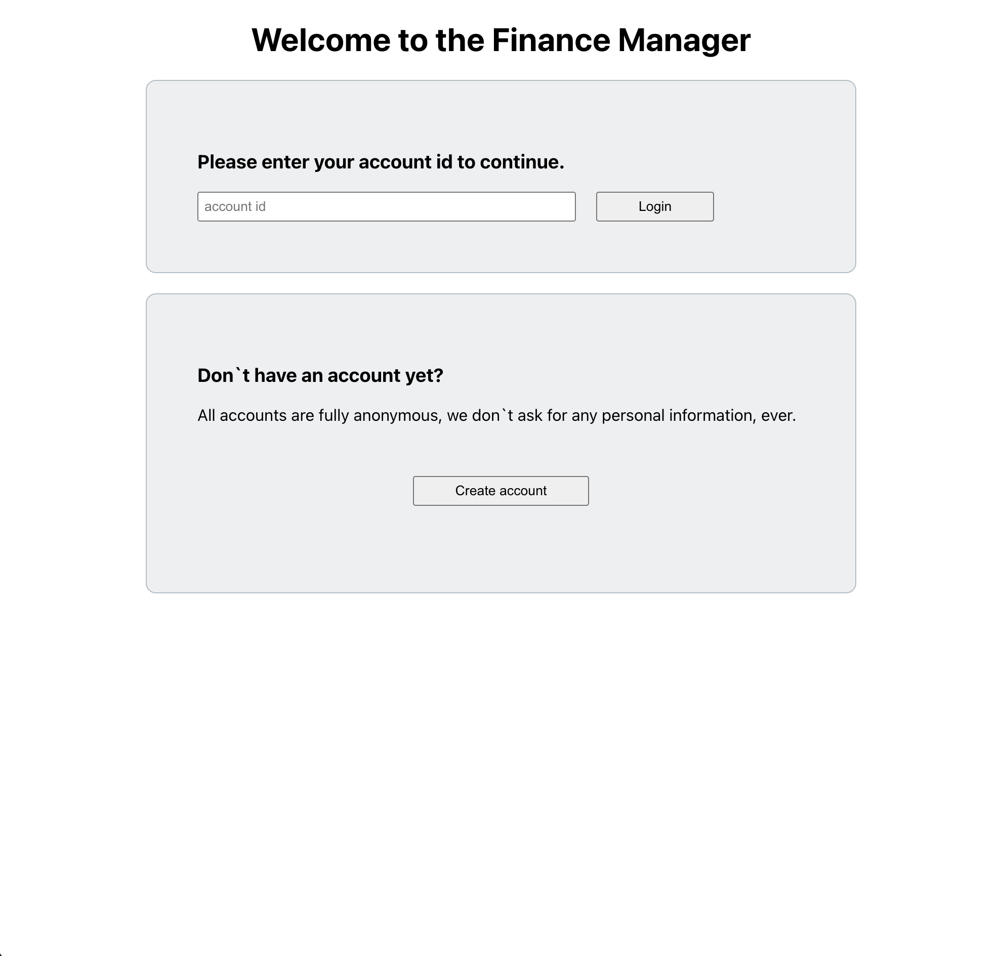
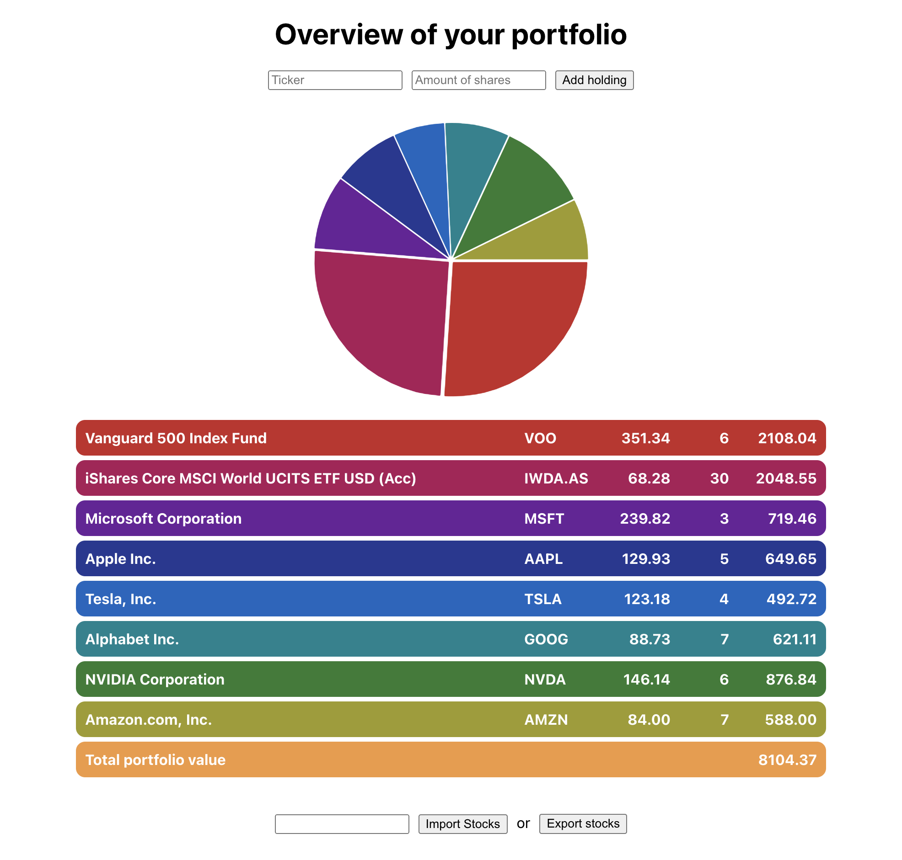
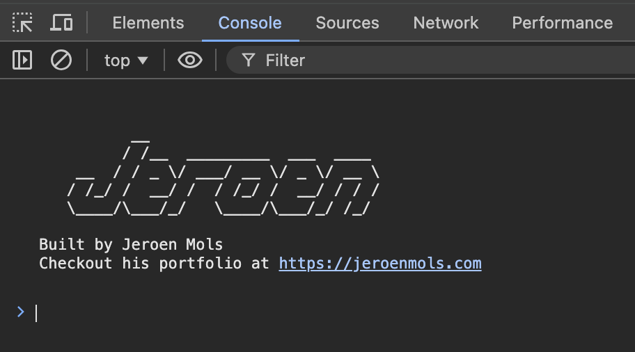
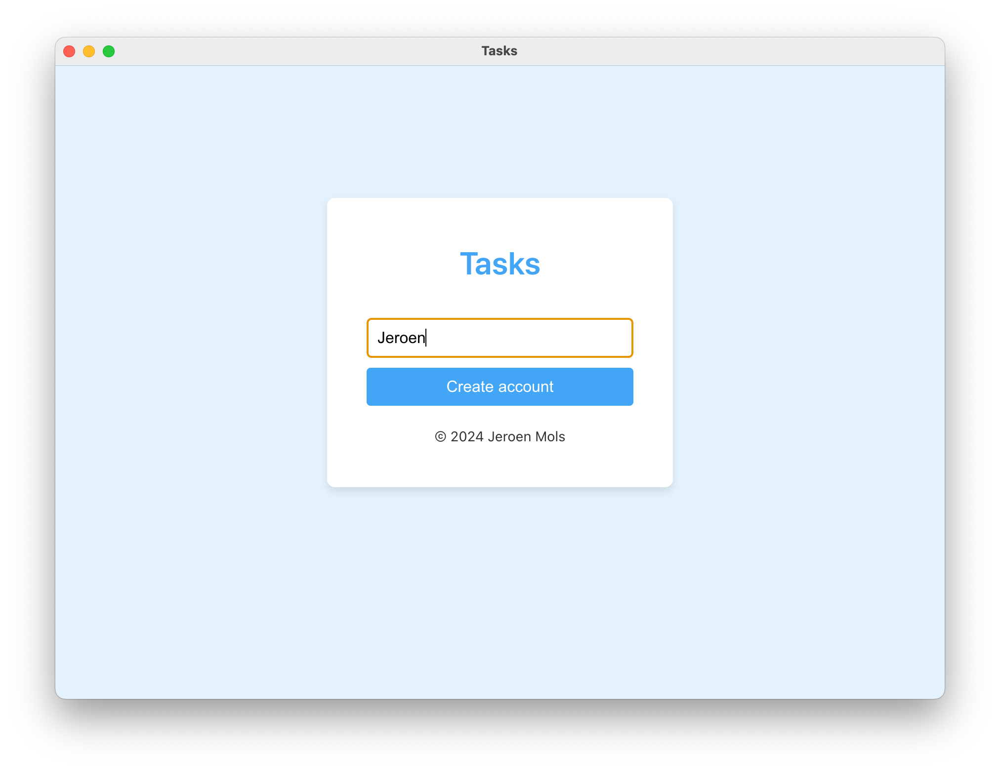
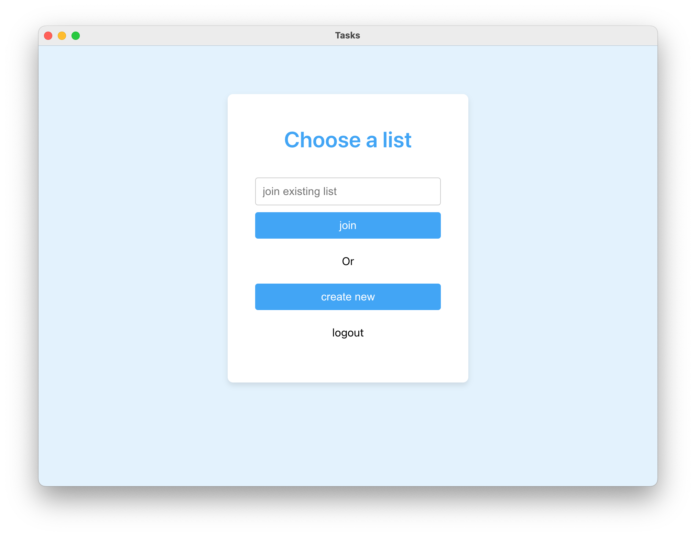
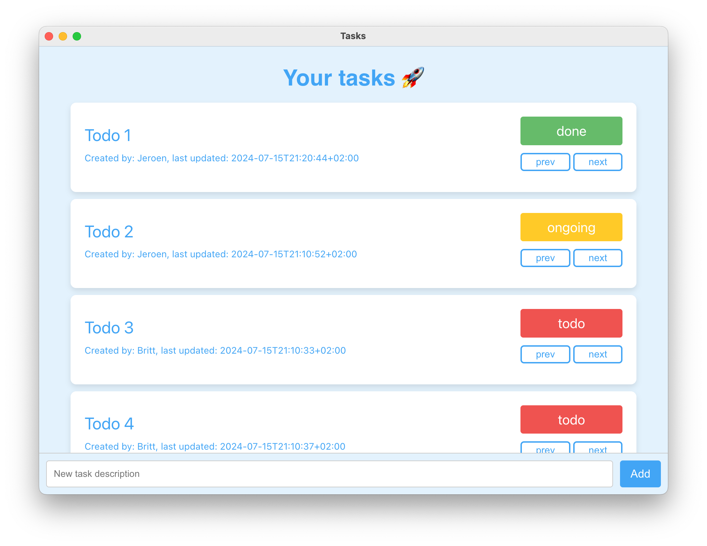

After pivoting my career to full-stack development, I missed the "depth" I used to have on mobile. So to build out more foundational full-stack knowledge, I decided to build a few side projects.

Follow me along in this series to learn why, how, and what I learned.

## A brief history
After a decade of mobile development, my learning started stalling, which drove me to join a full-stack team. 

This meant learning a lot of new things: 

- new languages: Ruby, Typescript
- SQL databases, especially migrations
- deploying code
- mutation testing
- running development servers
- ...

Fortunately, my new team mentored me to learn all this on the job. Huge credit to the [Cognito team](https://cognitohq.com/) for taking a chance on me!

However, after a while, I started wondering:


Am I effective at full-stack? Or is it just this specific role within this company?


## The missing piece
Since I joined an existing project, all fundamental design choices have already been made. And most of my work centers around working within those constraints.

This is quite different from my mobile days, where I used to be a driving force behind all architecture and technical choices.

But in the decade I did mobile, I started small, and incrementally moved on to much larger and complicated systems. Along the way, I made a lot of design choices, including a lot of mistakes, and those incrementally deepened my Android knowledge.

On full-stack, however, I just jumped in on a mature product with an existing code base. And hence I never really had the opportunity to do:

- API design
- Server language choice
- Choosing a frontend framework
- Selecting a Database
- Approach testing
- Security
- ...

So I identified this as a growth area: I want to be able to found new full-stack projects myself. And to replacate my learning experience from mobile, I wanted to try building a side project.

> Disclaimer: side projects aren't the only way to learn new things. And time spent on a side project means time not spent on other things (i.e. my family). 
>
> Prioritizing my family is why I haven't done side projects lately. But kids grow older, dads enter new fields (full-stack), and the blogger in me wanted to enable others to learn. Sharing my experience here, tipped that balance this time.

## Finance manager project
Immediately after starting full stack, almost 2 years ago, I tried building something cool that I would use myself: a Finance manager. It keeps track of your equities across different platforms in one graphical overview.


  
  


This project resembles the tech stack at work: [React](https://react.dev/) frontend with [TypeScript](https://www.typescriptlang.org/) and a [PostgreSQL database](https://www.postgresql.org/). But the backend was different: [Node.js](https://nodejs.org/en) running [Express JS](https://expressjs.com/).

Besides getting better at React, typescript, and PostgreSQL, I learned about securing endpoints using tokens, deploying to Heroku, and reusing data models across the front- and backend. I even sneaked in a privacy feature with accounts that are just random UUIDs without requiring any PII.

Oh yeah, and there's also an easter egg! 😎
(Credit to Michael Troute for the idea!)

While fun, this project turned out to be quite a bit more work than expected and unfortunately I never really finished it.

If you're interested, you can find the finance-manager [here](https://github.com/JeroenMols/finance-manager) and the finance-server [here](https://github.com/JeroenMols/finance-server).

## To-do list project
Fast forward almost two years, and I was ready for another attempt. To get my "shipping" fix this time, I focussed on something simpler: a [to-do list application](https://github.com/JeroenMols/tasks). 

These were my goals:

- support accounts & authentication
- accounts have one or more to-do lists
- to-do list has items with three states (todo, ongoing, done)
- items can only move from todo > ongoing > done > todo


  
  
  


Sounds boring? 

Hell yes! But this series isn't about the specific app, it's about the technology choices (part 2) and the implementation details (part 3).

## Wrap up

This site is 100% tracker free, :heart: for liking my post on <a href="https://androiddev.social/@Jeroenmols">Mastodon</a> or <a href="https://www.linkedin.com/in/jeroenmols/">Linkedin</a> to let me know you've read this.

After pivoting my career to a Full Stack, I used side projects to deepen my understanding of this new field. While side projects are incredibly time-consuming, they are a hands-on tool to learn new things. 

Follow me for part 2 to learn about the technology choices I made for my to-do list application.