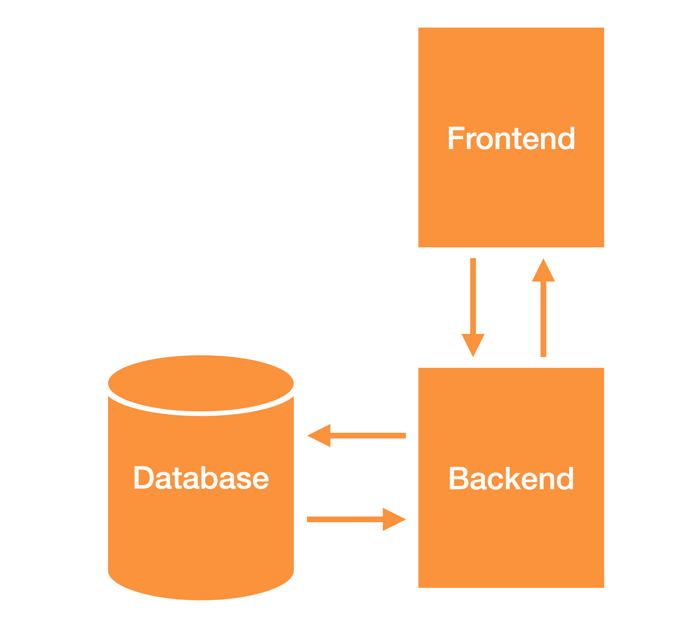
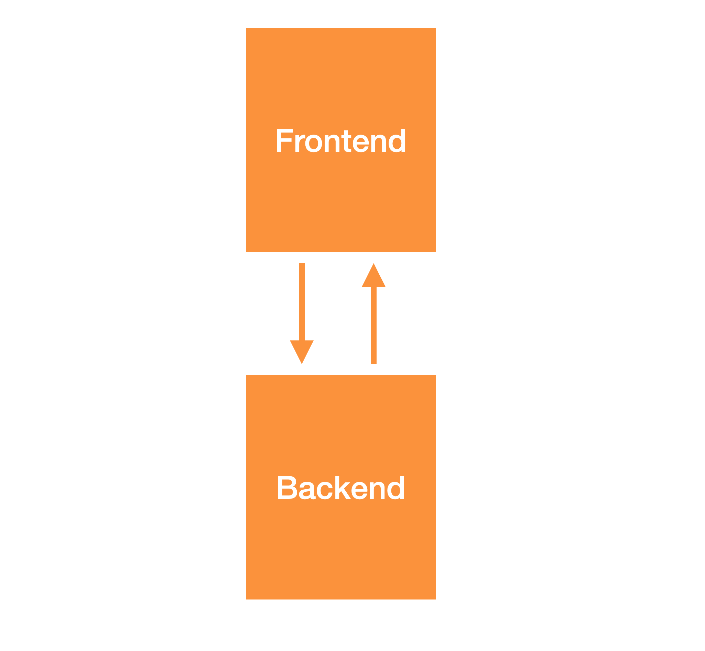
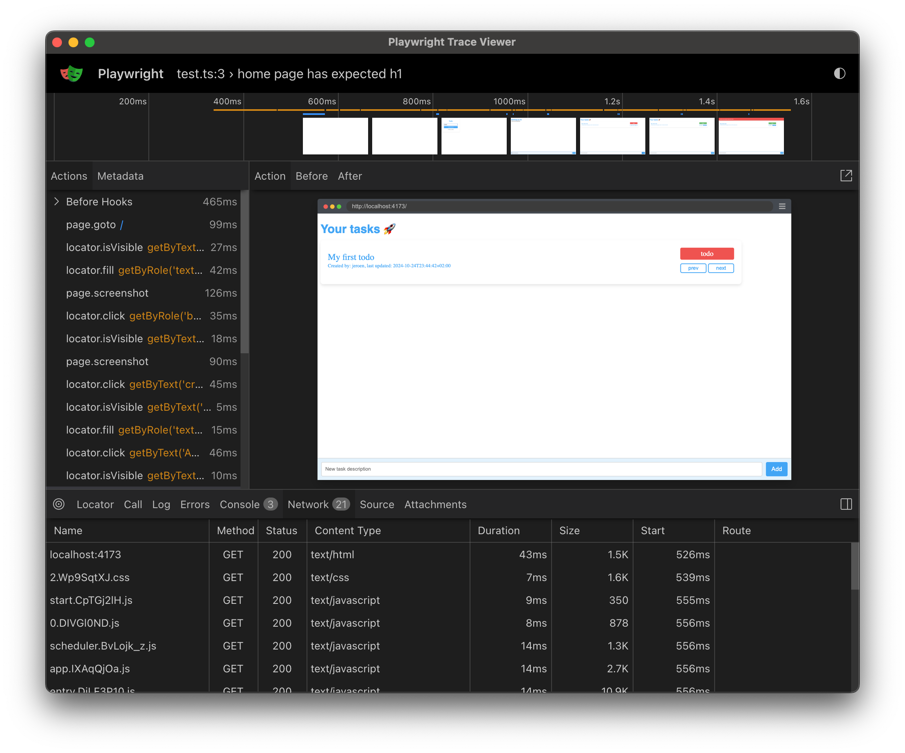

One of my main drivers for this side project was to make all technology choices myself. To do that effectively, I would have to consider the pros and cons of different options and frankly learn many new things.

Read on to learn what choices I made, why, and how they played out.

## Architecture
To recap, we plan on building a full-stack to-do list application with the requirements detailed in [part 1](). 

The system architecture looks like this:



Let's look at the technology choices for these.

## Backend

### Programming language
These are the languages/frameworks I considered for the backend:

- [NodeJS](https://nodejs.org/en) with [ExpressJS](https://expressjs.com/) and [TypeScript](https://www.typescriptlang.org/)
- [Ruby on Rails](https://rubyonrails.org/)
- [Go(lang)](https://go.dev/)

#### NodeJS
NodeJS is a cross-platform JavaScript runtime with a vibrant community of open-source libraries. What drew me to Node last time was the allure of using the same language across the frontend and backend. 

It was pretty cool to reuse data models and validation code across the front- and backend. However, there was one thing that bugged me: Javascript requires all database and network access to happen asynchronously.

```js
async function getUser(userId) {
    const user = await db.query('SELECT * FROM users WHERE id = $1', [userId]);
    return user.rows[0];
}
```

While not a big deal in this example, not everything in ExpresJS was idiomatic out of the box. And I ended up writing helpers to [wrap callback-based interfaces](https://github.com/JeroenMols/finance-server/blob/main/src/http-promise.ts) to fit the async/await model. 

```
export function httpsGet(url: string): Promise<string> {
 return new Promise((resolve, reject) => {
 const req = https.get(url, (res) => {
 let data = '';

 res.on('data', (chunk) => (data += chunk));
 res.on('error', reject);
 res.on('end', () => {
 const { statusCode } = res;
 const validResponse = statusCode !== undefined && statusCode >= 200 && statusCode <= 299;

 if (validResponse) resolve(data);
 else reject(new Error(`Request failed. status: ${statusCode}`));
 });
 });

 req.on('error', reject);
 req.end();
 });
}
```

However, in Ruby, I've never had to think about this! So this "promise" boilerplate didn't make Node feel like the right tool.

#### Ruby on Rails
Ruby on Rails was very appealing because it's such a complete framework to quickly bootstrap a side project. I've heard so many great things about Rails, and even the people I know using it tend to be very happy.

Had my goal been to quickly build something polished, I would have chosen Rails. However, this project was all about making design choices and hence I wanted to go less batteries included. Finally, I already use Ruby extensively at work, and I felt like trying out a new language instead.

#### Go(lang)
So I decided to use Go as my backend language. It has quite some appealing characteristics, like static typing, built-in concurrency, fast compilation, and near-native performance.

An advantage over Javascript is that database access and network requests are synchronous:

```go
func (db *Database) GetUser(userId string) (*User, error) {
    user := &User{}
    err := db.QueryRow("SELECT * FROM users WHERE id = ?", userId).Scan(&user.ID, &user.Name)
    return user, err
}
```
And its advantage over Ruby is that it's statically typed.

Go's developer experience however turned out to be a mixed bag. Yes, it's very fast, and when using Golang it's quite easy to navigate code bases. But oh my, is Go verbose and full of ceremony that feels redundant.

Take the example above and notice how `GetUser` func is defined on `(db *Database)`. This is because Go doesn't have any classes, instead, you define an interface and a type (like a struct) that then implements all interface methods.

```go
type Database interface {
  GetUser(userId string) (*User, error)
}
```

```go
type InMemoryDatabase struct {
  Users         map[string]User
}
```

```go
func (d *InMemoryDatabase) GetUser(userId string) (*User, error) {
  user, exists := d.Users[userId]
  if !exists {
    return nil, errors.New("user not found")
 }
  return &user, nil
}
```

In my humble opinion, supporting classes could have made this much more expressive. And this is just the tip of the iceberg: there's no return type inference, default method parameters, strict null handling,...

But all these missing features do make Go fast, which is likely why many big techs (like [Plaid](https://plaid.com/)) use it. So for that reason alone, I'm happy I learned more about Go.


## Database
The to-do list application has three main resources `Users`, `TodoLists`, and `TodoItems`. These are related and we expect queries such as:

- Give me all the Todo's in list X
- Give me all the Lists for User Y
- ....

There are no special super-latency data requirements or need to store massive amounts of data. So a relational database suits well due to its reliability, proven track record, and a large community of experts to hire.

However, I wanted this project to be super easy to run and hence went with a simple in-memory database. This avoids the need to [install, configure, and load up a schema](https://github.com/JeroenMols/finance-server?tab=readme-ov-file#setup-database) in a database server:

```markdown
# Setup database
For the server to work, it requires a [PostgreSQL](https://www.postgresql.org/ ) database.

- Install PostgreSQL using homebrew: brew install postgresql
- Create the database: createdb finance_server --port=5432
- Initialize the database with the expected tables
- From the project root folder, open a shell to the database: pgcli finance_server
- Run the [init-db.sql](https://github.com/JeroenMols/finance-server/blob/main/init-db.sql) script: \i init-db.sql
- Exit the shell: exit
```

It also simplies the system architecture to:



And to make it easy to replace with a real SQL database later, there's a [database interface](https://github.com/JeroenMols/tasks/blob/main/backend/db/database.go#L9):

```go
type Database interface {
    CreateUser(name string) *User
    GetUser(userId string) (*User, error)
    CreateAccessToken(accountNumber string) *AccessToken
    GetAccessToken(token string) (*AccessToken, error)
    CreateTodoList() *TodoList
    CreateTodo(listId string, description string, user string) *TodoItem
    UpdateTodo(todo *TodoItem) (*TodoItem, error)
    GetTodo(todoId string) (*TodoItem, error)
    GetTodos(listId string) (*[]TodoItem, error)
}
```

Being in-memory, the database was ephemeral, which ended up being pretty helpful in clearing state between different end-to-end test runs. However, it also massively bit me, but that's a story for part 3...

## Frontend
Since there are so many Javascript frameworks around, my main focus here was learning new technologies.

### Programming language
Contrary to the backend, JavaScript/Typescript seems to be the clear choice for the frontend. I decided to go with [Typescript](https://www.typescriptlang.org/), because static types make programming easier, and static analysis catches bugs at compile time.

### Choosing a framework
> If you're not very familiar with Frontend frameworks like me, I highly recommend this [20 min video comparing the same app across 10 JS frameworks](https://www.youtube.com/watch?v=cuHDQhDhvPE).

By far the most used framework is React, followed by Vue, Angular, and Svelte (see [npm trends](https://npmtrends.com/@angular/core-vs-react-vs-svelte-vs-vue)). Since I am already familiar with React, I wanted to experiment with something new.

Selfishly I wanted to go for the cool kid on the block, Svelte, especially since it [stands out](https://survey.stackoverflow.co/2024/technology#2-web-frameworks-and-technologies) in terms of developer happiness.

Unlike React, which operates primarily through a virtual DOM, Svelte compiles your code to efficient, imperative JavaScript at build time, resulting in faster applications.

This gives `.svelte` files a unique structure:

```svelte
<script lang="ts">
  // typescript code here
</script>

// html elements here

<style>
 // CSS code here
</style>
```

Svelte also has a unique syntax to interact between code and HTML:

```svelte
{#if todos.length == 0}
  <h1>Nothing to do</h1>
{:else}
  <h1>Your tasks 🚀</h1>
  <ul class="task-list">
 {#each todos as todo}
      <li class="task-item">
        <h2>{todo.description}</h2>
      </li>
 {/each}
  </ul>
{/if}
```

Svelte turned out to be a delightful choice. I especially like how it offers a cleaner split between logic (`<script>`) and ui (`html`), which can get a little messy in React with JSX. This also resulted in much smaller components: the [longest component](https://github.com/JeroenMols/tasks/blob/main/frontend/src/renderer/src/components/to-do.svelte) is around 200 LOC, of which 110 are CSS. (and I could have moved to the main CSS)

The syntax has a small learning curve, but overall the concepts are much easier than React: no `useEffect`, `useState`,...

### Electron
Just because I decided to [wrap my application in electron](https://www.electronjs.org/) so I could run it as a native Mac or Windows application.

Overall, I was impressed with how out of the box Electron worked, all I had to do was move my Svelte code to the `renderer/src` directory.

```
src
├── main
├── preload
└── renderer
 ├── index.html
 └── src
 ├── App.svelte
 ├── components
 ├── env.d.ts
 ├── main.ts
 ├── net
 └── utils
```

It did end up making end-to-end testing a lot harder, but more on that in part 3.

### Vite
Instead of [Webpack](https://webpack.js.org/), I decided to use [Vite](https://vitejs.dev/) (and [Vitest](https://vitest.dev/)) to have the fastest possible developer experience. Specifically, I used [Electron-vite](https://electron-vite.org/).

I didn't do a scientific comparison, but Vite felt snappier for this small application.

### Playwright
For end 2 end tests, I used [PlayWright](https://playwright.dev/), especially because of the impressive [the trace viewer](https://playwright.dev/docs/trace-viewer-intro) that allows you to go back and forward in time to debug your tests.



Tests are written pretty declaratively:

```typescript
import { expect, test } from '@playwright/test';

test('login', async ({ page }) => {
  await page.goto('/');

  // Login
  await page.getByText('Create Account').isVisible()
  await page.getByRole('textbox').fill('jeroen')
  await page.screenshot({ path: 'screenshots/intro.png' })
  
  await page.getByRole('button').click()
});
```

Unfortunately though, [Playwright support for Electron is still experimental](https://playwright.dev/docs/api/class-electron), and hence the trace viewer didn't end up working for this project.

### Eslint and Prettier
And finally, we have the usual suspects: [EsLint](https://eslint.org/) and [Prettier](https://prettier.io/). Frankly speaking, I think these are great, but they're an ordeal to configure properly in your editor. (e.g. format on save)

## Wrap up

<p style="color: #646769; background: #f2f3f3; padding: 20px;">This site is 100% tracker free, :heart: for liking my post on <a href="https://androiddev.social/@Jeroenmols/110770683160145866">Mastodon</a> or <a href="https://www.linkedin.com/posts/jeroenmols_fullstack-android-dns-activity-7089323809362604032-Tu2C?utm_source=share&utm_medium=member_desktop">Linkedin</a> to let me know you've read this.</p>

Even for a relatively simple to-do list application, there are a ton of technological choices that have to be made. I ended up going for a Golang backend with an in-memory database and a Svelte frontend running in an Electron shell. This exposed me to many new technologies and consequently, I learned a ton.