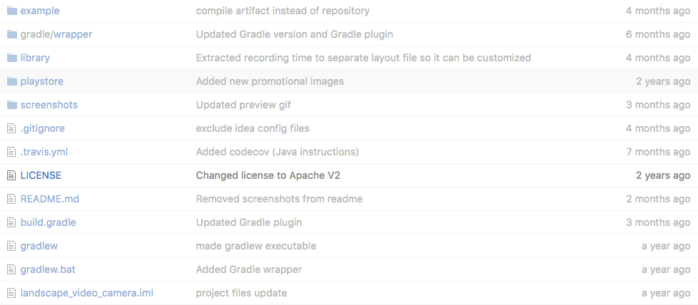
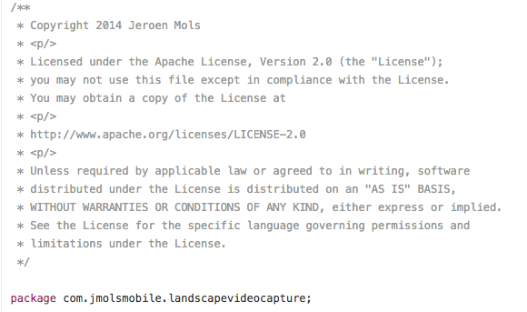
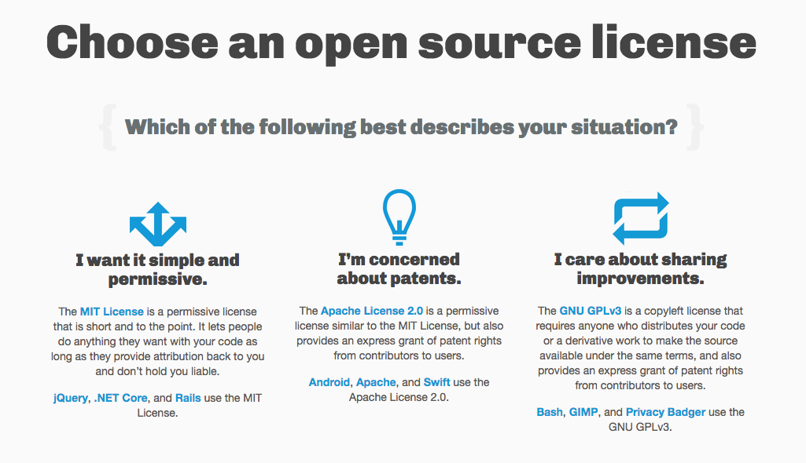
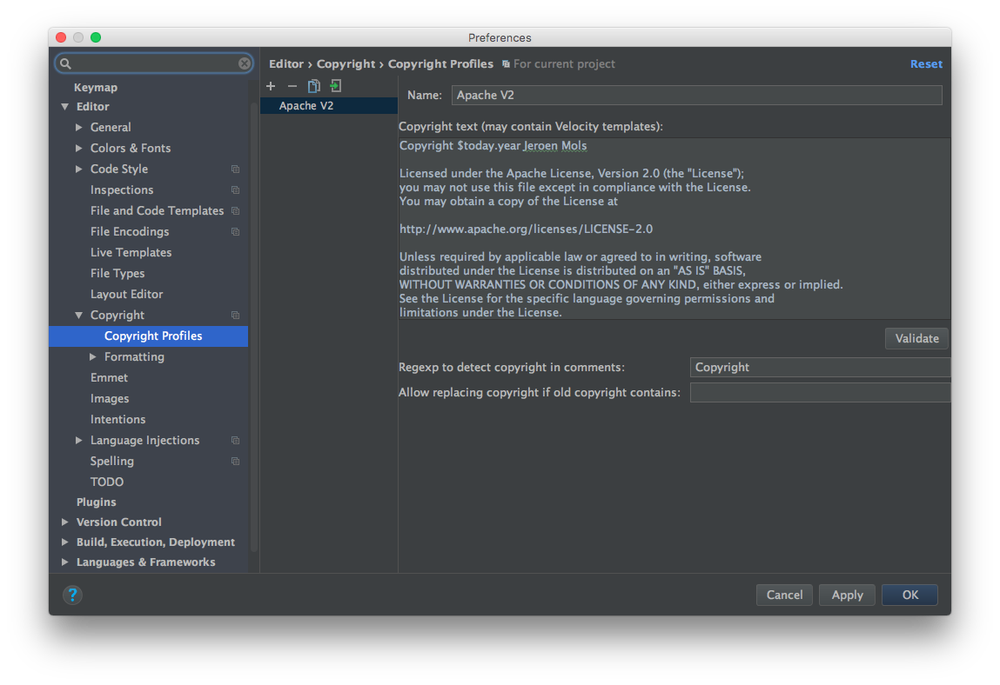
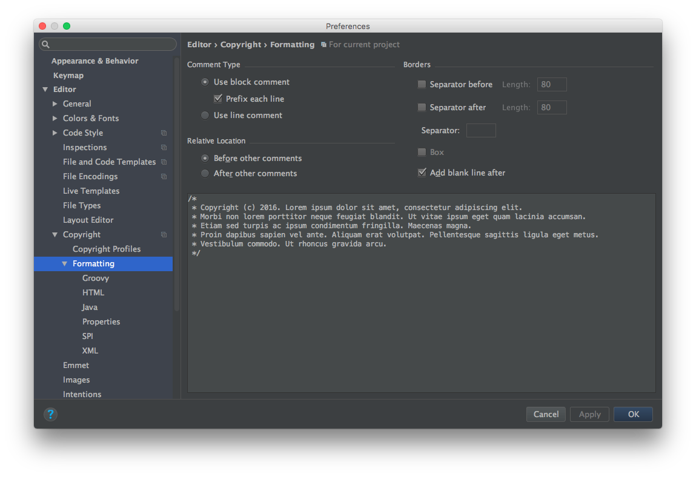
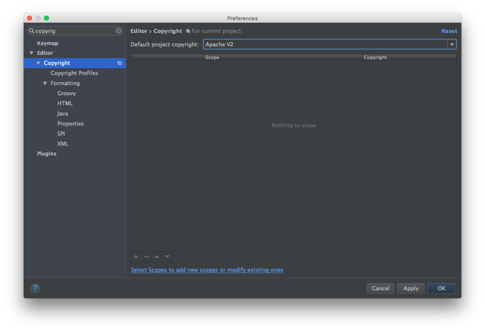
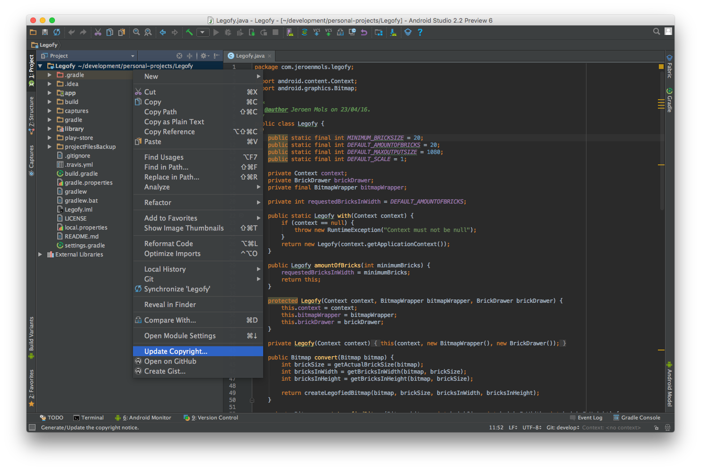
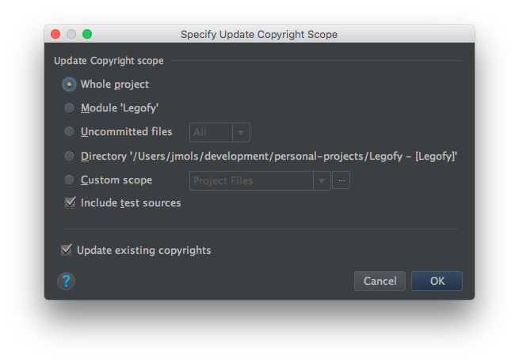
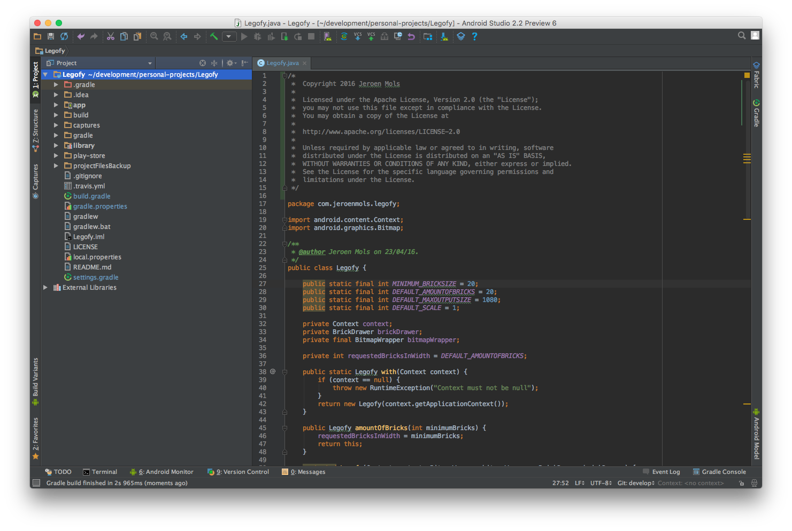

As die hard Android developers, copyright notices are usually not on top of our priority list. Yet large corporations always insist to add a copyright header. Why do they do that? Should you do that for your open source libraries?

This blog post will explain what copyright is and why it's so important. Further it'll also show how to easily add/update copyright notices to your code base.


## Intro to copyrights
According to wikipedia, copyright is:

> ...a legal right created by the law of a country that grants the creator of an original work exclusive rights for its use and distribution

Simplified this means that when you create something "original", people cannot simply use or copy that without your explicit permission.

This applies to art forms such as: literary works, music compositions, photographs,... and the highest art form of all: computer software!

Hence every line of code you write is - besides a true piece of art - protected by copyright for the rest of your life. No action is needed to acquire this right, it's implicitly granted on creation.

Now obviously this is highly simplified and there are important exceptions, most notably "[the right of quotation](https://en.wikipedia.org/wiki/Right_to_quote)". But it's fair to state that anything you blog or code in your time is falls under copyright protection.

> **What with the software I write for my employer?**<br> All copyrights explicitly belong to your employer, unless you explicitly agree to other terms in your contact.


## Licenses
A software license is a "contract" that allows others from using your code. Restrictions may apply on how "it can be used" and explicit terms may be imposed prior to using it.

### Creating code
All code you write is by default copyright protected, even when not enforced by an explicit license. Therefore others are not allowed to use it, even if you make it [publicly available](https://help.github.com/articles/open-source-licensing/) on GitHub!

> ...the absence of a license means that the default copyright laws apply. This means that nobody else may reproduce, distribute, or create derivative works from your work.

Therefore it is utterly important to explicitly state a license, otherwise all open source code you write is... well... useless.

To apply a license, simply distribute a license together with your source code e.g by putting a `LICENSE` file at the root of my repository. Further it is also a good idea to add a copyright notice on top of every file to avoid any confusion.

This is how I did it in the my library [LandscapeVideoCamera](https://github.com/JeroenMols/LandscapeVideoCamera).



And at the top of every file:




### Using code
There is a common misconception that open source equals free to use. In reality however, even seemingly innocent open source communities will take legal action if you infringe on their license. Hence care must be taken to comply with the license of all code you use.

Complying to a license can range from:

- Making all your code open source
- Only non commercial use
- Acknowledging the author
- ...

Do carefully review the license of every piece of software you use and make sure you satisfy all of its terms.

Should that not be acceptable for your use case, you can always contact the author and request him/her to purchase the same software under an alternative license.


### Understanding licenses
As you're likely not a legal ninja, you must be wondering:

- How do I pick the right license for my project?
- Given a license, where can I find its terms/restrictions?

Well there is a great website explaining the ins and outs of various licenses: [choosealicense.com](http://choosealicense.com/).



Obviously if you work for a larger corporation like me, you should also involve your legal department.


## Adding/Updating licenses to your code
Fortunately Android studio can completely handle all hassle of adding copyright notices for you. It can even update existing notices should you decide to move to a different license or simply update the year.

First of all go to "Preferences > Editor > Copyright > Copyright profiles" and press the plus icon to add a new profile. Give it a meaningful name and fill in your copyright notice.


```
Copyright $today.year Jeroen Mols

Licensed under the Apache License, Version 2.0 (the "License");
you may not use this file except in compliance with the License.
You may obtain a copy of the License at

http://www.apache.org/licenses/LICENSE-2.0

Unless required by applicable law or agreed to in writing, software
distributed under the License is distributed on an "AS IS" BASIS,
WITHOUT WARRANTIES OR CONDITIONS OF ANY KIND, either express or implied.
See the License for the specific language governing permissions and
limitations under the License.
```



Note that you can use the flag `$today.year` to denote the current year.

Optionally, the formatting pane allows you to tweak the copyright notice for every file type (Java, Xml, Groovy,...)



Now select the "default project copyright" in the main Copyright pane and you're fancy new copyright will be added to every new file you create.



To update or add the notice to all your existing files, simply right click any file in the project pane and select "Update copyright...".





That's it! You now have a one click way of ensuring your copyright notices are up to date.



## Wrap-up
Copyright is not something to mess around with and you can face cause serious legal consequences if you don't. Even your open source projects should have a proper copyright notice. Fortunately [choosealicense.com](http://choosealicense.com/) and Android Studio help you choose and apply the correct license.

As always you can reach me on [Mastodon](https://androiddev.social/@Jeroenmols), or leave a comment below!
