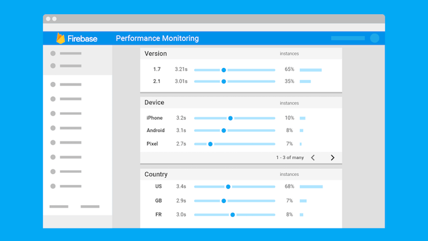

Being my 2nd year at Google IO, I decided to do things differently: Besides taking notes during sessions, I also created a personal todo list. This contains all new (and even old) technologies I got triggered to look into.

This post won't cover all big #io17 announcements, but instead tries to be an alternative, biased, inside scoop with my personal highlights.

## Architecture
The most exciting announcement for me is that Google finally becomes opinionated about architecture. This will dramatical lower the bar for starting developers. If you're already more seasoned however... well .. rules are meant to be broken.

My todo list:

* Read and get inspired by the new [architecture guide](https://developer.android.com/topic/libraries/architecture/guide.html)
* Learn how [LifecycleObservers](https://developer.android.com/topic/libraries/architecture/lifecycle.html#lco) can simplify our codebase
* Investigate if [ViewModels](https://developer.android.com/topic/libraries/architecture/viewmodel.html) are a better fit for our current state persistence
* Strip out all font code and replace it with [XML fonts](https://developer.android.com/preview/features/working-with-fonts.html#fonts-in-xml)
* Experiment with [downloadable fonts](https://developer.android.com/preview/features/downloadable-fonts.html)

Recommended videos:

* [Architecture components - introduction](https://www.youtube.com/watch?v=FrteWKKVyzI)
* [Architecture Components - Solving the Lifecycle Problem](https://www.youtube.com/watch?v=bEKNi1JOrNs)

## World class apps
Creating a globally awesome app can be quite challenging. Fortunately we now have some really interesting tools to help us out.

My todo list:

* Investigate automatic APK splits. Here the Play console will automatically split APKs to minimize their size. This requires you to opt-in to [Google play app signing](https://support.google.com/googleplay/android-developer/answer/7384423), which is permanent! (for security reasons)
* Get approval to migrate services to Firebase, which is really becoming the best set of developer tools
  * Migrate to Firebase analytics, that now supports [custom parameters for events](https://support.google.com/firebase/answer/7397304)
  * Replace crash reporting with Crashlytics (finally). That will become the default Firebase crash reporting since [Google acquired Fabric](https://fabric.io/blog/fabric-joins-google).
  * Integrate [Firebase performance monitoring](https://firebase.google.com/docs/perf-mon/) to automatically measures app performance. This gives you detailed statistics about startup, requests times,... and allows you to filter those by country, devices, versions,... all with zero effort!
  
* Look into [Android vitals](https://developer.android.com/topic/performance/vitals/index.html), a developer console feature to monitory overall app stability and performance.

Recommended videos:

* [Great app performance with Firebase](https://www.youtube.com/watch?v=HwFIxbCR4Hs)
* [Android performance: UI](https://www.youtube.com/watch?v=9HtTL_RO2wI)

Recommended posts:

* [I/O 2017: Everything new in the Google Play Console](https://android-developers.googleblog.com/2017/05/whats-new-in-google-play-at-io-2017.html)
* [What’s new from Firebase at Google I/O 2017](https://firebase.googleblog.com/2017/05/whats-new-from-firebase-at-google-io.html)
* [Introducing Firebase Performance Monitoring](https://firebase.googleblog.com/2017/05/introducing-firebase-performance.html?m=1)

## Build improvements
I'm definitely big on tooling and making builds cleaner and more efficient. Fortunately (and unsurprisingly) the tools team didn't disappoint this year.

My todo list:

* Migrate to the [Android Gradle 3.0 plugin](https://developer.android.com/studio/preview/features/new-android-plugin-migration.html), that includes some breaking changes to make building multi module projects faster.
* Use support libraries directly from the new Google Maven repository
    ```java
    allprojects {
        repositories {
            jcenter()
            maven { url 'https://maven.google.com' }
        }
    }
    ```
* Apply all [Gradle build speed up tips](https://developer.android.com/studio/build/optimize-your-build.html)
* Reduce APK size by explicitly defining supported languages (`resConfigs`)

Recommended videos:

* [Speeding Up Your Android Gradle Builds](https://www.youtube.com/watch?v=7ll-rkLCtyk)
* [What's New in Android Development Tools](https://www.youtube.com/watch?v=Hx_rwS1NTiI)

## Other
Besides the above themes, there are many more exciting areas to explore.

My todo list:

* Start a study group to [learn Kotlin](https://kotlinlang.org/docs/tutorials/koans.html). It's important to get the entire team up to speed with the basics, then defining a plan forward and start migrating.
* Add support for the super tall Galaxy S8 screen
    ```java
    <meta-data android:name="android.max_aspect" android:value="2.1" />
    ```
* Learn about [Android instant apps](https://developer.android.com/topic/instant-apps/overview.html)
* Watch [TDD on Android](https://www.youtube.com/watch?v=pK7W5npkhho) talk
* Get up to speed with Android O [notification channels](https://developer.android.com/preview/features/notification-channels.html), as you must use these when targeting Android O or your [notifications will be dropped](https://twitter.com/xgouchet/status/865223151243886592).
* Investigate what's needed to optimize apps for [autofill](https://developer.android.com/preview/features/autofill.html)

Recommended videos:

* [Introduction to Kotlin](https://www.youtube.com/watch?v=X1RVYt2QKQE)

## Wrap-up
It's always super inspiring to visit a conference, especially google IO. This year we got an impressive set of new developer tools/apis and I had the pleasure of meeting many interesting people. We're lucky to have such a vibrant community!

Do you like this format? Let me know in the comments below or on [Mastodon](https://androiddev.social/@Jeroenmols).
