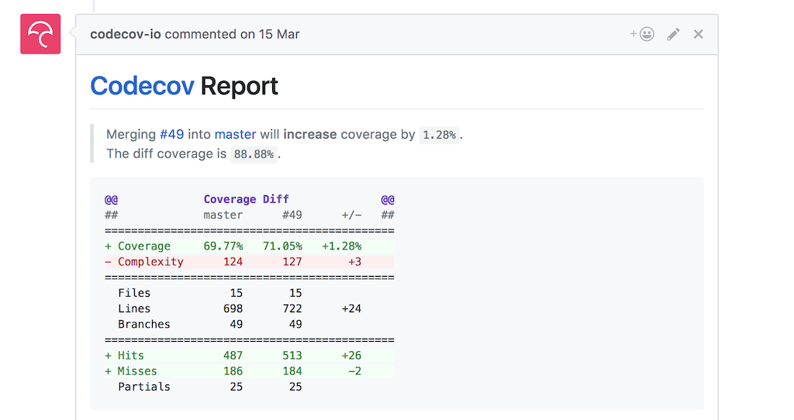

While you may be tempted to strive for 100% code coverage, that would be a horrible idea. Besides some code being hard to test, the concept of coverage is actually fundamentally limited.

This post will deep dive in what code coverage actually means, detail why you should never set coverage goals and help you get the most value out of this concept.

## App coverage
Take a step back and try to answer the following question:

> If your app has 100% code coverage, are you then sure everything will work as expected? (i.e. there are no bugs) Why/why not?

...

...

Well obviously no! Because even if all your classes have 100% coverage, that still doesn't mean they will correctly interact with each other.

For instance your JSON parser could get an unexpected response back from the web server. (Note that this is typically something you address with integration tests.)

## Class coverage
Let's narrow down the scope and look at one single very focussed class e.g. a Calculator class.

```java
public class Calculator {
  public int sum(int a, int b) {
    return a+b;
  }
}
```

> If one single focussed class has 100% code coverage, are you then sure everything will work as expected for that class? (i.e. there are no bugs) Why/why not?

...

...

Mmmmm trickier...

But the answer is still clearly no!

This is because code coverage doesn't tell you anything about the quality of your tests. It only counts what lines of code are executed during tests and what aren't.

A good Calculator test (with 100% line coverage) would be:

```java
@Test
public void sumOfOneAndThreeShouldBeFour() throws Exception {
  int result = new Calculator().sum(1,3);

  assertEquals(4, result)
}
```

But even the same test without assert would result in 100% line coverage:

```java
@Test
public void sumOfOneAndThreeShouldBeFourWithoutAssert() throws Exception {
  int result = new Calculator().sum(1,3);
}
```

That test is just plain useless! It doesn't prevent you from changing the implementation of `sum()` at all.

## Code coverage != quality of tests
So if we remove all asserts from our test suite, our code coverage would remain the same. Interesting... what else is broken with code coverage?

Even if you have asserts, code coverage doesn't guarantee that you've covered your functionality. For instance if we change our `Calculator` class and hardcode the result of the sum:

```java
public class Calculator {
  public int sum(int a, int b) {
    return 4;
  }
}
```

All above tests would still pass, code coverage would be 100% but your code doesn't functionally do what it should. We would need to add multiple tests (covering the same line of code) to guarantee that.

So coverage doesn't ensure your tests:

1. do an actual assert
2. are complete (cover all functionality)

## Use for coverage
Hopefully it is clear now that you should never use code coverage as a goal or KPI (key performance indicator). This is because the tool can too easily be fooled and 100% coverage is in that regard meaningless.

Even if coverage wouldn't be flawed, it still would be a mistake to try and get 100% coverage. While everything can be tested, not everything is easy to test!

Think about UI animations, communication between Threads, operations on filesystem,...


Trying to test complex things doesn't just take way to much effort. The resulting tests usually also tend to be so complex that they will end up being a maintenance burden. Wasted effort with hardly any value in return.

Well then, how should you use coverage?

> The real value is in the evolution of code coverage over time.

Assume the team is proficient in writing [high quality tests](https://jeroenmols.com/blog/2017/02/16/unittests/) and has the ambition to have everything well tested, then code coverage shouldn't decrease right?

Why not use it to identify parts of your app that should get some extra testing love?

Or how about automatically adding a coverage report to every pull request? This is something I do for all my [open source projects](https://github.com/JeroenMols/LandscapeVideoCamera/pull/49).



So the next time your boss asks you to have 100% code coverage, you know what to do:

1. generate all your tests using a [tool](https://plugins.jetbrains.com/plugin/8326-generate-tests)
2. claim your bonus
3. go back to doing proper engineering and empower yourself with coverage to build something your proud of.

## Wrap-up
Code coverage can be an incredibly powerful tool to improve the quality of your code as long as you don't blindly optimize for maximum coverage.

If you've made it this far you should probably follow me on [Mastodon](https://androiddev.social/@Jeroenmols). Feel free leave a comment below!
