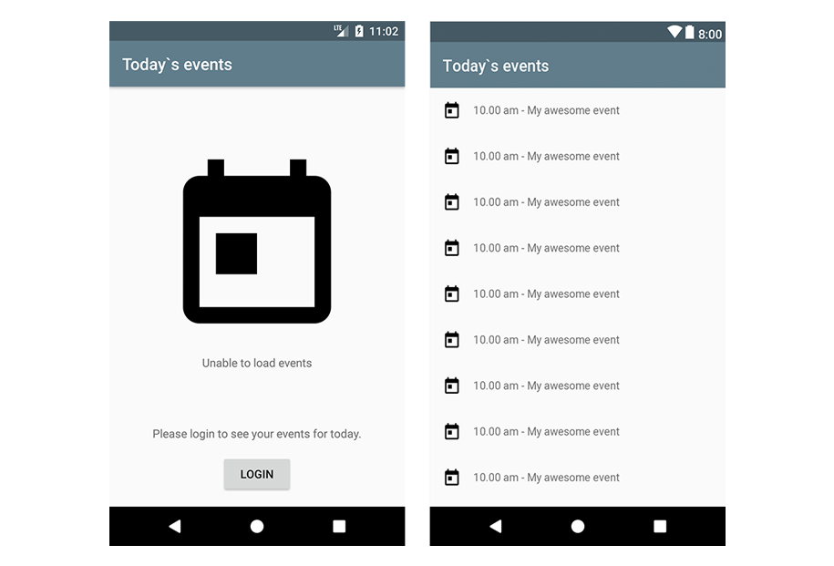
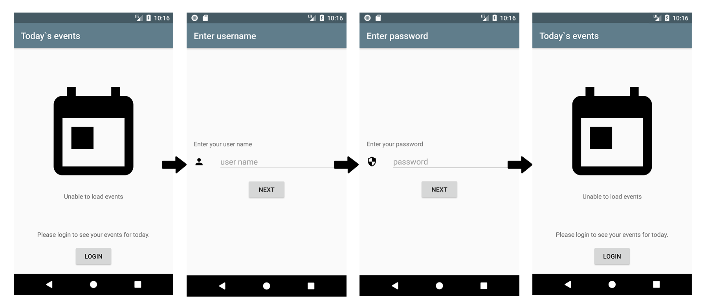
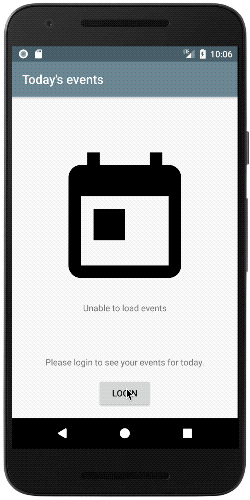
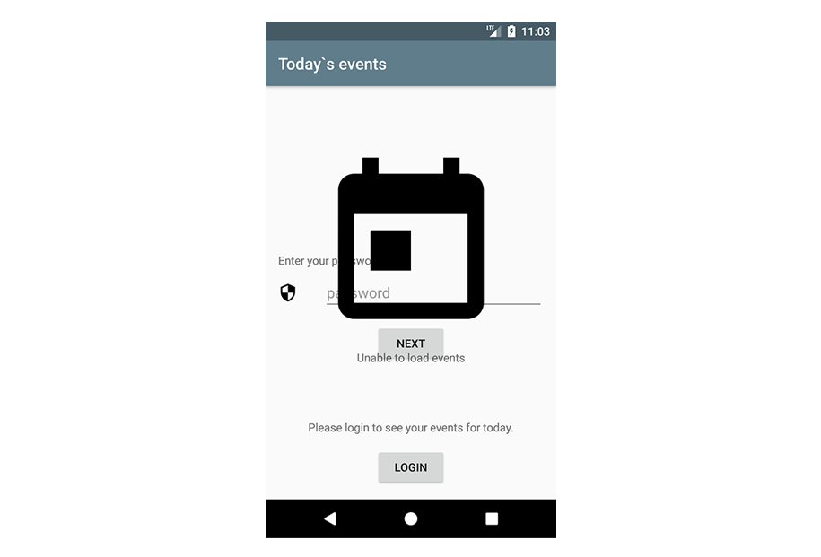

Do Fragment transactions and back navigation have no more secrets for you? Well then you should try to solve the mystery in this post, where a Fragment (literally) came to haunt us...

Seemingly simple Fragment transactions can sometimes have unintended side effects. While investigating, we'll learn how Fragment transactions actually work.

## Part 1: the haunt
Let's build a very straightforward app that shows all today's calendar events for a particular user. To do so, users will obviously have to log in first.

Assume now that the app consists out of a single screen that:

- either shows today's events if user is logged in
- otherwise shows a placeholder + login button



The login is a two-step flow that consists out of a `UserNameFragment` and a `PasswordFragment`. Afterwards, the app navigates back to the main screen to show the events.



Note that for simplicity we don't display the events when navigating back, but instead show the placeholder screen again after successful login.

A simple implementation for all Fragment transactions could be:

```kotlin
transaction.replace(todayFragment)
transaction.replace(userNameFragment).addToBackStack(null)
transaction.replace(passwordFragment)
```

Notice that we only add the `UserNameFragment` to the back stack! This way one single back would always take the user back to the `TodayFragment`, making it super easy to navigate back when log in was successful.

```kotlin
fun onLoginSuccess() {
  activity.onBackPressed()
}
```

But that gives surprising results:



The `PasswordFragment` is back to haunt us!

## Part 2: investigative development
Let's have another look at the sequence of transactions that takes place:

```kotlin
transaction.replace(todayFragment)
transaction.replace(userNameFragment).addToBackStack(null)
transaction.replace(passwordFragment)
```

Since a replace is just a combination of `remove()` and `add()` we can rewrite this to:

```kotlin
transaction.remove(null).add(todayFragment)
transaction.remove(todayFragment).add(userNameFragment).addToBackStack(null)
transaction.remove(userNameFragment).add(passwordFragment)
```

Now it is important to know that the FragmentTransactionManager only saves the FragmentTransactions that were executed, not the Fragments themselves!

Consequently, when you press back in the `PasswordFragment`, it won't show all Fragments that were present before the Transaction! Instead, it will revert the previous Transaction that was added to the back stack:

```kotlin
transaction.remove(todayFragment).add(userNameFragment).addToBackStack(null)
```

Which will then be executed in reverse:

```kotlin
transaction.remove(userNameFragment).add(todayFragment)
```

But because we are on the `PasswordFragment`, which has replaced the `UserNameFragment`, there is no `UserNameFragment` in this situation!

```kotlin
transaction.remove(null).add(todayFragment)
```

Hence nothing is removed and the `TodayFragment` is added leaving the users with both the `PasswordFragment` and `TodayFragment`.



## Part 3: mystery solved
As a first stab, you could say that this problem is caused by transaction three not being added to the back stack. So why not also add that transaction and do a double back.

```kotlin
transaction.replace(todayFragment)
transaction.replace(userNameFragment).addToBackStack(null))
transaction.replace(passwordFragment).addToBackStack(null))
```

```kotlin
fun onLoginSuccess() {
  activity.onBackPressed()
  activity.onBackPressed()
}
```

While simple, this actually won't work! After calling `onBackPressed()` the first time, the fragment will be detached from its activity, causing a `NullPointerException` on accessing the activity for the second back press.

But even if that would've worked, it would still be a poor idea because this way the `PasswordFragment` has hardcoded in it that it's preceded by exactly one Fragment. Should you ever change that, this would break.

Alternatively you could assign a tag to the first `addToBackStack` invocation and add every transaction to the back stack:

```kotlin
transaction.replace(todayFragment)
transaction.replace(userNameFragment).addToBackStack("username")
transaction.replace(passwordFragment).addToBackStack(null)
```

```kotlin
fun onLoginSuccess() {
  activity.supportFragmentManager.popBackStack("username", POP_BACK_STACK_INCLUSIVE)
}
```

That actually works! But unfortunately, the `PasswordFragment` still needs to know what the first screen of the login flow is... This won't just break easily, but it also makes it very complex to build dynamic login flows.

So what would be the clean way of setting it up?

Well actually... since all login screens together form a separate flow, why not just move them all to a single `LoginActivity`?

That has many advantages:

- Default way of reusing app parts on Android
- Screens in the flow don't know about each other
- Ability to pass back a result
- Better fits multi-module architectures
- Super simple back handling: `activity.finish()`
- ...

## Epilogue
Fragment transactions are a surprisingly simple concept of adding/removing and reversing those operations. When navigations become complex, consider moving parts of the flow to a separate activity.

If you've made it this far you should probably follow me on [Mastodon](https://androiddev.social/@Jeroenmols). Feel free leave a comment below or check out [the code](https://github.com/JeroenMols/FragmentBackNavigation) on GitHub!
