Struggling to navigate your code? Getting lost in deep inheritance hierarchies? Hard time figuring out relations between classes? Let's learn how to navigate code in Android Studio like a pro.

Being a skilled Android developer means getting the most out of the tools at your disposal. While there are plenty resources listing shortcuts, it's often hard to make sense and master those.

Therefore this series aims to be a practical guide with clear examples on how to better navigate and refactor code. It will effectively cover how I personally use Android Studio.

## TL;DR
I strongly suggest you look at the examples below, but a quick reference is always useful.

* `⌘ + O`: find class
* `⌘ + ⌥ + O`: find symbol
* `⌘ + ⇧ + O`: find file
* `⇧ + ⌘ + T`: go to/from test

* `⌘ + ⌥ + F7`: show usages
* `⌘ + U`: jump to superclass/defining method
* `⌘ + ⌥ + B`: jump to subclass/overridden method
* `^ + H`: show class hierarchy

* `⌘ + F12`: show methods
* `⌘ + B`: go to declaration
* `F2`: next error/warning
* `⇧ + F2`: previous error/warning
* `⌘ + L`: go to line

* `⌘ + E`: show recent files
* `⌘ + [`: to previous code position
* `⌘ + ]`: to next code position
* `⌘ + ⇧ + backspace`: to last code edit

Windows equivalents can be found [here](https://developer.android.com/studio/intro/keyboard-shortcuts.html).

## Opening classes and files
Better than search everywhere is telling Android Studio what you are looking for:

* `⌘ + O`: a class
* `⌘ + ⌥ + O`: a symbol
* `⌘ + ⇧ + O`: a file

This makes search a lot faster and returns fewer, more relevant results!

Searched for classes but needed a file? Just hit `⌘ + ⇧ + O` while open to dynamically swap between modes. You can even use [Camel Casing](https://en.wikipedia.org/wiki/Camel_case) to quickly find `AlbumActivityTest` by typing `AlAT` or directly jump to a line number by adding `:`.

Already found the class you were looking for, but quickly want to go to the test? Go to the class declaration and use `⇧ + ⌘ + T`. It even suggests to create a new test and also works from the test.

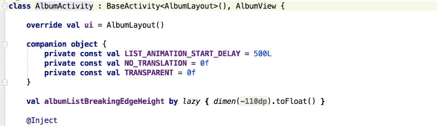

## Relationships between classes
If you want to figure out where a class is being used? `⌘ + ⌥ + F7` shows it in a handy pop over. Note that you can show the same info in the find tab using `⌘ + F7` for a more static view.

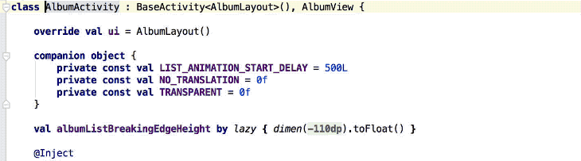

Inheritance hierarchies are typically easy to get lost in.

Did you know you can use `⌘ + U` to jump to the super class or `⌘ + ⌥ + B` to go to a sub class? It even works for method overrides!

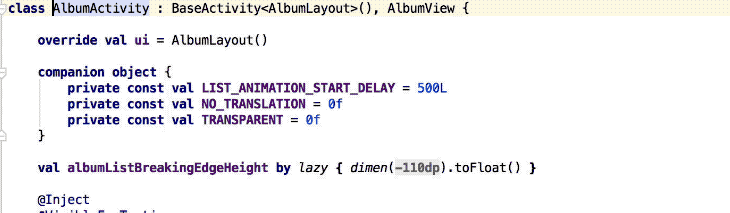

Finally, `^ + H` dumps out the entire class hierarchy in a handy overview.

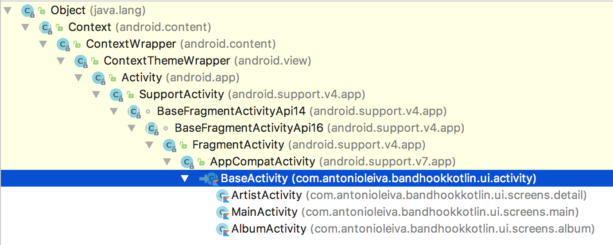

## Structure of classes
Use `⌘ + F12` to show all methods and properties of a class. Like any other view in Android Studio, even this one is searchable.

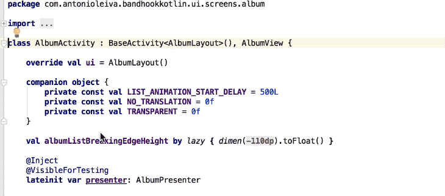

Come across a member in code? With `⌘ + B` you can immediately jump to where it is defined. Tapping `⌘ + B` a second time shows you where it is used.

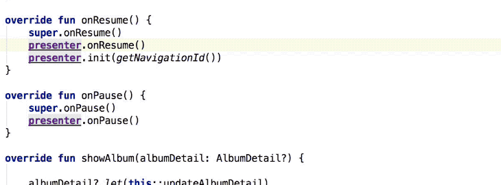

Be it a failing build due to multiple errors, or you scroll away from broken code under development. Compilation errors are common and can be hard to navigate to.

Using `F2` and `⇧ + F2`, however, will let you jump back and forth between all errors in a file. If there are none, those keys will do the same for all warnings.

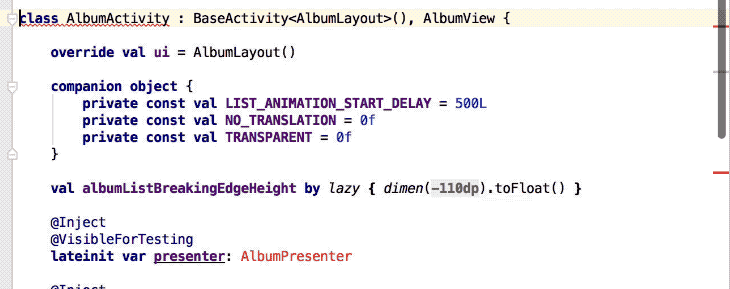

Know the exact line number? Then `⌘ + L` is the shortcut for you.

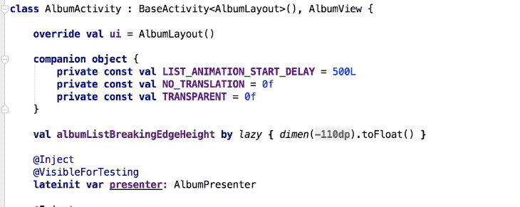

## History
With all these new code navigation superpowers, there is one critical element missing: how do you find your way back to where you started?

One of the well-known options is to use `⌘ + E` to list your recently opened files.

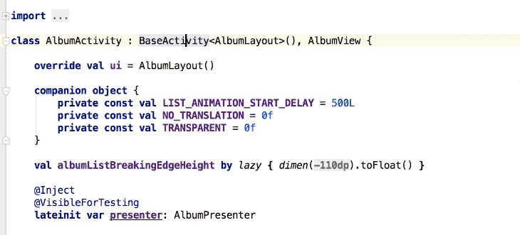

However, when clicking through code you can also use `⌘ + [` and `⌘ + ]` to take a step back or forth respectively.

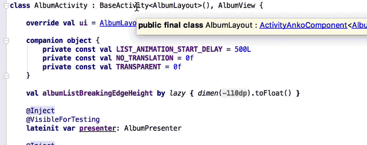

And finally, if you just want to continue coding where you left off, use `⌘ + ⇧ + backspace` to jump to where you made the last code edit.

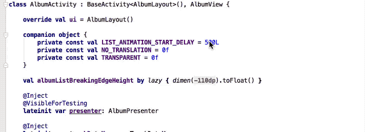

> If you've made it this far you should probably follow me on [Mastodon](https://androiddev.social/@Jeroenmols).

## Wrap up
This was part one of my series to get the most out of Android Studio, feel free to continue reading [the second part]({{ site.baseurl }}).

If you've made it this far you should probably follow me on [Mastodon](https://androiddev.social/@Jeroenmols). Feel free leave a comment below!

Special thanks to Antonio Leiva, all gifs are made with code from his open source project [Bandhook](https://github.com/antoniolg/Bandhook-Kotlin).
