Refactoring can be tedious and easily introduce bugs. The main reason for this is the number of manual steps involved: rename, move, copy-paste,... So wouldn't it make sense to automate this and have Android Studio do all the work for you?

This post will zoom in on the most useful refactoring options of Android Studio. Enabling you to refactor more confidently, introduce fewer bugs and increase overall quality as also variables, documentation, etc. will be updated.

## TL;DR
I strongly suggest you look at the examples below, but a quick reference is always useful.

* `⌘ + D`: duplicate line
* `⌘ + backspace`: delete line
* `⌘ + ↑`: move line up
* `⌘ + ↓`: move line down
* `⇧ + ⌘ + ↑`: move method up
* `⇧ + ⌘ + ↓`: move method down

* `⇧ + F6`: rename
* `⌘ + F6`: change method signature
* `F6`: move

* `⌥ + ⌘ + V`: extract variable
* `⌥ + ⌘ + M`: extract method
* `⌥ + ⌘ + P`: extract method parameter
* `⌥ + ⌘ + F`: extract property (or field)
* `⌥ + ⌘ + C`: extract constant (java only)
* `⌥ + ⌘ + N`: inline
* `^ + T`: open refactoring menu

* `⌥ + enter`: quick fix

Windows equivalents can be found [here](https://developer.android.com/studio/intro/keyboard-shortcuts.html).


## Code manipulation
In order to speed up development, you want to reduce the amount of typing to a minimum. While autocomplete definitely helps, sometimes it's faster to directly manipulate lines:

* `⌘ + D`: duplicate line
* `⌘ + backspace`: delete line

These shortcuts will work regardless of the cursor position in the line.

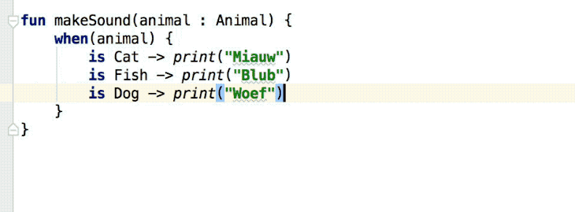

After duplicating you can simply move code up/down by using `⌘ + ↑` and `⌘ + ↓` for lines, or `⇧ + ⌘ + ↑` and `⇧ + ⌘ + ↓` for methods.


Both combined provide a powerful way of extending code: you duplicate a line, edit it and move it to its location.

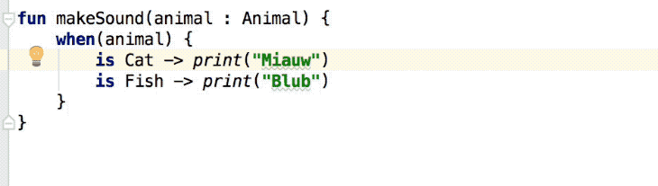


## Rename, update and move
Renaming classes is very involved: rename class definition, rename the file and update all references and documentation. Fortunately `⇧ + F6` does all of that for you.

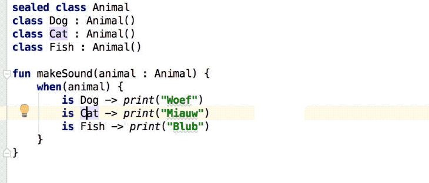

This doesn't just work for classes, but also for methods, variables, fields,...

Similarly `⌘ + F6` allows you to update the signature of a method. This is especially useful to add, remove or reorder new parameters to the method definition.

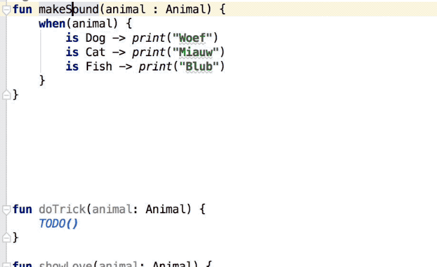

Note how you can specify a default value so all existing method consumers will be updated by Android Studio! Use `⌘ + ↑` and `⌘ + ↓` to quickly reorder parameters.

Finally, you can move classes to their own file or to another package using `F6`. This works for all top-level declarations and Java static methods/constants.

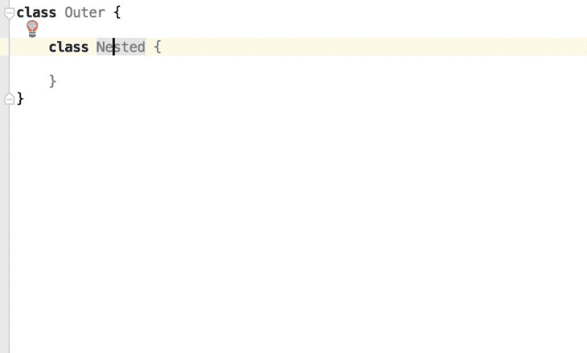

## Refactoring
To clean up code it is often handy to convert values into variables with a meaningful name. This is easy using `⌥ + ⌘ + V`.

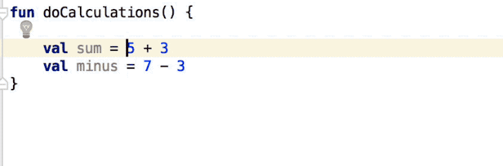

Note that you can either replace one or all occurrences.

Similarly, you can extract code into a method with `⌥ + ⌘ + M` and give it an easy to understand name.

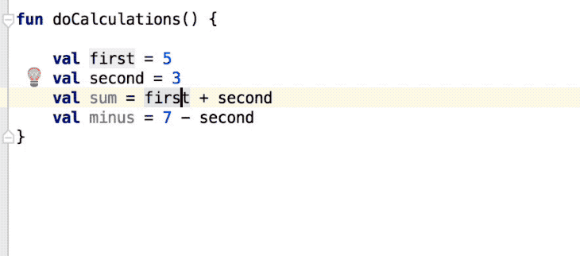

You can even convert a variable to a parameter that is injected into the method using `⌥ + ⌘ + P`.

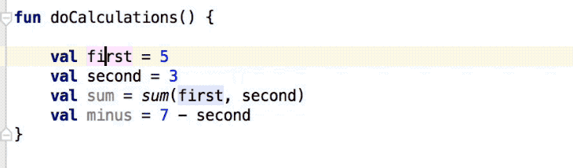

If this makes another parameter obsolete, then it will be automatically removed from the method signature.

Same holds true to create properties, by using `⌥ + ⌘ + F`.

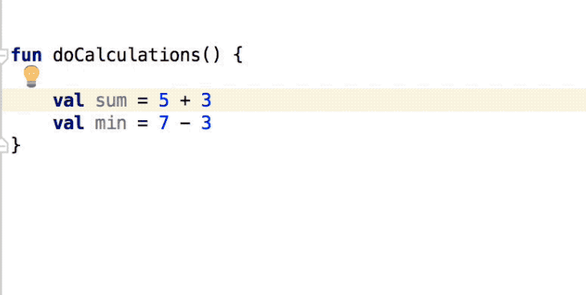

Note that for Java you can also use `⌥ + ⌘ + C` to extract a static final field. This isn't available for Kotlin however.

Besides extracting, you can also do the inverse operation: inlining `⌥ + ⌘ + N`. This is available for almost everything you can extract: methods, variables, properties,...

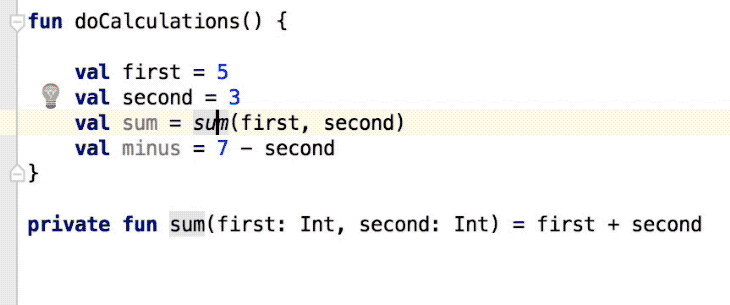

Inlining gives you the option to inline it only in one place or everywhere. Plus you can optionally still keep the inlined variable or method.

While the above refactorings are the most commonly used ones, Android Studio actually offers quite a lot more if you press `^ + T`:

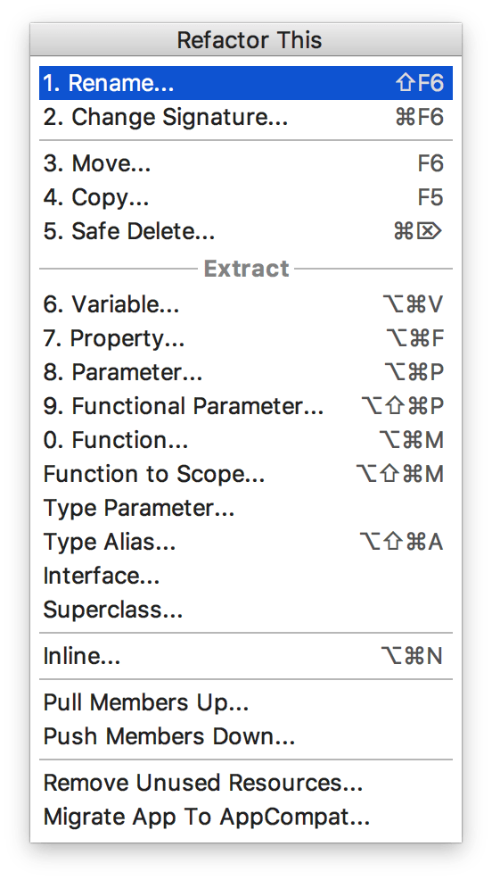

I strongly encourage you to experiment with these and learn how they work. Good knowledge of these can dramatically speed up your development and reduce mistakes.

## Android studio quick fixes
With `⌥ + enter` Android Studio is able to quickly fix a number of common issues: add imports, remove unused method, remove unused parameter, restrict access modifiers,...


This quick fix option is significantly more powerful than you might think. Have a look at the function below:

```kotlin
fun shouldFollowAuthorOnTwitter(isBadBlogPost: Boolean, hasReadArticle: Boolean): Boolean {
    val isBlogJeroen = true

    if (isBlogJeroen) {
        if (!isBadBlogPost && hasReadArticle) {
            return true
        }
    }
    return false
}
```

Not easy to understand, is it?

Let's now use Android Studio to simplify this complex code for us.

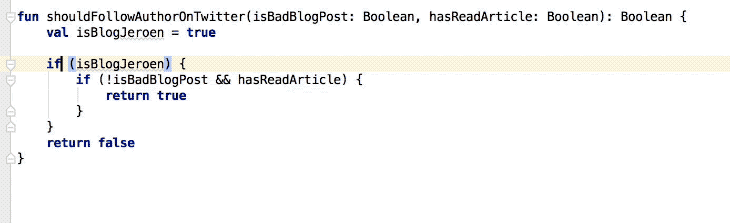

Pretty cool, no?

Even better: this procedure is 100% safe!!! This is because we've offloaded all correctness checks and code changes to our IDE.

> If you're interested in the next posts it's probably best to follow me on [Mastodon](https://androiddev.social/@Jeroenmols).

## Wrap up
Refactoring can be tedious and easily introduce bugs. Therefore we should automate as much as we can using Android Studio.

This was part two of my series to get the most out of Android Studio.

If you've made it this far you should probably follow me on [Mastodon](https://androiddev.social/@Jeroenmols). Feel free leave a comment below!
