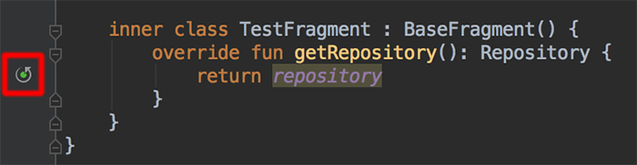

Java interop is one of the best features of the Kotlin language, yet sometimes this also can cause unforeseen issues...

## Puzzle

> Disclaimer, the example below is a consequence of legacy code and only serves to demonstrate a Kotlin puzzler.

Have a look at the simple test class below. It subclasses the subject under test (`BaseFragment`) to inject a mocked `Repository` that is used by the `getDataOperation()` method in the test.

```kotlin
class BaseFragmentTest {

    @get:Rule
    public val mockitoRule = MockitoJUnit.rule()

    @Mock
    lateinit var repository: Repository

    @Test
    fun `data should be as expected`() {
        val actual = TestFragment().getDataOperation()

        assertEquals(actual, "expected")
    }

    inner class TestFragment : BaseFragment() {
        override fun getRepository(): Repository {
            return repository
        }
    }
}

```

What do you think will happen we run the test?

...

Well...

...

```
java.lang.StackOverflowError
    at com.jeroenmols.BaseFragmentTest$TestFragment.getRepository(BaseFragmentTest.kt:26)
    at com.jeroenmols.BaseFragmentTest$TestFragment.getRepository(BaseFragmentTest.kt:26)
    at com.jeroenmols.BaseFragmentTest$TestFragment.getRepository(BaseFragmentTest.kt:26)
    at com.jeroenmols.BaseFragmentTest$TestFragment.getRepository(BaseFragmentTest.kt:26)
    at com.jeroenmols.BaseFragmentTest$TestFragment.getRepository(BaseFragmentTest.kt:26)
    at com.jeroenmols.BaseFragmentTest$TestFragment.getRepository(BaseFragmentTest.kt:26)
    at com.jeroenmols.BaseFragmentTest$TestFragment.getRepository(BaseFragmentTest.kt:26)
```

Wait, what???

This trace indicates that the line `return repository` (line 26) is called recursively... How is that even possible? That line just return a value, right?

Well...

# Explanation
This is actually a very interesting case of Java/Kotlin interop. Because a Kotlin property is compiled down to the following Java elements:

- a getter method with `get` prefix
- a setter method with `set` prefix
- a private field backing the property

Hence the `return repository` statement actually ends up executing `return getRepository()` and hence recursively calling itself!

Now the really interesting detail here is that this only happens when `BaseFragment` is a Java class! When converting the class to Kotlin this doesn't happen.

So let's have a look at the decompiled bytecode:

```kotlin
// Decompiled when BaseFragment in Java
public final class TestFragment extends BaseFragment {
   @NotNull
   public Repository getRepository() {
      return this.getRepository();
   }
}

// Decompiled when BaseFragment in Kotlin
public final class TestFragment extends BaseFragment {
   @NotNull
   public Repository getRepository() {
      return BaseFragmentTest.this.getRepository();
   }
}
```

Sure enough, the decompiled Java code recursively links to the `TestFragment` when `BaseFragment` is in java and properly links to the right method when `BaseFragment` is in Kotlin.

A simple way to fix this is to strongly refer the overridden method to point at the `BaseFragmentTest` class:

```kotlin
inner class TestFragment : BaseFragment() {
        override fun getRepository(): Repository {
            return this@BaseFragmentTest.repository
        }
    }
```

Fortunately Android Studio also warns you about recursion with an indicator:



## Wrap-up
This post indicates an interesting case where methods/properties get linked incorrectly when inheriting from a Java class in Kotlin. Fortunately, Android Studio and the decompiled bytecode clearly indicate what is going wrong.

If you've made it this far you should probably follow me on [Mastodon](https://androiddev.social/@Jeroenmols). Feel free leave a comment below!
