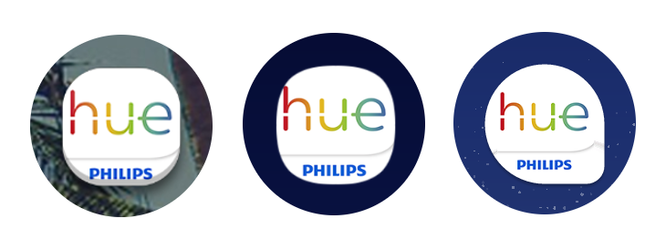

Your icon is one of the most important assets in your app. With a bit of luck, users might even put it on their main launcher screen!

As various Android launchers, versions or devices might resize/reshape your icon to make them look consistent, you'll need to be robust against this kind of changes. Learn how we did that at Philips Hue.

## Background
For various years, different device manufacturers have been reshaping icons to make them fit their custom skin of Android. Unfortunately, there wasn't a clear contract in place to do that reshaping, leading to some pretty bad results:



Shadows overlayed on top of the Philips wordmark, part of the Hue text cut off and a teardrop shape that looked really weird are just a few of the problems.

Fortunately, in Android O, adaptive icons came to the rescue to solve this problem.

## Icon design
Inspired by [this blog post from Nick Butcher](https://medium.com/google-design/designing-adaptive-icons-515af294c783), we wanted to create a depth effect in our icon. Wouldn't it be cool if our icon could change color just like our lights?

Hence we decided to use a gradient as the background layer:


Notice how the gradient gets lighter towards the top and darker towards the bottom. It also contains a darker shade of red on the left side and a darker shade of blue on the right.

The foreground of the icon, however, consists out of a static blue "Philips" word mark and a plain white background with "Hue" cut out from that:


Now when the icon will be dragged or pressed, the foreground will move independently of the background causing the "Hue" cutout to hover over different parts of the gradient. This creates a very nice effect where the Hue logo slightly changes colors!

## Implementation
In Android Studio, right-click your project and select "New > Image asset".


For the best scaling quality and minimal icon size, we use a vector asset as the foreground layer. This wasn't possible for the gradient though due to the complexity of that asset, so for that we use a webp background.

Notice how both "Hue" and "Philips" fit nicely within the safe zone indicated by the circle area. This is the zone that is guaranteed to be always displayed and never cut off.

Make sure to also generate a round icon for Android N and plain image assets for older Android versions. Click next and review the assets being generated, and finish to complete the icon creation.

You'll see that in `mipmap-anydpi-v26` two resources get generated `ic_launcher.xml` and `ic_launcher_round.xml`. Both these files simply indicate what resource to use for the icon foreground and background:

```xml
<?xml version="1.0" encoding="utf-8"?>
<adaptive-icon xmlns:android="http://schemas.android.com/apk/res/android">
    <background android:drawable="@mipmap/ic_launcher_background"/>
    <foreground android:drawable="@drawable/ic_launcher_foreground"/>
</adaptive-icon>
```

In the Android manifest you simply reference both resources in order to use them:

```xml
<application
       ...
       android:icon="@mipmap/ic_launcher"
       android:roundIcon="@mipmap/ic_launcher_round">
```

> Note: `ic_launcher_round.xml` got introduced with the launch of the Google Pixel (Android N) and has since been replaced with the more powerful adaptive icon. <br /> However you can still provide a rounded icon to avoid that Android N devices show your square item in a round bounding box:


## End result
Bringing it all together, we now have an icon that not only adapts to any device launcher, but also has a nice subtle color effect on the Hue letters while moving.


Notice for instance how the letter "e" changes from green to blue while moving right.

## Wrap-up
The launcher icon is one of the most important assets of your app and therefore it is key to make it look perfect on any device. Adaptive icons make that possible and also allow you to add a nice little extra touch to your app.

If you've made it this far you should probably follow me on [Mastodon](https://androiddev.social/@Jeroenmols). Feel free to leave a comment below!
