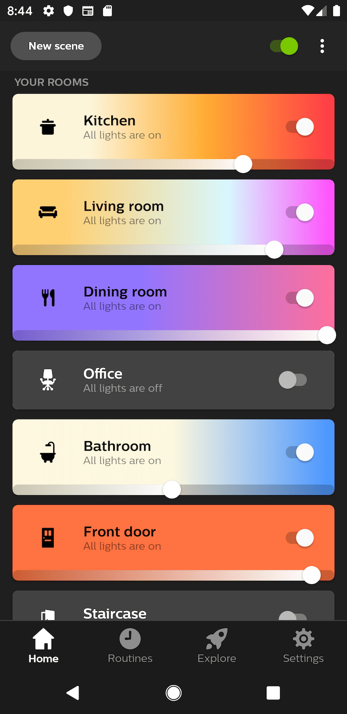
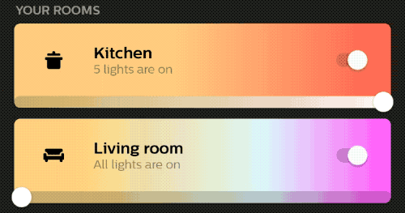
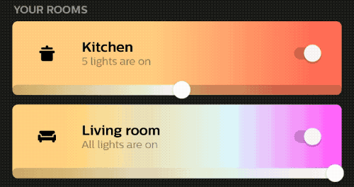
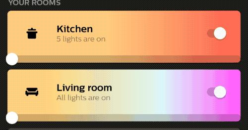

From Android Q onwards devices can now operate in a fully gestural system navigation mode. In that mode, there is no longer an on-screen back button, instead users can swipe from both edges to navigate back.

In this blog post, we'll look at a case study on how we added support for these back gestures in the Philips Hue app.

## Unique Challenge
At Philips Hue we've heavily optimized the information density so users can control the maximum amount of rooms/zones (cards) within one screen:

<center></center>

There are three main optimizations we made to allow the maximum amount of cards to fit:

1. The brightness slider is aligned with the bottom of the card
2. Card height is smaller when a room/zone is off
3. Brightness slider only responds to swiping the thumb, not clicking on a position in the slider. This is done to avoid confusion when clicking on the card to enter a room/zone.

Let's investigate how these created some unique challenges to prepare our app for Android Q gesture navigation.

## Edge to edge Brightness sliders
To start, as the cards go nearly edge to edge, moving the bottom aligned brightness slider isn't possible when the thumb is near the min or max. Instead, the back gesture is triggered:



Fortunately, Android Q offers a way to tell the Android system that it shouldn't intercept gestures in a particular area of the screen using [`setSystemGestureExclusionRects`](https://developer.android.com/reference/android/view/View#setSystemGestureExclusionRects(java.util.List%3Candroid.graphics.Rect%3E)):

```kotlin
brightnessSlider.doOnLayout {
    val exclusions = listOf(
            Rect(0, 0, exclusionWidth, it.height), // min area
            Rect(it.width - exclusionWidth, 0, it.width, it.height) // max area
        )
    ViewCompat.setSystemGestureExclusionRects(brightnessSlider, exclusions)
}
```

In the example above, we exclude both the minimum and maximum area of the brightness slider from navigation gestures.

Important to know is that you should define the `systemGestureExclusionRects` in coordinates relative to the `View`/`ViewGroup` you are applying the exclusion `Rects` on!

In the example above we apply them on the brightness slider so we use coordinates relative to the slider (notice the use of `width` and `height`). But we can also apply the exclusion to the parent (notice the use of `left` and `right`):

```kotlin
parent.doOnLayout {
    val exclusions = with(brightnessSlider) {
      listOf(
            Rect(left, top, exclusionWidth, bottom), // min area
            Rect(right - exclusionWidth, top, right, bottom) // max area
        )
    }
    ViewCompat.setSystemGestureExclusionRects(parent, exclusions)
}
```

At any rate, we can only apply the exclusion `Rects` once the view is laid out, hence we wrap the `setSystemGestureExclusionRects` with the awesome [`doOnLayout` method](https://developer.android.com/reference/kotlin/androidx/core/view/package-summary#doonlayout) from Android KTX.

To get the width of the exclusion area `exclusionWidth`, we should add an `OnApplyWindowInsetsListener` and ask the returned insets for the `getSystemGestureInsets`. There is one problem though: this listener is only called when the edge to edge system UI flags (`View.SYSTEM_UI_FLAG_LAYOUT_FULLSCREEN`) are set!

So as an alternative we can take the `WindowInsets` from the root view, which can easily be done in the following way:

```kotlin
seekbar.doOnAttach {
    val insets = WindowInsetsCompat.wrap(view.rootWindowInsets)
    val minExclusionWidth = insets.systemGestureInsets.left
    val maxExclusionWidth = insets.systemGestureInsets.right

    applySystemGestureExclusionRects(minExclusionWidth, maxExclusionWidth)
}
```

> Note that [`doOnAttach`](https://android-review.googlesource.com/c/platform/frameworks/support/+/983823/) and [`WindowInsetsCompat.wrap()`]() have yet to be released in an upcoming support library

Finally, note that you need to use at least androidx.core version 1.2.0 or higher in order for the [ViewCompat `setSystemGestureExclusionRects` API](https://developer.android.com/reference/androidx/core/view/ViewCompat#setSystemGestureExclusionRects(android.view.View,%2520java.util.List%3Candroid.graphics.Rect%3E))) to be available. If you're not ready to jump on 1.2.0 yet, you can always surround it with an API level check (make sure to use compile SDK Q).

```kotlin
if (Build.VERSION.SDK_INT >= Q) {
    val exclusions = with(brightnessSlider) {
        listOf(
            Rect(0, 0, exclusionWidth, height),
            Rect(width - exclusionWidth, 0, width, height)
        )
    }
    brightnessSlider.setSystemGestureExclusionRects(exclusions)
}
```

## Exclusion limitations
Android Q will only excluding a maximum of 200dp from each edge from back navigation (effective from Q beta 6 onwards). Otherwise, apps could exclude both full edges and completely break the back navigation.

Unfortunately, this creates a problem for us as our screen can show up to 8 cards at any given point in time. Hence we would require almost double the allowed maximum assuming our brightness slider has a 48dp height!!!

Requesting too much area exclusion area will cause the topmost cards not to have any exclusion as Android grants the exclusions from bottom to top:

<script async class="speakerdeck-embed" data-slide="82" data-id="62721c9fa7ca493aad3dd38f978dacf9" data-ratio="1.77777777777778" src="//speakerdeck.com/assets/embed.js"></script>

So how do we solve this?

First of all, the thumb of the brightness slider can only be at one edge at any given point in time, so the very first thing we can do is only exclude a brightness slider edge when the thumb is there:

```kotlin
brightnessSlider.doOnLayout {
    if (isThumbNearMin()) {
        ViewCompat.setSystemGestureExclusionRects(it, getMinExclustionRect())
    } else if (isThumbNearMax()) {
        ViewCompat.setSystemGestureExclusionRects(it, getMaxExclusionRect())
    } else {
        ViewCompat.setSystemGestureExclusionRects(it, emptyList())
    }
}
```

This doesn't just improve the user experience (by supporting back gestures on most cards), but it also significantly reduces the likelihood that we request more than the max exclusion area. Only when more than 5 cards are at full brightness or minimum brightness we would still exceed!

Secondly, when cards are off (and the brightness slider is at 0 alpha), we also shouldn't ask for any exclusions of such a slider:

```
if (!switch.checked) {
    ViewCompat.setSystemGestureExclusionRects(brightnessSlider, emptyList())
}
```

The end result is pretty neat:



- When thumb is near max/min: you can swipe back from the opposite edge
- When thumb is not near max/min: you can swipe back from both edges

## Crosstalk with brightness sliders
Unfortunately, all isn't good just yet, because in very rare cases back navigation would still accidentally cause `onTouchEvent` of our custom brightness slider to also be called:



Imagine a user opening our app, lowering the brightness of a room and then navigating back just to see the brightness jumping back to 100% right before the app exits... infuriating!

To fix this we decided to detect whether a swipe gesture is being performed near the min/max of the brightness slider while the thumb isn't there. In that case, the system should handle the back gesture and we should ignore the touch:

```kotlin
private fun isTouchInterferingWithBackNavigation(touchX: Float): Boolean {
    if (Build.VERSION.SDK_INT < Q) return false

    val positionOnSlider = (getProgressForXPosition(touchX) - min).toFloat() / (max - min)
    val slideGestureNearMinNotOnThumb = positionOnSlider < 0.1f && !isThumbNearMin
    val slideGestureNearMaxNotOnThumb = positionOnSlider > 0.9f && !isThumbNearMax
    return slideGestureNearMinNotOnThumb || slideGestureNearMaxNotOnThumb
}
```

Ignoring the touch is as easy as just returning false in the `onTouchEvent` method:

```kotlin
when (ev.getAction() and MotionEvent.ACTION_MASK) {
    MotionEvent.ACTION_DOWN -> {
        if (isTouchInterferingWithBackNavigation(x)) {
            return false
        }
        ...
}
```

Note that this does impact the UX of our brightness slider as touch only works near the edges when the thumb is there. But this is a trade-off we made to avoid the thumb from accidentally jumping to the wrong position while navigating back.

Finally, we have the exact behavior we were looking for!

## Wrap-up
Android Q gesture navigation will impact how users interact with our apps. For most apps, this should work out of the box, but in rare cases, the system gesture exclusion API can help whitelist parts of your app where touch is required to work near the edges.

Follow me on [Mastodon](https://androiddev.social/@Jeroenmols) to get notified when I post more interesting content! Feel free to leave a comment below.
