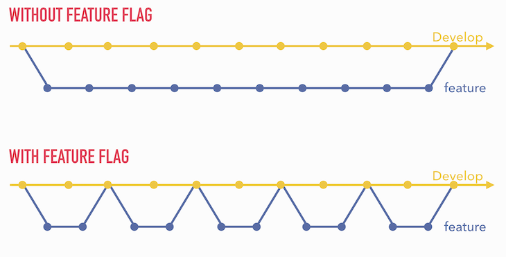
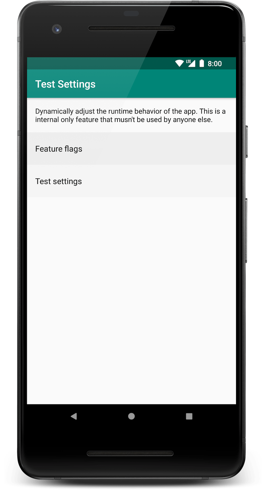

A key ingredient to speed up modern software development is feature flags. But what is a feature flag precisely? Why should you care about them? How do you integrate them into your codebase? And how can we make them easy to use?

This mini-series will explain the benefits of using feature flags and propose a handy architecture that enables local feature flag configuration, remote configuration, and easy testability.

## What is a feature flag
In essence, a feature flag is simply a `Boolean` that determines whether something is "on" or "of":

```kotlin
if (isFeatureOn) {
    // give access to something
} else {
    // prevent access to something
}
```

This "something" can be many things:

- a new user-facing feature in your app (e.g. enable dark theme)
- a non-user-facing feature (e.g. new analytics provider)
- a replacement for existing feature (e.g. rewrite of some screen)
- a refactoring of business logic (e.g. conversion of SQL to Room)
- ...

Basically, a feature flag decides whether a particular code path will be executed or not. As such it can make both very small (e.g. new button color) as very large things (e.g. new multi-screen feature) available to users. The mechanics are always the same.

There are two types of feature flags: static and dynamic.

A static feature flag gets hardcoded into the app at build time and hence you decide during compilation what will be "on" or "off". Because of its inflexibility at runtime, it's benefits are mostly limited to the development process itself.

A dynamic feature flag, on the other hand, can still be changed at runtime. This happens either via a secret settings screen in the debug variant or via a remote tool (e.g. [Firebase Remote Config](https://firebase.google.com/docs/remote-config)) when the app is in production. This enables some very interesting use cases such as gradual feature rollout and A/B testing.

Finally, note that feature flags don't affect the code that is bundled into your app binary! All they do is change the code path that is executed. This is in contrast to tools like [ProGuard](https://www.guardsquare.com/en/products/proguard) that can actually strip out parts of your code.

## Why use feature flags
The key benefit of using feature flags is that they decouple development from app releases. This means two things:

- features can be merged before they are fully implemented
- fully implemented features can remain hidden until you are ready to release them.

First and foremost, feature flags help developers because incomplete features can be merged! This allows to split a feature into many small increments and merge those branches one by one.



These smaller branches aren't just easier to review (fewer files), but they are also easier to merge. This is because their difference with master is small causing a lot less merge conflicts. When merging is painless, it will happen more often and hence development will speed up.

Secondly, feature flags also help with releasing. In the old days, an app release could get blocked when finding a last-minute issue on a new feature. Thanks to feature flags, this can no longer happen! If a feature isn't fully ready, it can just be temporarily disabled.

Even more, when a feature is ready to ship, you no longer have to do a big bang roll out to all users. Instead, you can gradually roll out and make a data-driven decision on to roll out further or maybe even roll back! That dramatically de-risks rolling out new features. At Philips Hue, we recently rewrote one of our most important screens and rolled it out over 10 days to make sure users weren't negatively impacted.

Also, there are commercial benefits: time-critical new features can be built ahead of time and only made available when you are ready to announce them. This was especially useful at Philips Hue where we need to time app launches together with new product introductions (e.g. a new lamp or accessory).

Finally, improvements to new features can be built side by side the old feature and using A/B tests you can then decide which feature should remain. This allows optimizing user engagement in your app.

> Benefits of feature flags:
> - speed up development by integrating incomplete features
> - allow releasing when a new feature is not yet ready
> - enable to derisk releases using gradual feature rollout
> - enable roll back when production issue found in feature
> - time the release of new features to the market
> - enable A/B testing

## Requirements of good feature flags
Now that we know that feature flags can be quite useful, let's take a minute and think about what we need to make feature flags work.

First and foremost: it must be incredibly easy to add a new feature flag. The easier that is, the more you will do it and the more you'll benefit from them. In the next posts, we'll see how we can define feature flags using one single line of code!

Next, we need to be able to toggle feature flags both locally and remotely. For developer (debug) builds, you want predictable, easy access to feature flags. Hence there should be some screen in the app where you can see the current state of all feature flags and toggle them. Ideally, this UI should even be auto-generated.

On the other hand, for production (release) builds, you want to be able to remotely toggle the feature flags. Hence they should also be remotely available, which is typically provided by a framework like [Firebase Remote Config](https://firebase.google.com/docs/remote-config).

In terms of feature flag values, we are going to restrict ourselves to just boolean flags. Having binary values keeps things simple, both from a development perspective as conceptually: something is either on or off. Using many feature flags can already be quite confusing with just binary values, let alone if strings or integers are allowed. This simplification also allows to elegantly generate the UI for our feature flags later on.

We do need more than just feature flags though! Apps typically also have a dynamic configuration that you only use in the debug build type: logging, leak canary, espresso idling resources, development backend, bypass onboarding, simulate a crash... All of these are "test settings" that facilitate testing or debugging your app. Wouldn't it be nice if you could also turn these on or off using a built-in UI?

<center></center>

Tests settings don't just ease development and testing, but they also reduce the need to build flavors. Instead of having a separate flavor for leak canary or logging or espresso idling resources or ... these now become a configuration that you can turn on or off on demand!

This allows having predictable debug builds that never behave differently due to a remote feature flag change (that would also cause test flakiness). And at the same time enables to turn the remote feature flagging on to actual test whether remote feature flags still work.

Contrary to feature flags, test settings are long-lived and are never shipped directly to users.

Finally, we should be able to easily toggle feature flags on/off in automated tests and we don't want to lock ourselves into a particular framework. So it should be easy to swap to a different remote feature flag tool later on.

> Wrapping it all up, feature flags should be:
> - very easy to add
> - locally and remotely available
> - binary in value
> - cater for both features and test settings
> - configurable for automated tests
> - agnostic of the used remote feature flag tool

## Wrap-up
Feature flags are an incredibly powerful tool to speed up development: they allow to merge incomplete features and derisk app release by allowing gradual rollouts. They should be incredibly easy to add, usable in automated tests and you should be able to toggle them remotely for production use and locally for development and testing.

Make sure you follow me on [Mastodon](https://androiddev.social/@Jeroenmols) and read on in [part 2]() that covers how you can use and release feature flags.
