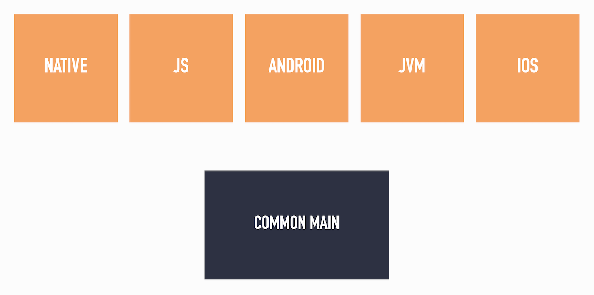

While Android supports most Java language features, it doesn't support every API that Java provides. On the other hand, Kotlin multiplatform only allows sharing code across all targets (commonMain), not a subset of targets (commonJvm).

Read on to learn how to share part of your code between Android and Java (Jvm), while still providing platform-specific implementations of some classes.

## Problem description
In a typical Kotlin multiplatform project, there is a `commonMain` `SourceSet` (blue) which defines both common code and `expected` code for specific `SourceSets` (orange):



Besides making use of the common code, the specific `SourceSets` also must provide `actual` implementations for the expected code.

While this mechanism works great, it doesn't allow to share code between specific `SourceSets`. Take for instance `Android` and `Jvm`, they have a lot of common API's but some (e.g. `Base64`) are different.

As such `Android` has defined its own `android.util.Base64` class which is different from the `Jvm` `java.util.Base64` class. (Though API level 26 and higher also support `java.util.Base64`)

So the challenge at hand is to share most `actual` implementations across `Android` and `Jvm`, but provide platform-specific implementations for some functions.

Visually speaking we would like to accomplish the following:


## Approach 1: New sourceset
Inspired by [an example](https://github.com/h0tk3y/k-new-mpp-samples/blob/master/split-actuals/build.gradle) from [Sergey Igushkin](https://twitter.com/h07k3y?lang=en), let's add a new sourceSet `commonJvmAndroid` that will have the shared `actual` implementations across `Android` and `Jvm`.

This requires the following:

1. create a new folder `commonJvmAndroid` under `src`
2. create a new `SourceSet` called `commonJvmAndroid`
3. make `androidMain` and `jvmMain` depend on this new `SourceSet`

And the resulting `build.gradle.kts` file will be:

```kotlin
kotlin {
  ...

  sourceSets {
    ...

    // Must be defined before androidMain and jvmMain
    val commonJvmAndroid = create("commonJvmAndroid") {
      dependsOn(commonMain)
    }

    val androidMain by getting {
      dependsOn(commonJvmAndroid)
      dependencies {
        ...
      }
    }

    val jvmMain by getting {
      dependsOn(commonJvmAndroid)
      dependencies {
        ...
      }
    }
  }
}
```

While this solution works great from the command line, Intellij autocomplete unfortunately doesn't work and all `Java` imports show up red.

I suspect this is because Intellij doesn't know what kind of `SourceSet` `commonJvmAndroid` is, whereas it can recognize the default multiplatform `SourceSets`.

## Approach 2: New srcDir
To ensure Intellij autocomplete works, a `srcDir` can be added to the existing `SourceSets`.

1. create a new folder `commonJvmAndroid` under `src`
2. add this new sourceSet to `androidMain` and `jvmMain`

And the resulting `build.gradle.kts` file will be:

```kotlin
kotlin {
  ...

  sourceSets {
    ...

    val androidMain by getting {
        kotlin.srcDir("src/commonJvmAndroid/kotlin")
        dependencies {
            ...
        }
    }

    val jvmMain by getting {
        kotlin.srcDir("src/commonJvmAndroid/kotlin")
        dependencies {
            ...
        }
    }
  }
}
```

Because there is no new sourceSet, Intellij will implicitly use the `Android` or `Jvm` one while browsing code in `commonAndroidJvm`, and hence autocomplete will work!

## Real-life example
Want a bigger example of this principle in action? Have a look at the awesome [PbandK](https://github.com/streem/pbandk) project, that provides a Kotlin code generator and runtime for Protocol Buffers. It is built to work across multiple Kotlin platforms.

In the [runtime module](https://github.com/streem/pbandk/tree/master/runtime), the [build.gradle.kts](https://github.com/streem/pbandk/blob/master/runtime/build.gradle.kts) adds the extra `srcDir` to `androidMain`/`jvmMain` and the [src directory](https://github.com/streem/pbandk/tree/master/runtime/src) has the shared code in a `commonAndroidJvm` folder.

## Wrap-up
While `Android` and `Jvm` projects share most APIs, not every `Java` API is available on Android. To share a subset of code across both platforms, it's best to use a shared `srcDir` so Intellij autocomplete works as expected.

If you've made it this far you should probably follow me on [Mastodon](https://androiddev.social/@Jeroenmols). Feel free to leave a comment below!
