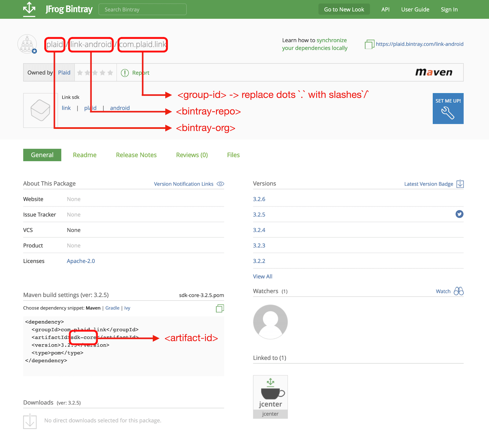

With JCenter shutting down, many are migrating to Maven Central. And while there are many posts on how to publish new artifacts, also all existing artifacts should be migrated away from JCenter.

This post will cover all steps required to migrate artifacts from JCenter to Maven Central. It will present a script to automatically perform such a migration so that it can be run on a CI and have the secrets injected.

## Required before you start
To migrate an existing project to Maven Central involves two steps:

1. Update (Gradle) scripts to publish to Maven Central
2. Migrate all existing artifacts from JCenter to Maven Central

This post will only cover the second step and hence assumes that the reader has a [Sonatype account](https://issues.sonatype.org/secure/Dashboard.jspa) and GPG key available.

If you don't have these yet, have a look at [this great post](https://getstream.io/blog/publishing-libraries-to-mavencentral-2021/) by [Márton Braun](https://twitter.com/zsmb13). It will also explain the required steps to make artifacts available after uploading on the Sonatype backend.

## Migration steps
These are the steps to migrate from JCenter to Maven Central:

1. [Enumerate all versions to migrate](#1-enumerate-all-versions-to-migrate)
2. [Configure GNU PG with a signing key](#2-configure-gnu-pg-with-a-signing-key)
3. [Setup credentials to upload to Maven Central](#3-setup-credentials-for-maven-central-upload)
4. For each existing version:
  - [Download the artifact from JCenter](#4a-download-artifacts)
  - [Add all missing info to `pom.xml`](#4b-add-all-missing-info-to-pomxml)
  - [Sign and upload the artifact to Maven Central](#4c-sign-and-upload-to-maven-central)

If you're impatient, feel free to [jump ahead to the full script](#bringing-it-all-together) below.

Though I encourage you to have a look at specific sections as your signing key may be in a different format, sections may be missing from your `pom.xml`,...

## 1. Enumerate all versions to migrate
To get all previously published versions from JCenter, navigate to the following url:

`https://dl.bintray.com/<bintray-org>/<bintray-repo>/<group-id-slash-separated>/<artifact-id>`

For the [Plaid Link Android SDK located](https://bintray.com/plaid/link-android/com.plaid.link):

- `<bintray-org>`: `plaid` - first part of url
- `<bintray-repo>`: `link-android` - second part of url
- `<group-id-slash-separated>`: `com.plaid.link` - group id with `.` replaced by `/`
- `<artifact-id>`: `sdk-core` - artifact id



Resulting in the [following url](https://dl.bintray.com/plaid/link-android/com/plaid/link/sdk-core):

```bash
BINTRAYURL=https://dl.bintray.com/plaid/link-android/com/plaid/link/sdk-core
```

From this, all versions can be copy-pasted in plain text and converted into a space-separated array. Either using a text editor or command line (OSX only):

```bash
pbpaste | tr '/' ' ' | tr -d '\n'
```

Now the versions can be used as an input variable for the script:

```bash
VERSIONS=(0.1.0 0.1.1 0.1.2 0.1.3 0.1.4 0.1.5 0.2.0 0.2.1 0.2.2 \
            0.3.0 0.3.1 0.3.2 0.3.3 0.3.4 0.3.5 0.3.6 1.0.0 1.0.1 \
            1.0.2 1.0.3 1.1.0 1.2.0 1.2.1 1.3.0 1.3.1 1.4.0 1.4.1 \
            2.0.0 2.0.0-rc1 2.0.0-rc2 2.0.0-rc3 2.1.0 2.1.1 2.1.2 \
            2.2.0 3.0.0 3.0.1 3.1.0 3.1.1 3.2.0 3.2.0-rc1 3.2.0-rc2 \
            3.2.1 3.2.2 3.2.3 3.2.4)
```

Finally, keep this URL somewhere as we'll need it later on to download all artifacts.

## 2. Configure GNU PG with a signing key
To sign the artifacts, we'll use [GNU PG](https://gnupg.org/).

First, ensure GNU GPG is installed:

- OSX: `$ brew install gnupg`
- Docker: `$ RUN apk add gnupg`

Now your private key can be imported by:

```bash
gpg --import private.key
```

Or if you'll be running the script on your CI environment, you may want to inject a base64 encoded version of the private key:

```bash
# Export base64 key
gpg --export-secret-key --armor | base64

# Import base64 key
echo $BASE64_SIGNING_KEY | base64 -d | gpg --import
```

## 3. Setup credentials for Maven Central upload
To make sure Maven can access your Sonatype credentials, a `settings.xml` needs to be created in the `~/.m2` folder with the `username` and `password`.

First define a variable for `username` and `password`:

```bash
SONATYPE_USERNAME="<username_here>"
SONATYPE_PASSWORD="<password_here>"
```

Note that these shouldn't contain any characters that aren't compatible with xml. Hence we better xml encode them before using:

```bash
function xml_encode() {
  echo $1 | sed 's/&/\&amp;/g; s/</\&lt;/g; s/>/\&gt;/g; s/"/\&quot;/g; s/'"'"'/\&#39;/g'
}

SONATYPE_USERNAME=$(xml_encode "<username_here>")
SONATYPE_PASSWORD=$(xml_encode "<password_here>")
```

Next, make sure the `~/.m2` directory is created:

```
mkdir -p ~/.m2
```

And finally create the `settings.xml` file with the credentials:

```bash
echo "<settings xmlns=\"http://maven.apache.org/SETTINGS/1.0.0\" xmlns:xsi=\"http://www.w3.org/2001/XMLSchema-instance\"
  xsi:schemaLocation=\"http://maven.apache.org/SETTINGS/1.0.0 https://maven.apache.org/xsd/settings-1.0.0.xsd\">
  <servers>
    <server>
      <id>$MAVEN_CENTRAL_REPOID</id>
      <username>$SONATYPE_USERNAME</username>
      <password>$SONATYPE_PASSWORD</password>
    </server>
  </servers>
</settings>" > ~/.m2/settings.xml
```

## 4.a Download artifacts
First, define the output directory where the downloaded files will be placed.

```bash
OUTPUT_DIR="output"
```

Then for each version, create a new directory that will host the downloaded artifacts:

```bash
for v in ${VERSIONS[@]}; do
  mkdir -p $OUTPUT_DIR/$v
done
```

And finally, download all the artifacts using the base URL that we created in step 1:

```bash
for v in ${VERSIONS[@]}; do
  ...
  curl -L $BINTRAYURL/$v/$ARTIFACT_ID-$v.aar \
      -o $OUTPUT_DIR/$v/$ARTIFACT_ID-$v.aar
  curl -L $BINTRAYURL/$v/$ARTIFACT_ID-$v.pom \
      -o $OUTPUT_DIR/$v/$ARTIFACT_ID-$v.pom
done
```

This will represent a similar folder structure in the output directory as what is present in Maven.

> Note: if you deploy more artifacts (e.g. `javadoc.jar`), make sure to download them here. And when your artifact is a `.jar`, update the extension.

## 4.b Add all missing info to `pom.xml`
Maven Central has [more mandatory fields](https://central.sonatype.org/publish/requirements/#sufficient-metadata) for the `pom.xml` and hence the `pom.xml` files may need to be amended before uploading.

I had to add the following info:

- name
- description
- URL
- license
- developer
- organization
- SCM (link to source control)

To add the information above, let's replace an existing attribute in the `pom.xml` with a new XML snippet that contains all information. A good candidate to replace is the `<packaging>` attribute:

```shell
POM_PLACEHOLDER="<packaging>.*>"
```

This will be replaced with a new XML snippet that starts with the same attribute, but adds the other attributes to the `pom.xml`:

```bash
POM_REPLACEMENT="<packaging>aar</packaging>

  <name>name here</name>
  <description>description here</description>
  <url>url here</url>


  <licenses>
    <license>
      <name>license here</name>
      <url>url to license</url>
    </license>
  </licenses>

  <organization>
    <name>name here</name>
    <url>url here</url>
  </organization>

   <developers>
    <developer>
      <organization>name here</organization>
      <organizationUrl>url here</organizationUrl>
    </developer>
  </developers>

  <scm>
    <connection>url here</connection>
    <developerConnection>url here</developerConnection>
    <url>url here</url>
  </scm>
  "
```

> To learn what data to provide for each attribute, have a look a the [sonatype documentation](https://central.sonatype.org/publish/requirements/#sufficient-metadata)

> Note that your `pom.xml` might already have been defining some of these attributes, so you may not need to add all of these replacement attributes when migrating your project

Using `sed` we can replace the placeholder with the replacement text:

```bash
sed -e "s/$POM_PLACEHOLDER/$POM_REPLACEMENT_ESCAPED/g" \
  $OUTPUT_DIR/$v/$ARTIFACT_ID-$v.pom
```

Unfortunately, that doesn't work as all `/` in the replacement snippet need to be escaped or `sed` will consider them part of its command.

To fix this, preprocess the replacement snippet:

```bash
POM_REPLACEMENT_ESCAPED=$(echo "${POM_REPLACEMENT}" |\
    sed 's#/#\\/#g')
```

Almost there, but `sed` cannot handle multi-line replacements.

This can be solved by using `tr` to temporarily swap the `/n` characters with a unique character `@` and swapping it back after the replacement:

```bash
POM_REPLACEMENT_ESCAPED=$(echo "${POM_REPLACEMENT}" |\
    sed 's#/#\\/#g' | tr '\n' '@')
sed -e "s/$POM_PLACEHOLDER/$POM_REPLACEMENT_ESCAPED/g" \
    $OUTPUT_DIR/$v/$ARTIFACT_ID-$v.pom |\
     tr '@' '\n' > temp.txt
mv temp.txt $OUTPUT_DIR/$v/$ARTIFACT_ID-$v.pom
```

Notice how an intermediate file `temp.txt` is used to avoid reading and modifying the original file at the same time.

## 4.c Sign and upload to Maven Central
To sign and upload the artifacts to Maven Central, what better tool to use than Maven itself?

First, make sure Maven is installed:

- OSX: `$ brew install maven`
- Docker: `$ RUN apk add maven`

Then define the repository id and staging URL constants:

```bash
# Constants, no need to change these
MAVEN_CENTRAL_STAGINGURL="https://oss.sonatype.org/service/local/staging/deploy/maven2"
MAVEN_CENTRAL_REPOID="ossrh"
```

Finally, invoke Maven with the GPG sign and deploy plugin:

```bash
for v in ${VERSIONS[@]}; do
  ...
mvn gpg:sign-and-deploy-file \
   -Durl=$MAVEN_CENTRAL_STAGINGURL \
   -DrepositoryId=$MAVEN_CENTRAL_REPOID \
   -DpomFile=$OUTPUT_DIR/$v/$ARTIFACT_ID-$v.pom \
   -Dfile=$OUTPUT_DIR/$v/$ARTIFACT_ID-$v.aar
done
```

This will upload all your files to the staging environment on Maven Central.

> Note: If you want to upload additional artifacts (e.g. javadoc.jar), have a look at the [Sonatype documentation](https://central.sonatype.org/pages/manual-staging-bundle-creation-and-deployment.html).

After, login to Sonatype to close the repository from future uploads and promote all artifacts to release. This process is well described in the [your first release](https://getstream.io/blog/publishing-libraries-to-mavencentral-2021/#your-first-release) section by [Márton Braun](https://twitter.com/zsmb13)

## Bringing it all together
Combined this results in the following script, that takes all required secrets as input parameters so it can easily be run on a CI:

```bash
$ ./migrate_to_mavencentral.sh $BASE64_SIGNING_KEY $SONATYPE_USERNAME $SONATYPE_PASSWORD
```

And the full script (including `TODOs`!) [can be found on Github](https://github.com/JeroenMols/MigrateArtifactsMavenCentral):

```bash
#!/bin/bash
set -euo pipefail

# TODO: add versions e.g. (1.0.0 1.0.1 1.0.2)
VERSIONS=()
# TODO : add artifact Id
ARTIFACT_ID=""
# TODO: https://dl.bintray.com/<bintray-org>/<bintray-repo>/<group-id-slash-separated>/<artifact-id>
BINTRAYURL=""

# TODO: define placeholder and provide additional pom information (starting with placeholder!)
ARTIFACT_EXTENSTION="aar"
POM_PLACEHOLDER="<packaging>.*>"
POM_REPLACEMENT="<packaging>aar</packaging>

  <name>name here</name>
  <description>description here</description>
  <url>url here</url>


  <licenses>
    <license>
      <name>license here</name>
      <url>url to license</url>
    </license>
  </licenses>

  <organization>
    <name>name here</name>
    <url>url here</url>
  </organization>

   <developers>
    <developer>
      <organization>name here</organization>
      <organizationUrl>url here</organizationUrl>
    </developer>
  </developers>

  <scm>
    <connection>url here</connection>
    <developerConnection>url here</developerConnection>
    <url>url here</url>
  </scm>
  "

# Constants
MAVEN_CENTRAL_STAGINGURL="https://oss.sonatype.org/service/local/staging/deploy/maven2"
MAVEN_CENTRAL_REPOID="ossrh"
OUTPUT_DIR="output"

# Utilities
function escape_pom() {
  echo "$1" | sed 's#/#\\/#g' | tr '\n' '@'
}

function xml_encode() {
  echo $1 | sed 's/&/\&amp;/g; s/</\&lt;/g; s/>/\&gt;/g; s/"/\&quot;/g; s/'"'"'/\&#39;/g'
}


echo "Loading script input"
BASE64_SIGNING_KEY=$1
SONATYPE_USERNAME=$(xml_encode $2)
SONATYPE_PASSWORD=$(xml_encode $3)
echo $SONATYPE_PASSWORD
if [ -z "${BASE64_SIGNING_KEY}"  -o -z "${SONATYPE_USERNAME}" -o -z "${SONATYPE_PASSWORD}" ]; then
  echo "USAGE: migrate BASE64_SIGNING_KEY SONATYPE_USERNAME SONATYPE_PASSWORD"
  exit 1
fi


echo "Setup signing key"
echo $BASE64_SIGNING_KEY | base64 -d | gpg --import


echo "Setup Maven credentials"
mkdir -p ~/.m2
echo "<settings xmlns=\"http://maven.apache.org/SETTINGS/1.0.0\" xmlns:xsi=\"http://www.w3.org/2001/XMLSchema-instance\"
  xsi:schemaLocation=\"http://maven.apache.org/SETTINGS/1.0.0 https://maven.apache.org/xsd/settings-1.0.0.xsd\">
  <servers>
    <server>
      <id>$MAVEN_CENTRAL_REPOID</id>
      <username>$SONATYPE_USERNAME</username>
      <password>$SONATYPE_PASSWORD</password>
    </server>
  </servers>
</settings>" > ~/.m2/settings.xml


echo "Migrate artifacts"
for v in ${VERSIONS[@]}; do
  echo "Migrating version $v"
  mkdir -p $OUTPUT_DIR/$v
  curl -L $BINTRAYURL/$v/$ARTIFACT_ID-$v.$ARTIFACT_EXTENSTION \
      -o $OUTPUT_DIR/$v/$ARTIFACT_ID-$v.$ARTIFACT_EXTENSTION
  curl -L $BINTRAYURL/$v/$ARTIFACT_ID-$v.pom \
      -o $OUTPUT_DIR/$v/$ARTIFACT_ID-$v.pom

  # Add required metadata to pom.xml
  sed -e "s/$POM_PLACEHOLDER/$(escape_pom "$POM_REPLACEMENT")/g" \
      $OUTPUT_DIR/$v/$ARTIFACT_ID-$v.pom |\
      tr '@' '\n' > temp.txt
  mv temp.txt $OUTPUT_DIR/$v/$ARTIFACT_ID-$v.pom

  mvn gpg:sign-and-deploy-file \
     -Durl=$MAVEN_CENTRAL_STAGINGURL \
     -DrepositoryId=$MAVEN_CENTRAL_REPOID \
     -DpomFile=$OUTPUT_DIR/$v/$ARTIFACT_ID-$v.pom \
     -Dfile=$OUTPUT_DIR/$v/$ARTIFACT_ID-$v.$ARTIFACT_EXTENSTION
done
```

## Wrap-up
Migrating existing artifacts to Maven Central involves quite a few steps. Fortunately, the [open source script](https://github.com/JeroenMols/MigrateArtifactsMavenCentral) presented in this blogpost can help with downloading all artifacts, updating their `pom.xml`, signing them, and uploading them to Maven Central.

If you've made it this far you should probably follow me on [Mastodon](https://androiddev.social/@Jeroenmols). Feel free to leave a comment below!
