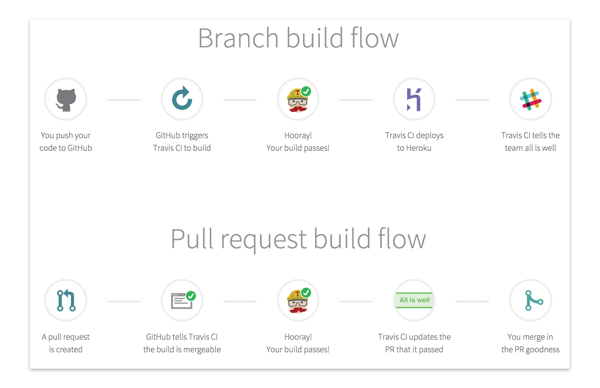
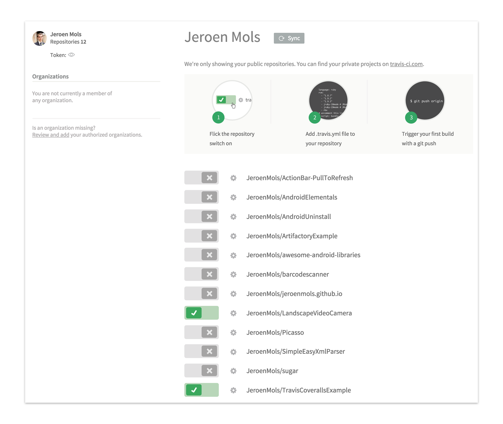
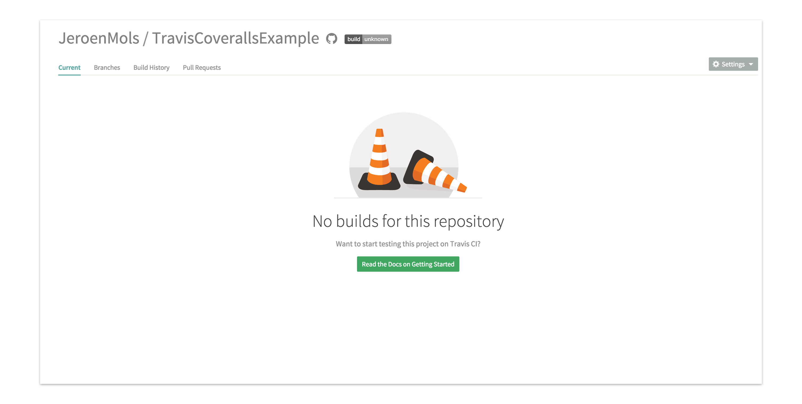
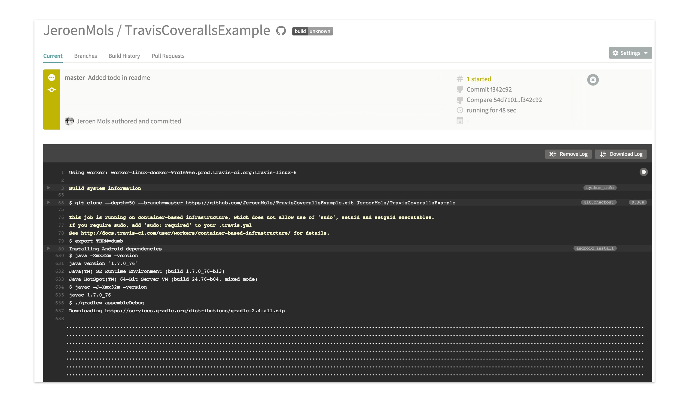
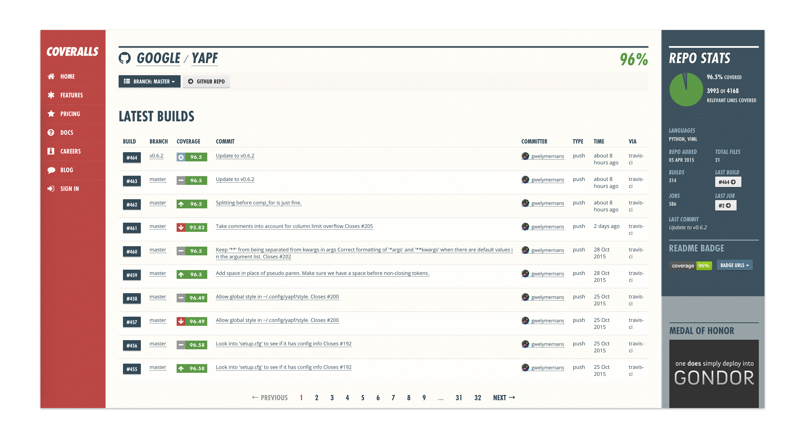
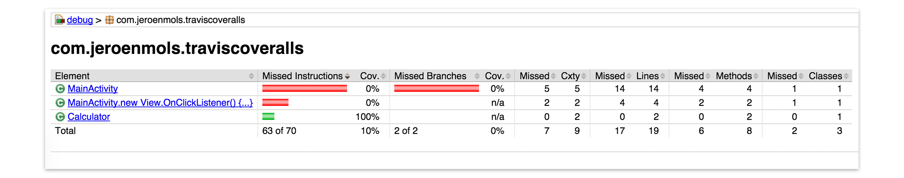
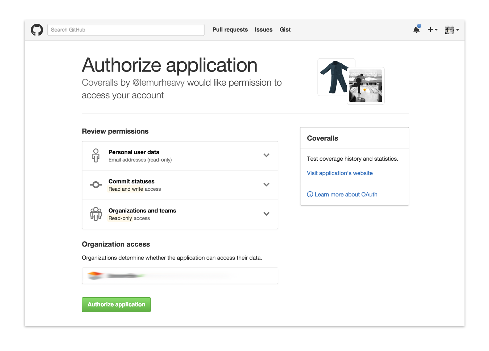

Wouldn't you love to have your open source projects built automatically by a continuous integration server? And to have a detailed code coverage report for all your unit tests? Even when someone generated a pull request? And how about having cool badges to show off all of this?

[](https://travis-ci.org/JeroenMols/LandscapeVideoCamera)    [](https://coveralls.io/github/JeroenMols/LandscapeVideoCamera?branch=master)

Actually, all of this a breeze to set up, once you understand what works and what doesn't. It is even completely free for open source projects!

In less than half an hour, this blogpost will add CI and code coverage to your projects, just like I did for my own library [LandscapeVideoCamera](https://github.com/JeroenMols/LandscapeVideoCamera). While this article focusses on Android, the material presented here can quite easily be extended to a broader scope.

## Preface
In order to keep things simple, I created a very basic project containing a [Calculator class](https://github.com/JeroenMols/TravisCoverallsExample/blob/master/app/src/main/java/com/jeroenmols/traviscoveralls/Calculator.java) and some [Android tests](https://github.com/JeroenMols/TravisCoverallsExample/blob/master/app/src/androidTest/java/com/jeroenmols/traviscoveralls/CalculatorTest.java). This will make things easier to understand as we'll add everything step by step to this project.

Later on I will present a more elaborate (and usefull) example, namely my own open source library [LandscapeVideoCamera](https://github.com/JeroenMols/LandscapeVideoCamera). Some time ago, I test driven refactored this project completely resulting in respectable code coverage statistics.

## Travis
### About
[Travis](https://travis-ci.org/) is a feature rich online CI service which integrates nicely with a lot of existing services. One major advantage over Jenkins is that you can put the entire CI configuration file under version control. It is completely free for open source projects, although private repositories are also supported on a subscription basis.



### Basic configuration
In order to get started, go to [travis-ci.org](https://travis-ci.org/), login with your GitHub account and authorize Travis to access your repositories.


Next, create a new file `.travis.yml` into the root of your project (note that this file will be hidden on Mac OSX/Linux systems). Open the file and specify the language of your project, in our case Android:

```yaml
language: android
```

Now Travis needs to know all dependencies in order to build the project. As such specify the build tools version and compile Android SDK version (note that this must match the `compileSdkVersion` of your [`build.gradle`](https://github.com/JeroenMols/TravisCoverallsExample/blob/master/app/build.gradle) file!). While there is an option to use the latest build tools version, I recommend to declare an explicit version as this makes your builds more reproducible. Next specify all of the Android SDK manager dependencies your project needs so Travis can install them before building the project.

```yaml
android:
  components:
    - build-tools-22.0.1
    - android-23
    - extra-android-m2repository
```

Note that our sample only depends on the AppCompat and design support library, hence there is only one extra defined `extra-android-m2repository`. In case your project uses other dependencies from the Android SDK, you can easily select them from the entire [dependency list](https://github.com/JeroenMols/TravisCoverallsExample/blob/master/misc/android_sdk_dependencies.txt) and add an extra item.

> **Extra: listing Android SDK dependencies**
>
> To generate the above mentioned list of Android SDK components, simply run the following command on your local machine:
>
>```bash
>android list sdk --no-ui --all --extended
>```

After, specify the exact `Gradle` command to run, in our case `assembleDebug`:

```yaml
script:
    - ./gradlew assembleDebug
```

Now that we have configured everything in the `travis.yml` file, we need to enable the project, so Travis will start listening to code changes. This can be done by going to your profile on [Travis](http://travis-ci.org) and flipping the appropriate slider.



This will result in the project being shown on the left hand side of your dashboard, while indicating that there are no builds.



Builds are automatically triggered whenever you push code to your GitHub repository or someone else creates a pull request. Therefore push some changes to GitHub and watch Travis pick them up automatically and start building your project.



Congrats! You now have a fully working Continuous Integration server for your [open source project](https://travis-ci.org/JeroenMols/TravisCoverallsExample).

### Running Android unit tests
While running normal unit tests is straight forward, Android tests are a different story because they require an Android emulator to run on. And because Travis support for Android is still in [beta](http://docs.travis-ci.com/user/languages/android/), there are a couple of limitations to consider:

1. Only `armeabi-v7a` emulators are supported.
2. The Android M emulator is not yet supported.

> **Extra limitations of Travis Android support**
>
> You can *skip this if you want*, just some extra context
>
> First of all, Travis does not yet support HAXM to speed up intel emulators, so there is no speed up while using an `x86` emulator. Even more, the latest `x86_64 Android M` emulator requires hardware acceleration, so that one simply cannot be used on Travis! For more information see issue [1419](https://github.com/travis-ci/travis-ci/issues/1419) and [1395](https://github.com/travis-ci/travis-ci/issues/1395) or check out this [failing build](https://travis-ci.org/JeroenMols/LandscapeVideoCamera/builds/88619658#L693).
>
> Secondly, Travis does not yet support the latest Android M emulator, causing the built-in `android-wait-for-emulator` script to time out while the emulator is booting. Therefore I recommend to use the `android-22` emulator instead. For more information see this [failing build](https://travis-ci.org/JeroenMols/LandscapeVideoCamera/builds/88620580#L1069).

So you'll have to accept that builds will be slow (starting emulator + running test) and that you cannot use an Android M emulator. But if these are acceptable, read on and I'll explain how to set up everything for running tests.

First of all, define the Android version and processor architecture of the emulator by adding a new environment at the top of the `travis.yml` file:

```yaml
env:
  matrix:
    - ANDROID_TARGET=android-22 ANDROID_ABI=armeabi-v7a
```

Then, ensure that all dependencies for the Android emulator are installed, by adding both the platform version and emulator image to the `components` section. Note that it is important to add both, because the Android emulator will only install if the corresponding Android platform is installed (see this [failing build](https://travis-ci.org/JeroenMols/LandscapeVideoCamera/builds/88631850#L815)).

```yaml
android:
  components:
    ...
    - android-22
    - sys-img-armeabi-v7a-android-22
```

Now we need to create a new Android emulator and start it before our build. As starting takes a really long time, Travis offers a built-in `android-wait-for-emulator` script to facilitate this. Finally we need to unlock the emulator once started by sending a key event.

```yaml
before_script:
    - echo no | android create avd --force -n test -t $ANDROID_TARGET --abi $ANDROID_ABI
    - emulator -avd test -no-skin -no-audio -no-window &
    - android-wait-for-emulator
    - adb shell input keyevent 82 &
```

After all of this configuration, all we need to do is change the `Gradle` command to run all of the tests and trigger a new build by pushing all these changes.

```yaml
script:
    - ./gradlew connectedAndroidTest
```

### Taking things further
As mentioned in the introduction, Travis is a really feature rich CI service. Therefore this section provides some tips to take things even further.

1. **Build notifications:** Travis supports sending notifications via Slack, HipChat, email,... whenever a built fails/succeeds.<br>
For more information, have a look at the [Travis documentation](http://docs.travis-ci.com/user/notifications/).

```yaml
notifications:
    email:
      - your.email@gmail.com
```

- **Build status badge:** Click the build badge on your Travis homepage to generate png/markdown/... build badges.<br>
[](https://travis-ci.org/JeroenMols/TravisCoverallsExample)

- **Branch information:** Print which branch or pull request is being built.

```yaml
script:
    - echo "Travis branch is $TRAVIS_BRANCH"
    - echo "Travis branch is in pull request $TRAVIS_PULL+REQUEST"
```

- **More options:** Have a look at the [Travis documentation](http://docs.travis-ci.com/user/languages/android/).

## Coveralls
### About
[Coveralls](https://coveralls.io/) is a visually attractive online code coverage tool which provides detailed statistics such as line coverage and repository trends. Furthermore it allows you to show of your code coverage and encourages you to increase it. Like Travis, it is free for open source projects, but a subscription service is available for private repositories.



### Enabling Android code coverage
First of all, your Android project needs to be configured to generate code coverage reports. As such, ensure that you are using at least version 0.4 of the [Android testing support library](https://google.github.io/android-testing-support-library/) (there was an [issue](https://code.google.com/p/android/issues/detail?id=170607) in version 0.3).

Then add the flag `testCoverageEnabled` to the debug buildTypes in your main module's `build.gradle` file, causing a code coverage report to be generated in the `build/reports/coverage/` folder.

```groovy
android {
  ...

  buildTypes {
        debug {
            testCoverageEnabled true
        }
    }
}
```

At this point, you should be able to run `gradle connectedAndroidTest` and view an `html` and `xml` report in the above mentioned directory.



### Basic configuration
In order to get started, go to [coveralls.io](https://coveralls.io/), login with your GitHub account and authorize Coveralls to access your repositories.



Next, we'll need to configure your `build.gradle` files to upload the coverage reports to Coveralls after each successful CI build. Therefore add a new classpath dependency to the root projects `build.gradle` file.

```groovy
buildscript {
    ...

    dependencies {
        ...
        classpath 'org.kt3k.gradle.plugin:coveralls-gradle-plugin:2.4.0'
    }
}
```

Then we can apply the `coveralls` plugin, point it to the coverage reports directory and ensure it only runs on CI builds by adding the following to your main module's `build.gradle` file:

```groovy
apply plugin: 'com.github.kt3k.coveralls'
```

```groovy
coveralls {
    jacocoReportPath = "${buildDir}/reports/coverage/debug/report.xml"
}

tasks.coveralls {
    dependsOn 'connectedAndroidTest'
    onlyIf { System.env.'CI' }
}
```

Note that we also added a dependency on the `connectedAndroidTest` task as that is the one that will actually generate the code coverage report.

Let's now change the build task in the `travis.yml` so it runs the `coveralls` task after every build. While not strictly necessary to still define the `connectedAndroidTest` task, I prefer to do so as it makes it more explicit what `Gradle` will exactly be building.

```yaml
script:
  ...
  - ./gradlew connectedAndroidTest coveralls

```

Next we need to activate our GitHub repository in coveralls, so it picks up the output from the `Gradle` plugin. This can easily be done by clicking `add repos` on [coveralls.io](https://coveralls.io) and flipping the switch on your repository.


This will result in the project being added to your dashboard without any builds.


Simply trigger a Travis build by pushing some changes to start seeing code coverage results online.

Finally you can easily add a badge to your repository by clicking the `Badge urls` button from the green banner in the detail view.

[](https://coveralls.io/github/JeroenMols/TravisCoverallsExample?branch=master)

Congratulations you know have attractive code coverage reports for [your repository](https://coveralls.io/github/JeroenMols/TravisCoverallsExample)!

## Wrap-up
Adding Travis CI and Coveralls code coverage to your project is fairly straightforward once you know what works and especially what doesn't work. Hopefully this blogpost was able to remove a lot of those frustrating barriers of entry.

A basic example project with everything in this blogpost integrated is available on [GitHub](https://github.com/JeroenMols/TravisCoverallsExample). But in case you're interested in a real life example, have a look at my Android library [LandscapeVideoCamera](https://github.com/JeroenMols/LandscapeVideoCamera), which actually has decent code coverage statistics.

[](https://travis-ci.org/JeroenMols/LandscapeVideoCamera)   [](https://coveralls.io/github/JeroenMols/LandscapeVideoCamera?branch=master)

As always you can reach me on [Mastodon](https://androiddev.social/@Jeroenmols), or leave a comment below!
