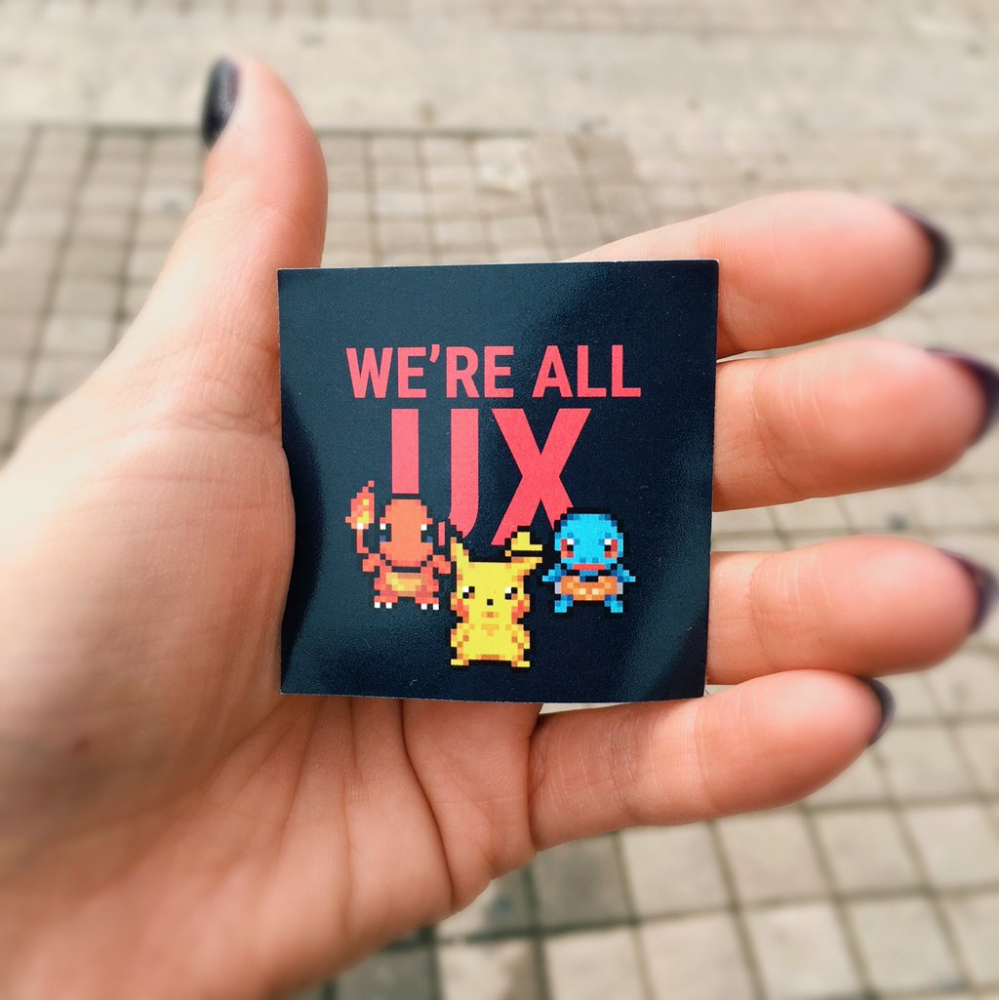
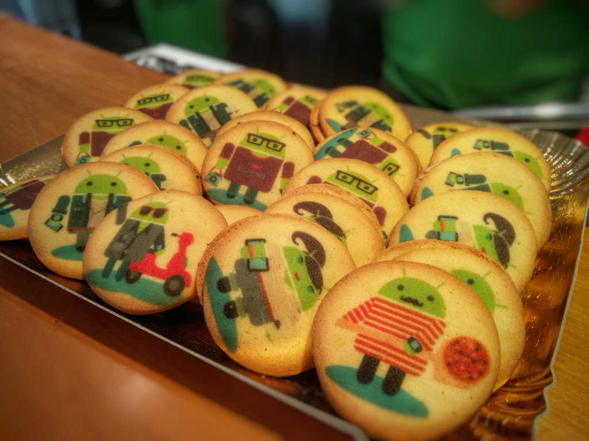

A conference about our favorite Green little robots? In sunny Italy? With great food and a party? Yeah, I can image how you must feel in case you missed it... I on the other hand was fortunate enough to attend and speak at this awesome conference.

With over 770 attendees and four different tracks, it was obviously not possible to attend every session. But I did notice some general themes and would like to share my personal highlights with you.

## We are all UX

The holy grail in app development is to have an amazing user experience. While app performance and feature set are obviously important, you must also understand your users, simplify main use cases and have a delightful design.

Do you really think a developer or designer alone can create such a great UX? NO, off course not! They'll both have to work together and synergize to really blow the users of their feet. We need more pairing between developers and designers folks!

The best advice I got was:

- A prototype is worth a thousand meetings.
- Five people to test your prototype with is the sweet spot. It's enough to notice patterns, yet not too much to be a burden.
- Developers and designers should be transparent and open to learn from each other
- "How might we..." is a great way to phrase problems as opportunities

## Optimizing layouts
{: .align-center}

Screens containing a lot of views can sometimes render slowly. Mostly caused by deeply nested view hierarchies and/or using RelativeLayouts as a root element. Using "heavy" layouts in lists or increased nesting makes these problems multiplicative instead of simply additive.

When running into issues, first resolve to Lint and investigate all warnings. If the problem persist, Hierarchy viewer will help you understanding what's going on. Always prefer simple solutions over complex ones and if you really really have to you can go - Facebook Style - replacing views with drawables.

The best advice in this track was:

- Rendering times in Hierarchy Viewer are not reliable
- Optimize responsibly

## DEX diet
{: .align-center}

Hitting the DEX method limit or trying to improve your app security? As a real Proguard expert you created an amazing configuration and now all those problems are gone. Or are they?

Analyzing your own APK file is a must to verify what methods are actually stripped and what code is obfuscated. Who knows you might even find some duplicate dependencies (GSON anyone?), causing a further method count reduction. Thanksfully all of this has become a breeze thanks to tools like [ClassyShark](http://www.classyshark.com/).

The best advice here was:

- Be restrictive using Proguard iso keeping entire packages
- IDE method count != dex method count
- Use [methodscount.com](http://www.methodscount.com/) to see how large a lib is before using it

## Other hot topics

Besides the three main themes, other topics varied from Kotlin, over library distribution to (MVP) architecture and app store optimizations. Awesome sources of inspiration, brought by even more awesome speakers.

My key takeaways:

- Use App invites to grow your user base
- If you don't like testing your code, most likely customers won't like testing your app either
- Italian food is awesome

## Conference slides

- [Distribute your libraries via Maven, even privately](https://speakerdeck.com/jeroenmols/distribute-your-libraries-via-maven-even-privately) by Jeroen Mols
- [Think like a designer](https://photos.google.com/share/AF1QipMB_VOceGeOuQZ0UhBf0dKrGhgu92k8-qpXu0X5WtWUvoSqFJKRsoPzESyuhNEDRw?key=VVctWHBsVG4zZVlsRlBjVGRBWkIzT295Vk9qcWlB) by Nick Butcher
- [Let it flow](https://speakerdeck.com/dorvaryn/let-it-flow) by Benjamin Augustin
- [#Perfmatters for Android](https://speakerdeck.com/alosdev/perfmatters-for-android-droidcon-turin-2016) by Hasan Hosgel
- [Android Library A-Z](https://docs.google.com/presentation/d/1f05lCKSnCuzn9nJUMHN0nZ_buIVtsVnB_lrT4FR3wXo/edit#slide=id.p) by Martin Liersch
- [The bytecode mumbo-jumbo](http://blog.rafols.org/wp-content/uploads/2016_04_droidcon_it.pdf) by Raimon Ràfols
- [To ∞ (~65K) and beyond!](https://speakerdeck.com/dextor/to-65k-and-beyond) by Sebastiano Gottardo
- [Android data binding in action using MVVM pattern](http://www.slideshare.net/fabio_collini/data-binding-in-action-using-mvvm-pattern) by Fabio Collini
- [From Clockwork to smartwatch](https://speakerdeck.com/danybony/from-clockwork-to-smartwatch) by Daniele Bonaldo
- [Android internal library management](http://www.slideshare.net/KellyShuster/internal-android-library-management-droidcon-sf-2016) by Kelly Shuster
- [Reverse engineering is not just for hackers](https://speakerdeck.com/jonreeve/reverse-engineering-is-not-just-for-hackers) by Jon Reeve
- [How to talk to your users](https://speakerdeck.com/anothem/how-to-talk-to-your-users) by Alex Florescu
- [Crafting Great Hypotheses](http://www.slideshare.net/Aetheros/crafting-great-hypotheses-droidcon-2016) by Hoang Huynh
- [Building maintainable app with MVP and Dagger2](http://www.slideshare.net/KristijanJurkovi/building-maintainable-app) by Kristijan Jurković
- [Build An Efficient REST Client On Android](http://www.slideshare.net/duckma/build-an-efficient-rest-client-on-android-droidcon-it-2016-matteo-gazzurelli?ref=http://blog.duckma.com/2016/04/build-efficient-rest-client-on-android.html) by Matteo Gazzurelli
- [Chronicles of TDD](https://docs.google.com/presentation/d/1DK_kOp--XXdV_BYOYWw-wWPvJ1B_i4NIclDqWQqBSw8/edit#slide=id.p) by Luca Falsina
- [Backend 4 Android developers](https://backend4android.github.io/#/) by
Antonio Mallia & Nicola Corti
- [A realtime infrastructure for Android apps: Firebase may be what you need..and even more!](http://www.slideshare.net/AlessandroMartellucc/a-realtime-infrastructure-for-android-apps-firebase-may-be-what-you-needand-even-more) by
Alessandro Martellucci
- [Evolving the Android core with Aspects](http://www.slideshare.net/CarloPescio/evolving-the-android-core-with-aspects) by Carlo Pescio
- [Android: It's time to go to work!](https://speakerdeck.com/nibble/android-its-time-to-go-to-work) by Pietro Maggi
- [Drive together not the same](https://speakerdeck.com/joaobiriba/drive-together-not-the-same) by Giovanni Laquidara
- [A friend in need - A JS indeed](http://www.slideshare.net/yoni1984/a-friend-in-need-a-js-indeed) by Yonatan Levin
- [Application Architecture for Scaled Agile](https://speakerdeck.com/sangsoonam/application-architecture-for-scaled-agile-droidconit-2016) by Sangsoo Nam
- [FLUX based clean architecure](https://speakerdeck.com/unsign3d/flux-based-clean-architecure) by Luca Bruzzone
- [Engage and retain users in android world](http://www.slideshare.net/MatteoBonifazi/engage-and-retain-users-in-the-android-world-droidcon-italy-2016?from_m_app=android) by Matteo Bonifazi
- [Bonjour Android, it's Zeroconf](https://speakerdeck.com/tiwiz/bonjour-android-its-zeroconf) by Roberto Orgiu
- [We're all UX!](https://speakerdeck.com/lyslydia/were-all-ux) by Lydia Selimalhigazi and Caroline Smith
- [Mastering the NDK](http://www.slideshare.net/ph0b/mastering-the-ndk-with-android-studio-and-the-gradleexperimental-plugin) by Xavier Hallade
- [BLE beacons, Eddystone and Physical Web](https://www.blueupbeacons.com/docs/WorkshopBeacons.pdf) by Alessio Cucini and Samuele Forconi
- [World-Class Testing Development Pipeline for Android](http://www.slideshare.net/PedroVicenteGmezSnch/worldclass-testing-development-pipeline-for-android) by Pedro Vicente Gómez Sánchez]
- [ClassShark - Android and Java executables browser](http://www.slideshare.net/seamaster29/classshark-android-and-java-executables-browser) by Boris Farber

## Credits
Thanks to the entire Droidcon Italy team for organizing such a great conference and to all sponsers for their support.

{: .align-center}
