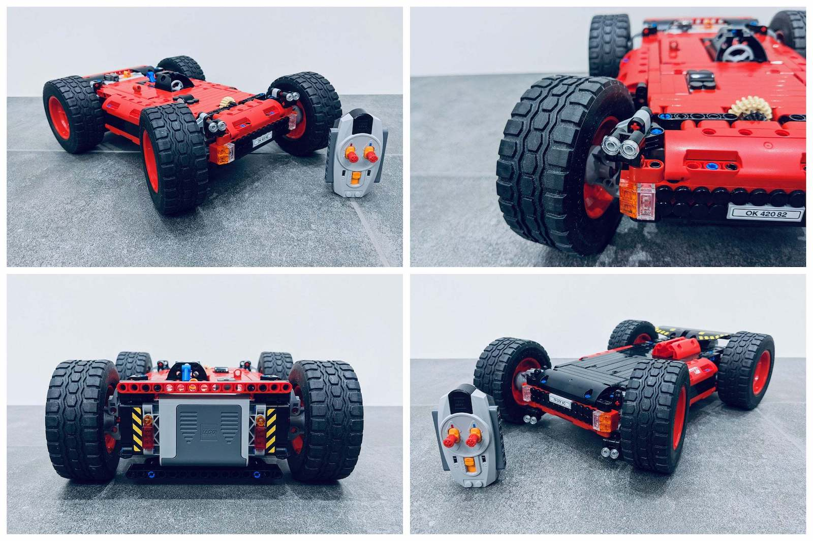

Well... I don't really know where to start this time. 2020 was quite the rollercoaster, with many downs... but fortunately also a few amazing ups. Let's focus on the good stuff.

My first lucky break was that I started working remotely by choice! This privilege meant I was quite well equipped both practically and mentally for the challenges of remote work. And while not without its challenges, I haven't been happier at my work.

The main work challenge was bridging the 9-hour timezone gap with my colleagues. And while I do work some evenings, I've never been more available for my kids. And I've grown really fond of:

- never (!!!) having to set an alarm clock
- exercising in the middle of a working day
- grabbing coffee/breakfast with my wife anytime I want (can?)

Another highlight was the amazing time I was able to spend with my kids during the first Lockdown. I would work from 2pm to 10pm so me and the kids could do fun stuff in the mornings (fixing up the house, gardening, playgrounds,...). I recognize how extraordinary it was to have so much playtime with my kids and truly enjoyed it.

However, working such long days also meant I pushed myself beyond my limits and I had to take it a lot slower for several weeks before I felt better. A huge shoutout to Plaid and my manager Judd for the immense understanding they've shown for my situation.

Further, I've also built and designed my own custom Lego set: [Radio-Controlled Flip Over Stunt Car](http://bit.ly/legostuntcar):

Please give me a [vote](http://bit.ly/legostuntcar)!!! If I make it to 10k supporters, Lego might actually make it into an official set. 🤞

Further 2020 highlights include:

- 🧱 Teaching my son and daughter how to build Lego
- 👨‍💻 Spoke at [4 online events](https://jeroenmols.com/speaking/) and produced [1 video](https://www.youtube.com/watch?v=TCKb1WfjAC8).
- 📝 Wrote [6 blog posts](http://jeroenmols.com/blog/)
- 📱 Grew my [Twitter](https://twitter.com/molsjeroen) followers by ~20% to more than 7500
- 🦠 Contributed code to the official [UK Covid app](https://github.com/nhsx/covid-19-app-android-ag-public/tree/master/app/src/main/java/com/jeroenmols)
- 🚗 Drove less than 1500 km with my car (down from 30k km)
- ☕️  Improved my coffee skills with (basic) latte art!
- 🚴‍♀️ Worked out (almost) biweekly on my indoor racing bike
- 🪒 Shaved my hair and grew a beard
- 📕 Read 4 books
- 📈 Started investing

To keep the best for last: we're expecting a baby girl in March! 🍼👼

In 2021, I'm going to try and exercise twice a week, read 5 books, enjoy every little moment with the baby and double down on being an awesome father for all my kids.

I do want to pick up my community contributions again and maybe even venture into other areas beyond Android.

As always you can reach me on [Mastodon](https://androiddev.social/@Jeroenmols), or leave a comment below!
