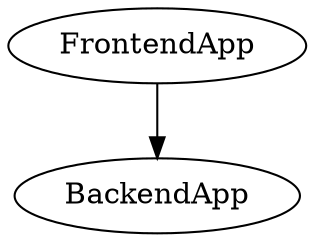
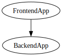

Tired of building un-versionable, lifeless architecture diagrams? Wouldn't it be great if you could add your diagram to Git, embed it in your documentation, and have clickable elements?

Well, look no further! In this blog post, we will explore how to generate an interactive system architecture diagram using Graphviz and HTML. Get ready to bring your diagrams to life!

## Curious?

Can't wait to see the result of what we're going to build, get a sneak peak of the result here:

👉 <a href="system_architecture" target="blank">Interactive system architecture diagram</a>.

## Building a Diagram with Graphviz

Graphviz is a powerful graph visualization tool that offers higher flexibility than alternatives like Mermaid. It allows us to export graphs to Scalable Vector Graphics (SVG) files, which are ideal for embedding in HTML documents. Additionally, Graphviz supports embedding URLs into the graph elements, enabling interactivity.

To start, you'll need to install Graphviz on your system.

```
brew install graphviz
```

Once installed, create a Graphviz file (with a `.dot` extension) that defines the architecture diagram. You can specify nodes, edges, and their properties using [the DOT language](https://graphviz.org/documentation/).

Here's a brief example of a Graphviz file:



To export the DOT file to an SVG file, use the following command:

```
$ dot -Tsvg diagram.dot -o diagram.svg
```

Which will yield the following diagram:



While this is a very simple example of a Graphviz diagram, it is possible to create more complex and better-looking ones.

For the sake of example, let's take [the diagram defined here](https://github.com/JeroenMols/architecturediagrams/blob/main/diagram.dot) and build an interactive version of that.


Here are my pro tips for Graphviz to create the layout you want:

- Have the diagram lay itself out from left to right
- Add an invisible column on the left with elements that define your rows (use `rank=same` to lay out the linked nodes under each other)
- Link each alignment row to the element you want to appear first on that row
- Link elements on different rows with an edge that has a `[constraint="false"] attribute
- Use invisible elements to add spacers or to force edges along a certain path

By following the suggestions above you can essentially lay out architecture blocks on a grid.

## Creating an HTML File to Embed the Diagram

To include the generated SVG in an HTML page, you can use the following code:

```html

```

However, simply using an `` tag to include the SVG won't allow the hyperlinks to link to the hosting page. So unfortunately, we have to directly include the SVG code between the `<svg>` and `</svg>` tags.

```html
<svg ...>
  <!-- SVG content goes here -->
</svg>
```

A few changes need to be made before embedding the SVG code to ensure compatibility with HTML:

- Remove all comments from the SVG file (comments start with `<!--` and end with `-->`).
- Remove the `xmlns:xlink="http://www.w3.org/1999/xlink"` attribute from the root `<svg>` tag.
- Remove any `xlink` prefixes used throughout the SVG code.

Next, let's talk about building the HTML page that will contain the diagram.

For each architecture component, we want to link from, we will need to add a section with an anchor link. A way to do this is to add a `<h2>` tag with an `id` attribute.

As an example, the following section:

```html
<h2 id="frontend-app">Frontend App</h2>
```

Can be linked to from the diagram by adding the following `URL` (notice the added #):


## Bringing It All Together: The Final Example

Now that we know how to prepare the SVG and create the HTML file, let's add sections and URLs for all diagram components. You can admire <a href="system_architecture" target="blank">result here</a>.

Pretty dope, isn't it? 😎

In this example, we have manually written the HTML file, but you could also use Markdown and have the HTML generated for you. I'm pretty confident this will work with whatever documentation tool you are currently using!

The advantages are numerous:

- diagram can be seamlessly added to your existing documentation pages
- interactivity allows users to navigate the system easily
- diagram is fully versionable under Git so you can keep track of changes and collaborate efficiently.

Here's the [Github repository](https://github.com/JeroenMols/architecturediagrams) with the diagram source code.

## Wrap up


  


By leveraging Graphviz and directly embedding an SVG diagram in an HTML document, you can create visually appealing diagrams that are interactive.

If this was helpful to you, consider [buying me a coffee](https://www.buymeacoffee.com/jeroen).
